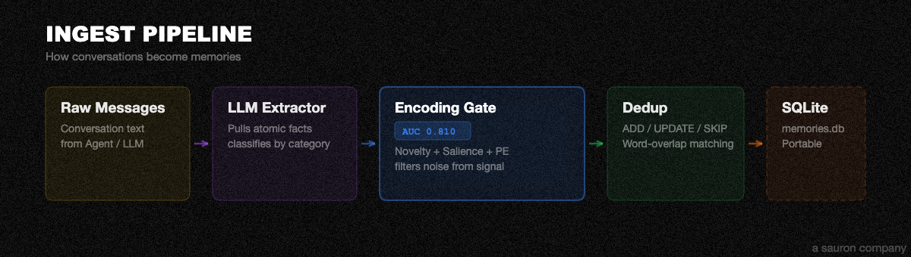
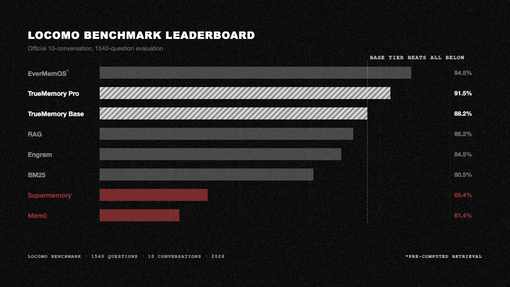

<p align="center">
  
</p>

<p align="center">
  A living memory system for AI agents. Long-horizon recall on commodity hardware.
</p>

<p align="center">
  <a href="https://pypi.org/project/truememory/"></a>
  <a href="https://pypi.org/project/truememory/"></a>
  <a href="https://github.com/buildingjoshbetter/TrueMemory/blob/main/LICENSE"></a>
  
  
</p>

<p align="center">
  <a href="#-what-is-truememory">What is TrueMemory?</a> · <a href="#-quick-start">Quick Start</a> · <a href="#%EF%B8%8F-edge--base--pro">Edge / Base / Pro</a> · <a href="#-architecture">Architecture</a> · <a href="#-benchmarks">Benchmarks</a> · <a href="#-python-api">API</a> · <a href="#-faq">FAQ</a>
</p>

---

## 💡 What is TrueMemory?

- **Remembers everything across sessions.** Facts, preferences, decisions, corrections. Your AI finally knows who you are.
- **93.0% on LoCoMo, SOTA on BEAM-1M.** Beats every live-retrieval memory system on both major benchmarks. Independently reproducible.
- **Runs locally on a single SQLite file.** Zero cloud, zero API keys for Edge and Base tiers. Your memories never leave your machine.
- **Neuroscience-inspired architecture.** Six retrieval layers plus an encoding gate that filters noise from signal before anything gets stored.
- **Works with Claude Code and Claude Desktop.** Four lifecycle hooks capture conversations automatically. No manual work needed.

---

## 🚀 Quick Start

### Claude Code / Claude Desktop

One command. Works on any Mac or Linux box, even if your system Python is old or missing entirely.

**Step 1.** Open Terminal:

- **Mac:** press `Cmd + Space`, type `Terminal`, press `Enter`
- **Linux:** press `Ctrl + Alt + T` (or open your distro's terminal app)

**Step 2.** Paste this one line and press `Enter`:

```bash
curl -LsSf https://raw.githubusercontent.com/buildingjoshbetter/TrueMemory/main/install.sh | sh
```

**Step 3.** Wait ~1-2 minutes while it downloads and installs. You'll see progress messages scroll by.

**Step 4.** If Claude Desktop was already open, **quit it with `Cmd+Q` and reopen it** (a new chat window is not enough; the config is only read at launch). Then start a new Claude session and TrueMemory walks you through choosing **Edge**, **Base**, or **Pro** on first run.

> **What this actually does:** installs [uv](https://docs.astral.sh/uv/) (Astral's Python tool manager) if needed, fetches a managed Python 3.12 into `~/.local/share/uv/`, installs TrueMemory into an isolated tool environment, registers the MCP server, wires up lifecycle hooks, and merges instructions into your `~/.claude/CLAUDE.md`. **Your system Python is never touched.** No sudo, no venvs, no pip struggle. Uninstall cleanly with `uv tool uninstall truememory`.

> **Want to audit the script first?** It's ~170 lines of shell, no sudo, stays entirely under `$HOME`. Read the source at [`install.sh`](install.sh), or download and inspect locally: `curl -LsSf https://raw.githubusercontent.com/buildingjoshbetter/TrueMemory/main/install.sh -o install.sh && less install.sh && sh install.sh`.

> **Want Base or Pro** (adds Qwen3 embeddings + gte-reranker + sentence-transformers, ~1.5-2.5GB depending on OS)?
> ```bash
> curl -LsSf https://raw.githubusercontent.com/buildingjoshbetter/TrueMemory/main/install.sh | TRUEMEMORY_EXTRAS="gpu" sh
> ```
> The default install is **Edge** (~30MB, the CPU-only tier). If you pick Base or Pro during first-run setup, TrueMemory will prompt you to install the extra models. Pro additionally requires an LLM API key at runtime for HyDE.
> *(Linux CPU-only boxes will pull PyTorch's default CUDA wheel, which is larger, ~2.5GB total. Mac installs are closer to ~1.5GB.)*

### Python library (for developers)

If you're embedding TrueMemory in your own Python project (requires Python 3.10+):

```bash
pip install truememory
```

> **Important:** `pip install` installs the Python library only. It does NOT register the MCP server, install hooks, or configure Claude. For Claude Code / Claude Desktop, always use the `curl | sh` installer above.

```python
from truememory import Memory

m = Memory()
m.add("Prefers dark mode and TypeScript", user_id="alex")
m.add("Allergic to peanuts", user_id="alex")

results = m.search("What are Alex's preferences?", user_id="alex")
print(results[0]["content"])
# "Prefers dark mode and TypeScript"
```

The database is created automatically at `~/.truememory/memories.db`.

---

## 🏗️ Edge / Base / Pro

Same architecture, three tiers. Trade off install size and hardware for accuracy.

| | Edge | Base | Pro |
|---|------|------|-----|
| **LoCoMo** (3-run mean) | 89.6% | 92.0% | 93.0% |
| **BEAM-1M** (3-run mean) | | | 76.6% (SOTA) |
| **Embedder** | Model2Vec potion-base-8M (8M params, 256d) | Qwen3-Embedding-0.6B (600M params, 256d) | Qwen3-Embedding-0.6B (600M params, 256d) |
| **Reranker** | MiniLM-L-6-v2 (22M) | gte-reranker-modernbert (149M) | gte-reranker-modernbert (149M) |
| **HyDE** | off | off | on (requires LLM API key) |
| **Runs on** | Any machine, CPU only | 4GB+ RAM, CPU or GPU | 4GB+ RAM + LLM API key |
| **Install size** | ~30MB | ~1.5GB | ~1.5GB |

**Edge** works everywhere. **Base** is the strongest fully-offline tier. **Pro** adds HyDE query expansion for the highest scores.

---

## 🧠 Architecture

TrueMemory uses a 6-layer retrieval pipeline inspired by how the brain encodes and recalls memory, plus an encoding gate that decides what gets stored.

### Ingest (what gets stored)



Every conversation flows through three stages before anything is stored:

| Stage | What it does |
|-------|-------------|
| **LLM Extractor** | Pulls atomic facts from raw conversation text. Classifies each as personal, preference, decision, correction, temporal, technical, or relationship. |
| **Encoding Gate** | Three-signal filter: compression novelty + speech-act salience + embedding pair-diff prediction error. Rejects noise, keeps signal. |
| **Dedup** | ADD / UPDATE / SKIP against existing memories using vector similarity + word-overlap Jaccard matching. Prevents duplicates and catches rephrased versions of the same fact. |

### Encoding Gate + Storage


Three signals decide whether a fact gets stored or skipped:

| Signal | What it measures |
|--------|-----------------|
| **Compression Novelty** | gzip-based information gain. How much new information does this fact add compared to what's already stored? |
| **Speech-Act Salience** | Rule-based scorer for short messages, learned scorer for longer text. Filters out greetings, reactions, and filler. |
| **Embedding Pair-Diff** | Embedding divergence between the message and existing memories on the same topic. Detects when someone says something *different* about a known subject. |

The weighted sum of all three must exceed a threshold (default 0.30) to be stored. Everything below gets skipped. One SQLite file at `~/.truememory/memories.db`. Portable. Backupable. `cp` it anywhere.

### Retrieve (how it answers)


When you ask a question, six layers work together:

| Layer | Name | What it does |
|-------|------|-------------|
| L0 | **Personality** | Char-n-gram style vectors + entity profiles. Answers "what kind of person is X?" questions that keyword search can't touch. |
| L2 | **Episodic** | FTS5 full-text keyword search with temporal filtering. Fast, broad recall. |
| L3 | **Semantic** | Dense vector search (Model2Vec or Qwen3 by tier) + RRF fusion + cross-encoder reranking. The heavy lifter. |
| L4 | **Salience** | Noise filtering + entity boosting. Learned 13-feature logistic regression scorer trained on retrieval-utility labels. |
| L5 | **Consolidation** | Structured fact summaries, contradiction resolution, and surprise-weighted reranking (alpha=0.2). |
| **+** | **Reranker** | Cross-encoder reranking (MiniLM or gte-modernbert by tier) for final precision. |

---

## 🔬 Benchmarks

<p align="center">
  
</p>

Tested on [LoCoMo](https://github.com/snap-research/locomo) (1,540 questions, 10 conversations) and [BEAM-1M](https://github.com/mohammadtavakoli78/BEAM) (700 questions, 35 conversations at 1M+ tokens each). All systems share the same answer model (GPT-4.1-mini), judge (GPT-4o-mini, 3x majority vote), and scoring pipeline. Zero errors across 12,320 total answers.

### LoCoMo (3-run validated means)

| Tier | Overall | Single-hop | Multi-hop | Temporal | Open-domain |
|------|---------|------------|-----------|----------|-------------|
| Edge | 89.6% | 88.7% | 88.5% | 79.2% | 91.4% |
| Base | 92.0% | 91.5% | 91.3% | 82.3% | 93.9% |
| Pro  | 93.0% | 92.6% | 90.0% | 86.5% | 95.4% |

### BEAM-1M (Pro tier, 3-run mean)

| Category | Score |
|----------|-------|
| Preference following | 97.1% |
| Contradiction resolution | 91.4% |
| Information extraction | 91.4% |
| Summarization | 89.5% |
| Instruction following | 84.8% |
| Abstention | 82.4% |
| Knowledge update | 77.6% |
| Multi-session reasoning | 67.1% |
| Temporal reasoning | 64.8% |
| Event ordering | 19.5% |
| **Overall** | **76.6%** |

<p align="center">
  
</p>

Every benchmark script is self-contained and runs on [Modal](https://modal.com). Reproduce any result yourself:

- **[LoCoMo Reproduction Scripts](benchmarks/locomo/scripts/)** — run any of the 8 systems (TrueMemory, Mem0, Zep, Engram, etc.)
- **[LoCoMo Full Results](benchmarks/locomo/BENCHMARK_RESULTS.md)** — per-category breakdowns, latency, cost, hardware
- **[LoCoMo Evaluation Config](benchmarks/locomo/EVAL_CONFIG.md)** — exact models, prompts, judge setup, parameters
- **[BEAM-1M Reproduction Script](benchmarks/beam/bench_truememory_pro_beam1m.py)** — 35 conversations at 1M+ tokens

### Evaluation config

Both benchmarks use the same eval pipeline. Nothing is hidden.

| Parameter | LoCoMo | BEAM-1M |
|-----------|--------|---------|
| **Dataset** | 10 conversations, 1,540 questions | 35 conversations at 1M+ tokens, 700 questions |
| **Answer model** | `openai/gpt-4.1-mini` | `openai/gpt-4.1-mini` |
| **Answer temp** | 0 | 0 |
| **Judge model** | `openai/gpt-4o-mini` | `openai/gpt-4o-mini` |
| **Judge voting** | 3x majority vote | 3x majority vote |
| **Retrieval top-k** | 100 | 100 |
| **Compute** | Modal T4 GPU | Modal T4 GPU |
| **Routing** | OpenRouter | OpenRouter |

Full details: [BENCHMARK_RESULTS.md](benchmarks/locomo/BENCHMARK_RESULTS.md) | [EVAL_CONFIG.md](benchmarks/locomo/EVAL_CONFIG.md)

---

## 🐍 Python API

```python
from truememory import Memory

m = Memory()

# Store
m.add("Prefers dark mode and TypeScript", user_id="alex")
m.add("Allergic to peanuts", user_id="alex")
m.add("Works at Anthropic as a senior engineer", user_id="alex")

# Search
results = m.search("What are Alex's preferences?", user_id="alex")

# Deep search (multi-round, higher accuracy, slower)
results = m.search_deep("What do we know about Alex's career?", user_id="alex")
```

| Method | Description |
|--------|-------------|
| `m.add(content, sender, recipient, timestamp, category)` | Store a memory |
| `m.search(query, user_id, limit)` | Search memories |
| `m.search_deep(query, user_id, limit)` | Multi-round agentic search (slower, higher accuracy) |
| `m.get(id)` | Get a specific memory by ID |
| `m.get_all(user_id)` | Get all memories for a user |
| `m.update(id, content)` | Update a memory |
| `m.delete(id)` | Delete a memory |
| `m.delete_all(user_id)` | Delete all memories for a user |

---

## ❓ FAQ

**My session doesn't seem to know anything about me. What's wrong?**

On your first session, TrueMemory runs setup. It won't recall memories until setup is complete. After that, every new session automatically searches your memory and injects up to 25 relevant facts as context. If memories still aren't loading, check that the MCP server is connected (`truememory_stats`) and that you have memories stored (`truememory_search` with a broad query).

**Where is my data stored? Is anything sent to the cloud?**

Everything lives locally in a single SQLite file at `~/.truememory/memories.db`. Edge and Base tiers make zero external network calls. Pro tier sends only your search query text to an LLM API for HyDE expansion. Your memories themselves are never transmitted. Back up anytime with `cp ~/.truememory/memories.db backup.db`.

**How do I switch tiers (Edge → Base → Pro)?**

Call `truememory_configure(tier="base")` (or `"pro"`) in any session. TrueMemory will automatically download the new models and re-embed all your existing memories. Base/Pro require `pip install "truememory[gpu]"` for the larger models. Pro also needs an API key for HyDE query expansion.

**I switched tiers and search results seem off. How do I fix it?**

After a tier switch, TrueMemory re-embeds all memories with the new model. If this was interrupted, run `truememory_configure(tier="...")` again to retry. If results are still degraded, you can delete `~/.truememory/memories.db` and start fresh. Your conversations are still in your chat history and will be re-extracted.

**Do I need Python installed?**

No. The recommended install (`curl -LsSf .../install.sh | sh`) uses [uv](https://docs.astral.sh/uv/) to manage a sandboxed Python 3.12. Your system Python is never touched. To uninstall cleanly: `uv tool uninstall truememory`.

---

Find me on X [@Building_Josh](https://x.com/Building_Josh) · Follow us [@Sauron_Labs](https://x.com/Sauron_Labs)

---

## 📝 Citation

```bibtex
@software{truememory,
  title = {TrueMemory: Neuroscience-Inspired Persistent Memory for AI Agents},
  author = {Building\_Josh},
  organization = {Sauron},
  year = {2026},
  url = {https://github.com/buildingjoshbetter/TrueMemory},
  version = {0.6.0}
}
```

---

## ⚖️ License

Licensed under [AGPL-3.0](LICENSE). Free for personal and research use. Commercial use requires a separate license. Contact josh@sauronlabs.ai.

---

<p align="center">
  <em>TrueMemory, a <strong>sauron company</strong></em> · <a href="https://sauronlabs.ai">sauronlabs.ai</a>
</p>
