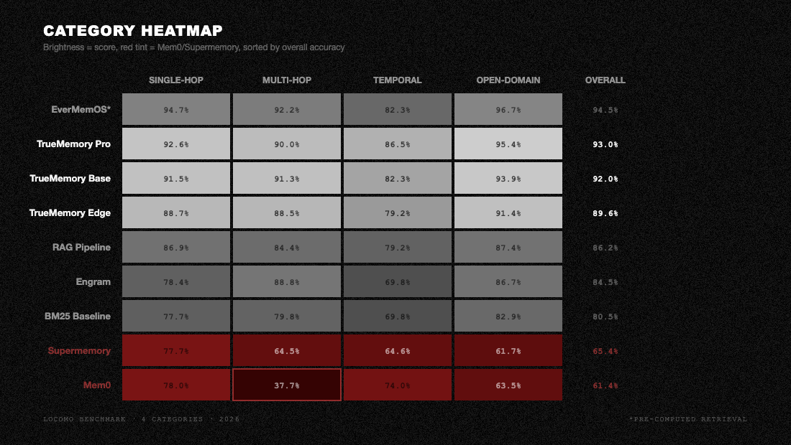
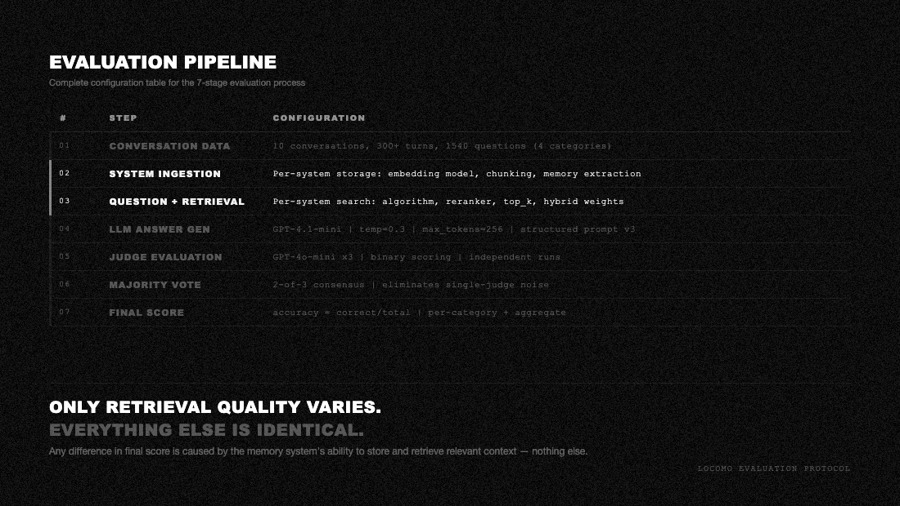

# LoCoMo Benchmark Results

Evaluation of 8 memory systems on the [LoCoMo](https://arxiv.org/abs/2312.17487) benchmark: 10 multi-session conversations, 1540 questions across 4 categories (single-hop, multi-hop, temporal reasoning, open-domain).

## Leaderboard

<p align="center">
  
</p>

<p align="center">
  
</p>

## Evaluation Pipeline

Every system was evaluated with the same pipeline to ensure fair comparison:

1. **Retrieval**: each system ingests the conversation and retrieves context for each question using its own retrieval method.
2. **Answer generation**: `openai/gpt-4.1-mini` via OpenRouter generates an answer from the retrieved context. `temperature=0`, `max_tokens=200`.
3. **LLM judging**: `openai/gpt-4o-mini` via OpenRouter judges whether the generated answer matches the gold answer. `temperature=0`, `max_tokens=10`. Run 3 times per question; majority vote decides correctness.

The answer model, judge model, prompts, temperature, and voting scheme are identical across all 8 systems. Only the retrieval layer differs.

<p align="center">
  
</p>

## How to Reproduce

### Prerequisites

1. A [Modal](https://modal.com) account (free tier works for most systems).
2. An [OpenRouter](https://openrouter.ai) API key for answer generation and judging.
3. For Supermemory: an additional Supermemory API key.

### Setup

```bash
# Create the Modal secret with your OpenRouter key
modal secret create openrouter-key OPENROUTER_API_KEY=sk-or-...

# For Supermemory only
modal secret create supermemory-key SUPERMEMORY_API_KEY=sm_...
```

### Run Individual Systems

Each script in `scripts/` is self-contained with zero local imports:

```bash
# Full run (10 conversations, 1540 questions)
modal run --detach scripts/bench_bm25.py

# Smoke test (1 conversation, 5 questions)
modal run --detach scripts/bench_bm25.py --smoke

# Download results from Modal Volume
modal volume get locomo-results / ./results --force
```

See `scripts/README.md` for details on each script.

### Verify Scores

```bash
python3 scripts/verify_scores.py
```

Recomputes accuracy from the raw JSON result files with zero dependencies beyond Python stdlib.

## File Structure

```
benchmarks/locomo/
  README.md                              # This file
  BENCHMARK_RESULTS.md                   # Full technical report (latency, cost, architecture)
  EVAL_CONFIG.md                         # Evaluation configuration
  requirements.txt                       # Python dependencies grouped by system
  data/
    locomo10.json                        # LoCoMo dataset (10 conversations, 1540 questions)
  results/
    bm25_v2_run1.json                    # BM25 (80.5%)
    engram_v2_run1.json                  # Engram (84.5%)
    evermemos_v2_run1.json               # EverMemOS (94.5%)
    mem0_v2_run1.json                    # Mem0 (61.4%)
    rag_v2_run1.json                     # RAG / ChromaDB (86.2%)
    supermemory_v2_run1.json             # Supermemory (65.4%)
    truememory_edge_v060_run1.json       # TrueMemory Edge run 1 (89.9%)
    truememory_edge_v060_run2.json       # TrueMemory Edge run 2 (89.5%)
    truememory_edge_v060_run3.json       # TrueMemory Edge run 3 (89.5%)
    truememory_base_v060_run2.json       # TrueMemory Base run 2 (92.1%)
    truememory_base_v060_run3.json       # TrueMemory Base run 3 (92.2%)
    truememory_pro_v060_run1.json        # TrueMemory Pro run 1 (92.8%)
    truememory_pro_v060_run2.json        # TrueMemory Pro run 2 (93.1%)
    truememory_pro_v060_run3.json        # TrueMemory Pro run 3 (93.1%)
  scripts/
    README.md                            # Script documentation
    bench_bm25.py                        # BM25 keyword baseline
    bench_engram.py                      # Engram memory system
    bench_evermemos.py                   # EverMemOS (pre-built retrieval)
    bench_mem0.py                        # Mem0 LLM-extracted memory
    bench_truememory_edge.py             # TrueMemory Edge (89.6% 3-run mean, CPU)
    bench_truememory_base.py             # TrueMemory Base (92.0% 3-run mean, T4 GPU)
    bench_truememory_pro.py              # TrueMemory Pro (93.0% 3-run mean, T4 GPU, +HyDE)
    bench_rag.py                         # ChromaDB RAG baseline
    bench_supermemory.py                 # Supermemory cloud API
    verify_scores.py                     # Score verification tool
```

## Full Details

See [BENCHMARK_RESULTS.md](BENCHMARK_RESULTS.md) for the complete technical report including per-category breakdowns, latency analysis, cost breakdown, hardware requirements, and retrieval architecture comparison.
