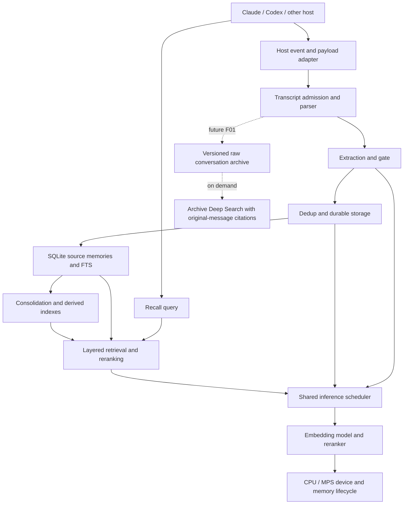

# TrueMemory performance and functionality audit v2

Date: 2026-10-08. This is the planning and issue-catalogue checkpoint. Production fixes and a release have not been implemented by this audit.

## Objective

Make existing TrueMemory reliable and quiet on a 32 GiB machine: bounded unified-memory use, low idle work, responsive interactive recall, and faster completed work without replacing the embedding models or rerankers. Preserve internal retrieval depth 100 and validate quality on the same fixed fixtures. Future archive-level Deep Search is specified separately under F01.

The live incident is real. The exact allocation responsible for its tens of gigabytes has not yet been attributed. Confirmed control-flow defects must not be presented as measured explanations for all of that allocation.

## What was reviewed

- Clean remote-main source at `063e5b8844af735a52fde886217a5d26a0f13064`; the original working checkout and its five preexisting modified files were left intact.
- All 393 issue records and all nine currently open issues, plus eight open PR descriptions; relevant prior resolution comments were inspected before choosing recurrence, update, or hold.
- The 17-page published paper, README, architecture and integration documentation, ingestion, retrieval, consolidation, model-server lifecycle, device fallback, rebuilds, dependency declarations, install scripts, and release CI.
- Three parallel audit workstreams followed by parent reconciliation and independent checks. Findings are attached to exact source revisions and separated from assumptions or future features.
- Four bounded reproduction programs using synthetic inputs and selected real functions. No personal conversation text, real model inference, live database mutation, cloud LLM request, service restart, or global setting change was needed for those probes. The runtime probe uses NumPy and reads the pinned open PR through GitHub; it does not import PyTorch or load weights.

## Incident evidence and interpretation

| Observation | Value | Meaning and limit |
|---|---|---|
| User Activity Monitor screenshot | 26.24 GB for TrueMemory; 12.52 GB system swap | Direct symptom evidence; not a model-allocation trace |
| Machine RAM | 34,359,738,368 bytes / 1,073,741,824 = 32 GiB | Verified with sysctl |
| Process vmmap | Approximately 40.2 G footprint; 78.4 G peak; 36.2 G MALLOC_LARGE | Large heap/footprint, not proof of a particular leak |
| GPU mapping in the same snapshot | Approximately 1.3 G IOAccelerator | GPU mapping alone does not explain the process footprint |
| Runtime state | Embedder and reranker report sticky CPU after MPS OOM | MPS allocator ceilings do not cap later CPU allocations |
| Later process snapshot | 95.4% CPU; RSS 12,794,768 KiB / 1,048,576 = 12.202 GiB | CPU remained active; RSS and footprint are different metrics |
| Later system swap | 15,035.75 MiB / 1024 = 14.683 GiB | System-wide; attribution requires an isolated comparison |
| Stored corpus aggregate | 9,942 rows; mean 233.666 characters; maximum 4,140 characters | Does not support blaming unusually long stored memories; query and padded token shapes remain unmeasured |
| Thermal check | No recorded warning from pmset | Not a temperature or power measurement |

Do not sum RSS, physical footprint, GPU mappings, compressed memory, and swap as disjoint physical allocations. Do not run stress tests on the already pressured process. Detailed operational observations are in `evidence/incident-observations-v1.md`.

## Architecture and data flow

The queue, model execution ownership, device transition, CPU fallback, and recovery budget must be one coherent lifecycle. Independently adding more locks, sleeps, caches, or watermarks can preserve the same failure in another path.

## Execution plan and checkpoints

### Checkpoint 0: baseline and evidence preservation

Inventory actual process family, devices, source/dependency versions, queue depth, active requests, model copies, request text/token shapes, operation durations, footprint, RSS, MPS metrics, and system pressure. Capture metadata only, not private text. Establish a recovered isolated baseline with the same models, corpus shape, and internal retrieval depth before changing behavior. Create a feature branch or isolated checkout for each atomic fix and preserve the original dirty checkout.

Pass condition: the incident can be distinguished from normal warm caching, and the workload, environment, quality fixtures, supported budgets, and stop conditions are recorded before comparison.

### Checkpoint 1: restore release gates

Resolve C01 dependency compatibility first so a fresh wheel can start and product CI is meaningful. Do not mistake Dependabot or CodeQL success for the product matrix. Installer success reporting C15 belongs in this gate when present. Keep packaging changes separate from runtime fixes.

Pass condition: wheel installation and MCP startup work in the supported dependency matrix, including minimum and upper allowed versions; product CI is green on the exact candidate commit.

### Checkpoint 2: bound inference work and recovery

Implement R13 together with R01/R03/R04/R05 as a coherent scheduler: real batch controls, token-aware bounded work, aggregate admission, execution ownership through retries, cancellation after queue waits, and truthful recovery. Address R06/R07 and existing #732 for consistent device policy, then R08/R09/R10 for duplicate models, blocking sampling, and effective budget units. Keep R02 as a measured hypothesis. Treat R11/R12 as blockers on unmerged PR729, not shipped regressions.

Pass condition: fault injection cannot create overlapping inference on an owned model, abandoned requests perform no new inference, queue and active memory accounting stay bounded, CPU fallback obeys the same budget, and recovery actually returns to a known state without reload storms.

### Checkpoint 3: stop avoidable database work and data loss

Implement A06/A07/A08/A09/A10/A17 for compute outside write transactions, atomic derived generations, changed-row updates, rebuild rollback, shared maintenance ownership, and streamed corpus input. Then P01/P02 for durable partial completion and cache invalidation. A11 must preserve the same retrieval candidate semantics. Existing #720/#721 remain explicit dependencies with separate capability and clustering-quality checks.

Pass condition: concurrent readers/writers remain responsive, failure preserves the previous good generation, retry is idempotent, unchanged maintenance avoids full FTS rewrites, and every admitted source range is durably accounted for.

### Checkpoint 4: make advertised functionality real

Implement A02/A03/A04/A05/A14 for provenance, preferences, style statistics, update invalidation, and named temporal landmarks. Fix C05/C06/C07/C08/C09 host transport paths using actual host fixtures and end-to-end dispatch tests. Update C02/C03/C04/C10 and A01 claims alongside the corresponding verified behavior. Existing #722 requires a real Windows host check; configuration-file presence is insufficient.

Pass condition: each supported host demonstrates capture and model-visible recall; original timestamps and attribution survive; derived state follows source corrections; documented data egress matches actual provider boundaries.

### Checkpoint 5: performance, quality, and soak validation

Use cold startup, warm recall, simultaneous sessions, background ingestion, consolidation, tier rebuild, cancellation, and injected MPS failure. Test representative current corpus size near 10,000 rows, a larger fixed corpus, short and long token shapes, and repeated bursts followed by idle periods. Compare identical model identities, model revisions, dimensions, corpus, queries, candidate depth, and reranking policy.

Record p50/p95/p99 latency, throughput, CPU seconds, CPU duty cycle, queue depth, current process-family memory, physical footprint/compression where available, MPS current/driver allocations, model loads, swap delta, and available thermal/power data. Missing thermal telemetry is unknown, not zero heat. Require a stable memory plateau after warmup and a return to the measured idle baseline after work. Ordinary idle operation should perform no unexplained inference or repeated full maintenance.

Declare a numeric supported budget B and measured worst-case incremental work D before release. Admission must show U + D <= B; defer/reject when U + D > B. Include system headroom and a bounded overshoot/recovery contract. An unvalidated arbitrary 1,500 MB watchdog threshold is not a substitute. Choosing and proving B on the 32 GiB target machine is a release gate, not completed work in this audit.

Use fixed retrieval fixtures and a trustworthy adjudicated evaluation set. Preserve historical benchmark variants and judge settings; #716 must not turn a judge change into a claimed retrieval gain. No new paid benchmark run is needed just to validate these planning findings.

### Checkpoint 6: review and release

For each fix: record the failing behavior, implement the smallest complete change, run meaningful regression tests, independently review the diff and failure paths, then make an atomic commit. Integrate in dependency order. Run the full release suite, fresh-wheel smoke checks, quality comparison, and bounded hardware soak on the exact release SHA. Publish the release only after those gates pass, with measured results and explicit remaining limitations. Close issues only with linked merged fixes and acceptance evidence.

F01 is a future phase after runtime and ingestion foundations are stable. It must not add an always-running full-archive inference workload to this performance release.

## Definition of done

- Current model and reranker identities, dimensions, index compatibility, and internal retrieval depth remain intact.
- Supported memory and compute budgets are numeric, enforced across CPU/MPS/fallback and the actual process family, and validated on the target hardware.
- Queue expiry, cancellation, overload, OOM, device changes, and recovery have bounded, observable outcomes.
- Durable ingestion does not mark failed chunks or writes complete; recovery and rebuilds are idempotent.
- Database maintenance preserves the previous good state on failure and avoids unchanged full-index writes.
- Supported host integrations pass real capture and recall checks, with unsupported or unverified hosts labeled accurately.
- Fresh installation, product CI, regression tests, retrieval quality checks, and hardware soak pass for the release commit.
- Release notes contain measured before/after results. No claim that the computer produces zero heat or that all memory growth has been solved without measurement.

## Existing open issue disposition

| Issue | Disposition |
|---|---|
| #732 | Keep open; unify rebuild scheduler device detection with the explicit device override, and test actual model placement as well as the label. R06 covers the separate local-loader gap. |
| #722 | Update with C14; real Windows Desktop lifecycle dispatch is still unverified. |
| #721 | Keep open; quantify cluster-size/noise distributions and per-query materialization before changing parameters. A11 bounds allocation without reducing retrieval depth. |
| #720 | Update with A12; missing optional capability must be visible and must not cause repeated successful-looking maintenance. |
| #716 | Update with C13; use a fixed-answer adjudicated judge-sensitivity test. |
| #397 | Future multi-source ingestion; separate from this performance release and F01 raw-chat research. |
| #384 | Future intelligent dropbox; outside current bug-fix scope. |
| #199 | Future Corpus Sync/shared infrastructure; does not authorize redesigning current single-user isolation. |
| #79 | Future Horizon/HNSW tier; no index/model replacement in this release. |

## Open PR disposition

| PR | Audit disposition |
|---|---|
| #729 | Do not treat as a delivered fix. R11/R12 identify concrete proposal defects; integrate only after scheduler, ownership, memory, and lifecycle review. |
| #734 | Backup/restore proposal; separate feature and data-safety review. |
| #728 | Multi-source ingestion proposal; reconcile source/provenance contracts when resumed. |
| #719 | Provider addition; separate from performance stabilization and explicit egress policy. |
| #715 | Host adapter proposal; require payload and real-dispatch tests, not config-writing tests alone. |
| #733, #724 | Dependency action updates; validate against product CI and release permissions. |
| #555 | Style-only proposal; no performance-release dependency. |

## Held decisions and exclusions

- #296 deliberately scoped current storage to a single user. No new multi-user isolation ticket is filed here.
- #276 explicitly chose opt-out telemetry. C04 corrects identifying-field disclosure without reopening that choice.
- #282 explicitly deferred the oracle badge wording as cosmetic. C12 remains catalogued and held.
- #67 historical reproduction work was tracked internally. C11 records remaining provenance limits without reopening that decision.
- R02, A15, A16, and A18 require impact measurements before optimization claims. R11/R12 concern only an unmerged PR.
- A13 is merged into P01 to avoid two issues for the same completion contract.
- Original user data, local configuration, and the original working tree were not rewritten.

## Reproduction bundle

Portable scripts and their original observed receipts are in the adjacent `evidence/` directory. Run each script from the audited source checkout root, or pass that root as its first argument. These are control-flow audit probes, not production regression tests or performance benchmarks. See README.md for requirements and scope.

## Evidence classes

Reproduced means the stated narrow failure was observed in the described fixture or existing public CI. Code-confirmed means an executable path or contract mismatch was inspected but a full host/hardware run was not performed. Measurement-required means a plausible performance cost or existing user report needs controlled validation. Requested-feature marks future scope. None of these labels alone establishes the root allocation behind the live incident.

## Catalogue summary

hold: 8, merged-into-P01: 1, new: 36, reopen-existing: 1, update-existing: 3.

| ID | Priority | Evidence | Disposition | Finding |
|---|---|---|---|---|
| R01 | P1 | reproduced | new | perf: model server discards batch controls before embedding and reranking |
| R02 | P2 | reproduced | hold | perf: CPU Qwen loads inherit the macOS eager-attention workaround without a resource contract |
| R03 | P1 | reproduced | new | fix: model requests whose deadlines expire in the queue still run inference |
| R04 | P1 | code-confirmed | new | perf: model server has no bound on accepted request threads or queued bytes |
| R05 | P1 | reproduced | new | fix: CPU OOM retries bypass inference ownership and overlap work on the same model |
| R06 | P1 | reproduced | new | fix: local embedding loads ignore TRUEMEMORY_DEVICE=cpu |
| R07 | P1 | reproduced | new | fix: local MPS fallback moves model devices while another inference is running |
| R08 | P1 | reproduced | new | perf: missing shared-server endpoint silently creates per-client local model copies |
| R09 | P2 | reproduced | new | perf: adaptive throttler sleeps 20 seconds inside a batch admission call |
| R10 | P2 | code-confirmed | new | fix: MPS resource budgets use physical RAM where PyTorch uses recommended working-set memory |
| R11 | P1 | reproduced | hold | fix: PR729 logs graceful recycle without scheduling any recycle |
| R12 | P1 | reproduced | hold | fix: PR729 embedding cache retains whole batch arrays through one cached vector |
| R13 | P1 | code-confirmed | reopen-existing | perf: enforce a whole-process memory budget across CPU inference and recovery |
| A01 | P2 | code-confirmed | new | docs/architecture: distinguish verbatim benchmark ingestion from extracted-fact auto-capture |
| A02 | P1 | reproduced | new | fix: preserve source timestamps, session provenance, and gate signals on ingested facts |
| A03 | P2 | reproduced | new | fix: scheduled preference extraction reports success while doing no work |
| A04 | P2 | reproduced | new | fix: incremental L0 style vectors are not the advertised mean and depend on insert order |
| A05 | P1 | reproduced | new | fix: memory updates leave stale L0 and consolidated artifacts after source content changes |
| A06 | P1 | reproduced | new | perf: clustering holds the write lock during computation and can commit an empty cache after failure |
| A07 | P1 | reproduced | new | perf: surprise-index rebuild holds the writer lock and loses prior scores on caught failures |
| A08 | P1 | reproduced | new | perf: episode recomputation rewrites the full FTS index twice without content changes |
| A09 | P1 | reproduced | new | fix: separation OOM retries a partially inserted tier-rebuild batch without rollback |
| A10 | P1 | reproduced | new | perf: coalesce automatic consolidation by database and track freshness independently of clustering |
| A11 | P2 | code-confirmed | new | perf: bound clustered-search materialization without changing the retrieval pool |
| A12 | P2 | code-confirmed | update-existing | fix: report missing clustering capability honestly in background maintenance health |
| A13 | P1 | code-confirmed | merged-into-P01 | fix: do not finalize auto-ingestion after extraction chunks or fact writes fail |
| A14 | P2 | reproduced | new | fix: connect named landmark dates to temporal query resolution or narrow the advertised behavior |
| A15 | P2 | measurement-required | hold | perf: measure repeated integrity checks when parallel search opens per-query databases |
| A16 | P2 | measurement-required | hold | perf: measure the full sender-diversity recount on every hybrid search |
| A17 | P2 | code-confirmed | new | perf: stream rebuild inputs instead of retaining the full message corpus before batching |
| A18 | P2 | measurement-required | hold | perf: profile repeated fact embeddings and lock-held LLM dedup before optimizing ingest |
| C01 | P1 | reproduced | new | Fresh main installation permits MCP 2 although the server imports removed FastMCP |
| C02 | P1 | reproduced | new | Automatic extraction can send transcript text to cloud providers despite the local-only claim |
| C03 | P1 | reproduced | new | DeepSearch refinement sends retrieved memory excerpts to its LLM, contradicting query-only egress |
| C04 | P2 | reproduced | new | Telemetry described as anonymous includes configured email and stable device identifier |
| C05 | P1 | reproduced | new | Shared transcript allowlist rejects default native Codex and Gemini session paths |
| C06 | P1 | reproduced | new | Codex rollout messages parse as zero conversation turns |
| C07 | P1 | code-confirmed | new | Shared recall JSON does not match native Cursor, Gemini, or Codex hook output contracts |
| C08 | P1 | code-confirmed | new | OpenClaw per-prompt bridge sends the wrong key and discards recall output |
| C09 | P1 | code-confirmed | new | Hermes shell hooks are installed without translating native event payloads or context output |
| C10 | P2 | code-confirmed | new | Manual integration setup snippets still reproduce previously fixed adapter configuration failures |
| C11 | P2 | code-confirmed | hold | Historical benchmark reruns resolve moving code and omit immutable execution provenance |
| C12 | P3 | code-confirmed | hold | README LongMemEval headline remains the unqualified oracle score |
| C13 | P2 | measurement-required | update-existing | BEAM verification remains sensitive to the weak default judge identified in open #716 |
| C14 | P1 | measurement-required | update-existing | Windows Claude Desktop capture still depends on an unverified SessionEnd dispatch path |
| C15 | P2 | code-confirmed | new | Installers report all models ready even after model downloads fail |
| P01 | P1 | reproduced | new | Ingestion marks sessions complete after failed extraction chunks or database writes |
| P02 | P2 | reproduced | new | Direct text ingestion leaves the recall cache stale after successful writes |
| F01 | P2 (future) | requested-feature | new | Deep Search across the complete accessible Claude and Codex conversation archive |

## Claims coverage

This matrix records both working implementations and gaps. Implemented means a corresponding code path exists; it is not a new reproduction of historical benchmark scores.

### Architecture claims

#### 1. Six-layer memory architecture has concrete storage, retrieval, and maintenance implementations.

- Source: https://arxiv.org/html/2605.04897v1#S4
- Implementation: L0 personality, L1 FTS, L2 vectors, L3 temporal/salience, L4 consolidation and L5 surprise modules are wired by engine.search/consolidate. Individual routes have the limitations below.
- Status: implemented
- Issue ids: No issue identified.
- Evidence: - https://github.com/buildingjoshbetter/TrueMemory/blob/063e5b8844af735a52fde886217a5d26a0f13064/truememory/engine.py#L1729-L2120; - https://github.com/buildingjoshbetter/TrueMemory/blob/063e5b8844af735a52fde886217a5d26a0f13064/truememory/engine.py#L1014-L1152

#### 2. Admitted input events are stored verbatim before later interpretation.

- Source: https://arxiv.org/html/2605.04897v1#S4
- Implementation: Bulk JSON import preserves incoming message content. Automatic transcript capture extracts and tags facts before admission/storage; no raw-event mapping is written by that path. External client transcripts may remain on disk.
- Status: partial
- Issue ids: - A01; - A02; - F01
- Evidence: - https://github.com/buildingjoshbetter/TrueMemory/blob/063e5b8844af735a52fde886217a5d26a0f13064/truememory/engine.py#L1464-L1468; - https://github.com/buildingjoshbetter/TrueMemory/blob/063e5b8844af735a52fde886217a5d26a0f13064/truememory/ingest/pipeline.py#L439-L468; - https://github.com/buildingjoshbetter/TrueMemory/blob/063e5b8844af735a52fde886217a5d26a0f13064/truememory/ingest/pipeline.py#L678-L730

#### 3. Production encoding gate combines novelty, salience and prediction error with category adjustments and a preservation floor.

- Source: https://arxiv.org/html/2605.04897v1#S4
- Implementation: evaluate computes the signals, normalizes nonzero weights, applies correction/failure rules, minimum preservation and category thresholds. Auto-capture evaluates extracted facts.
- Status: implemented
- Issue ids: No issue identified.
- Evidence: - https://github.com/buildingjoshbetter/TrueMemory/blob/063e5b8844af735a52fde886217a5d26a0f13064/truememory/ingest/encoding_gate.py#L242-L329

#### 4. Gate-disabled benchmark results evaluate the full retrieval substrate, not production gate accuracy.

- Source: https://arxiv.org/html/2605.04897v1#S6
- Implementation: Paper explicitly disables admission gating during benchmarks and says gated end-to-end accuracy is unmeasured. This historical experimental choice is not a missing production feature.
- Status: historical
- Issue ids: No issue identified.
- Evidence: - https://github.com/buildingjoshbetter/TrueMemory/blob/063e5b8844af735a52fde886217a5d26a0f13064/truememory/ingest/encoding_gate.py#L242-L329

#### 5. Novelty uses compression against nearest stored content.

- Source: https://arxiv.org/html/2605.04897v1#S4
- Implementation: Nearest-neighbor/fallback lookup and gzip conditional-compression score are implemented. No quality or gate-latency benchmark was executed in this audit.
- Status: implemented
- Issue ids: No issue identified.
- Evidence: - https://github.com/buildingjoshbetter/TrueMemory/blob/063e5b8844af735a52fde886217a5d26a0f13064/truememory/ingest/encoding_gate.py#L365-L423

#### 6. Gate scores are retained with admitted events for later analysis.

- Source: https://arxiv.org/html/2605.04897v1#S4
- Implementation: Scores are trace fields; _store_fact passes no metadata to engine.add. The source record also loses session identity and original event time.
- Status: missing
- Issue ids: - A02
- Evidence: - https://github.com/buildingjoshbetter/TrueMemory/blob/063e5b8844af735a52fde886217a5d26a0f13064/truememory/ingest/pipeline.py#L475-L492; - https://github.com/buildingjoshbetter/TrueMemory/blob/063e5b8844af735a52fde886217a5d26a0f13064/truememory/ingest/pipeline.py#L678-L730

#### 7. Raw message storage has FTS5 and dense vector indexes.

- Source: https://arxiv.org/html/2605.04897v1#S4
- Implementation: SQLite messages/FTS triggers and vector insertion/search paths exist; automatic capture supplies extracted fact text rather than full original messages.
- Status: implemented
- Issue ids: - A01; - A08
- Evidence: - https://github.com/buildingjoshbetter/TrueMemory/blob/063e5b8844af735a52fde886217a5d26a0f13064/truememory/storage.py#L30-L67; - https://github.com/buildingjoshbetter/TrueMemory/blob/063e5b8844af735a52fde886217a5d26a0f13064/truememory/engine.py#L724-L798

#### 8. Hybrid retrieval fuses FTS, completion and optional separation vector results using weighted RRF.

- Source: https://arxiv.org/html/2605.04897v1#S4
- Implementation: hybrid_search has candidate pools, source fusion and sender-diversity conditional separation weighting. Sender recount cost remains unmeasured.
- Status: implemented
- Issue ids: - A16
- Evidence: - https://github.com/buildingjoshbetter/TrueMemory/blob/063e5b8844af735a52fde886217a5d26a0f13064/truememory/hybrid.py#L123-L206

#### 9. Internal reranking window100 and presentation limit10 are distinct.

- Source: https://arxiv.org/html/2605.04897v1#S4
- Implementation: Normal MCP search uses the established internal100 limit. This audit treats pool size and current embedding/reranker choices as locked.
- Status: implemented
- Issue ids: No issue identified.
- Evidence: - https://github.com/buildingjoshbetter/TrueMemory/blob/063e5b8844af735a52fde886217a5d26a0f13064/truememory/mcp_server.py#L756; - https://github.com/buildingjoshbetter/TrueMemory/blob/063e5b8844af735a52fde886217a5d26a0f13064/truememory/mcp_server.py#L1137-L1144

#### 10. Temporal query interpretation and date-filtered retrieval are active.

- Source: https://arxiv.org/html/2605.04897v1#S4
- Implementation: Date references, trajectory detection and timeline fallback are wired into engine.search. Source dates are only as faithful as the ingestion route that supplied them.
- Status: implemented
- Issue ids: - A02
- Evidence: - https://github.com/buildingjoshbetter/TrueMemory/blob/063e5b8844af735a52fde886217a5d26a0f13064/truememory/temporal.py#L96-L198; - https://github.com/buildingjoshbetter/TrueMemory/blob/063e5b8844af735a52fde886217a5d26a0f13064/truememory/temporal.py#L215-L595; - https://github.com/buildingjoshbetter/TrueMemory/blob/063e5b8844af735a52fde886217a5d26a0f13064/truememory/engine.py#L1826-L1908

#### 11. Stored named landmarks can answer after-an-event queries without an explicit date.

- Source: truememory/temporal.py build_temporal_landmarks docstring
- Implementation: Landmarks are stored, but temporal query parsing has no database/landmark lookup. The isolated named-event query produces no temporal window.
- Status: missing
- Issue ids: - A14
- Evidence: - https://github.com/buildingjoshbetter/TrueMemory/blob/063e5b8844af735a52fde886217a5d26a0f13064/truememory/temporal.py#L337-L355; - https://github.com/buildingjoshbetter/TrueMemory/blob/063e5b8844af735a52fde886217a5d26a0f13064/truememory/temporal.py#L823-L906

#### 12. Episode segmentation groups events by conversation/time gaps.

- Source: https://arxiv.org/html/2605.04897v1#S4
- Implementation: compute_episodes stores assignments; it clears and rewrites every message on each pass, unnecessarily invoking FTS updates.
- Status: implemented
- Issue ids: - A08
- Evidence: - https://github.com/buildingjoshbetter/TrueMemory/blob/063e5b8844af735a52fde886217a5d26a0f13064/truememory/temporal.py#L676-L746; - https://github.com/buildingjoshbetter/TrueMemory/blob/063e5b8844af735a52fde886217a5d26a0f13064/truememory/storage.py#L63-L67

#### 13. Episode expansion is available as a retrieval helper.

- Source: Repository temporal.py public helper
- Implementation: expand_to_episodes exists but was not found on the default engine.search route. Paper table DDL alone is not a promise that every query expands episodes.
- Status: partial
- Issue ids: No issue identified.
- Evidence: - https://github.com/buildingjoshbetter/TrueMemory/blob/063e5b8844af735a52fde886217a5d26a0f13064/truememory/temporal.py#L768-L816; - https://github.com/buildingjoshbetter/TrueMemory/blob/063e5b8844af735a52fde886217a5d26a0f13064/truememory/engine.py#L1729-L2120

#### 14. Causal-edge storage is part of the schema.

- Source: https://arxiv.org/html/2605.04897v1#S4
- Implementation: causal_edges DDL exists. Source census found no populated causal inference writer/query stage; table existence does not establish causal reasoning. The paper DDL description alone does not require a new defect ticket.
- Status: partial
- Issue ids: No issue identified.
- Evidence: - https://github.com/buildingjoshbetter/TrueMemory/blob/063e5b8844af735a52fde886217a5d26a0f13064/truememory/storage.py#L138-L149

#### 15. L4 summaries and contradictions are computed after ingestion.

- Source: https://arxiv.org/html/2605.04897v1#S4
- Implementation: Both execute. Summaries group full-history monthly and entity-monthly buckets, not exactly the recent sliding-window cluster input described in the paper.
- Status: partial
- Issue ids: - A10
- Evidence: - https://github.com/buildingjoshbetter/TrueMemory/blob/063e5b8844af735a52fde886217a5d26a0f13064/truememory/consolidation.py#L868-L1068; - https://github.com/buildingjoshbetter/TrueMemory/blob/063e5b8844af735a52fde886217a5d26a0f13064/truememory/engine.py#L1084-L1103

#### 16. Contradiction detection and supersession timeline records exist.

- Source: https://arxiv.org/html/2605.04897v1#S4
- Implementation: Pattern-based contradiction extraction and atomic contradiction/timeline replacement are implemented. General semantic accuracy is not established by this code audit.
- Status: implemented
- Issue ids: No issue identified.
- Evidence: - https://github.com/buildingjoshbetter/TrueMemory/blob/063e5b8844af735a52fde886217a5d26a0f13064/truememory/consolidation.py#L432-L865; - https://github.com/buildingjoshbetter/TrueMemory/blob/063e5b8844af735a52fde886217a5d26a0f13064/truememory/engine.py#L1950-L1982

#### 17. L5 uses heuristic predictive fingerprints and surprise reweighting.

- Source: https://arxiv.org/html/2605.04897v1#S4
- Implementation: Number/noun/date/event/definition fingerprints, surprise index and multiplicative score boost are implemented. The paper identifies heuristics explicitly; no missing learned Bayesian predictor is alleged.
- Status: implemented
- Issue ids: - A07
- Evidence: - https://github.com/buildingjoshbetter/TrueMemory/blob/063e5b8844af735a52fde886217a5d26a0f13064/truememory/predictive.py#L141-L366; - https://github.com/buildingjoshbetter/TrueMemory/blob/063e5b8844af735a52fde886217a5d26a0f13064/truememory/l5_boost.py#L70-L137

#### 18. L0 builds per-speaker traits, style, topics and relationship profiles.

- Source: https://arxiv.org/html/2605.04897v1#S4
- Implementation: Batch and incremental profile writers exist, and personality search reads profiles. Speaker identifiers come from stored senders; automatic capture commonly uses one configured user sender.
- Status: implemented
- Issue ids: - A01; - A05
- Evidence: - https://github.com/buildingjoshbetter/TrueMemory/blob/063e5b8844af735a52fde886217a5d26a0f13064/truememory/personality.py#L441-L556; - https://github.com/buildingjoshbetter/TrueMemory/blob/063e5b8844af735a52fde886217a5d26a0f13064/truememory/personality.py#L844-L1053

#### 19. L0 scheduled preference-map refresh produces persisted preference buckets.

- Source: https://arxiv.org/html/2605.04897v1#S4
- Implementation: Both scheduled callsites pass entity=None, immediately returning {}; results are not persisted or consumed. Entity-scoped helper itself can calculate a dictionary.
- Status: missing
- Issue ids: - A03
- Evidence: - https://github.com/buildingjoshbetter/TrueMemory/blob/063e5b8844af735a52fde886217a5d26a0f13064/truememory/personality.py#L559-L585; - https://github.com/buildingjoshbetter/TrueMemory/blob/063e5b8844af735a52fde886217a5d26a0f13064/truememory/personality.py#L672-L685; - https://github.com/buildingjoshbetter/TrueMemory/blob/063e5b8844af735a52fde886217a5d26a0f13064/truememory/engine.py#L1076-L1082; - https://github.com/buildingjoshbetter/TrueMemory/blob/063e5b8844af735a52fde886217a5d26a0f13064/truememory/engine.py#L1538-L1548

#### 20. Preference/personality queries can still retrieve relevant original evidence.

- Source: https://arxiv.org/html/2605.04897v1#S4
- Implementation: Aspect-based FTS personality search and profile supplementation are live despite the disconnected scheduled preference-map helper.
- Status: implemented
- Issue ids: No issue identified.
- Evidence: - https://github.com/buildingjoshbetter/TrueMemory/blob/063e5b8844af735a52fde886217a5d26a0f13064/truememory/personality.py#L688-L907; - https://github.com/buildingjoshbetter/TrueMemory/blob/063e5b8844af735a52fde886217a5d26a0f13064/truememory/engine.py#L1910-L1948

#### 21. Style vectors use 256-dimensional character3/4/5-gram hashing and normalized mean pooling.

- Source: https://arxiv.org/html/2605.04897v1#S4
- Implementation: Batch path implements normalized mean pooling. Incremental path rescales a previously normalized mean as if it were an unnormalized sum, making insertion order matter.
- Status: partial
- Issue ids: - A04
- Evidence: - https://github.com/buildingjoshbetter/TrueMemory/blob/063e5b8844af735a52fde886217a5d26a0f13064/truememory/personality_style_vec.py#L32-L90; - https://github.com/buildingjoshbetter/TrueMemory/blob/063e5b8844af735a52fde886217a5d26a0f13064/truememory/personality_style_vec.py#L114-L162; - https://github.com/buildingjoshbetter/TrueMemory/blob/063e5b8844af735a52fde886217a5d26a0f13064/truememory/personality_style_vec.py#L215-L232

#### 22. Profile refresh tracks corrections to source evidence.

- Source: https://arxiv.org/html/2605.04897v1#S4
- Implementation: Adding messages updates profiles; engine.update does not invalidate or rebuild source-derived profile fields. Synthetic sender/content reassignment leaves the previous profile intact.
- Status: partial
- Issue ids: - A05
- Evidence: - https://github.com/buildingjoshbetter/TrueMemory/blob/063e5b8844af735a52fde886217a5d26a0f13064/truememory/engine.py#L780-L798; - https://github.com/buildingjoshbetter/TrueMemory/blob/063e5b8844af735a52fde886217a5d26a0f13064/truememory/engine.py#L1154-L1231

#### 23. Relationship strength is derived from interaction frequency.

- Source: https://arxiv.org/html/2605.04897v1#S4
- Implementation: Dunbar-style relationships use sender/recipient counts. This is not equivalent to extracting all people mentioned in conversation text; auto-capture does not supply recipient metadata.
- Status: partial
- Issue ids: - A02
- Evidence: - https://github.com/buildingjoshbetter/TrueMemory/blob/063e5b8844af735a52fde886217a5d26a0f13064/truememory/personality.py#L1242-L1310; - https://github.com/buildingjoshbetter/TrueMemory/blob/063e5b8844af735a52fde886217a5d26a0f13064/truememory/ingest/pipeline.py#L710-L715

#### 24. Entity-name resolution helper exists.

- Source: Repository personality.py public helper
- Implementation: Direct/fuzzy-name and context-word-overlap resolver is implemented but source census found no runtime caller; it is not proof of an active semantic entity-disambiguation layer.
- Status: partial
- Issue ids: No issue identified.
- Evidence: - https://github.com/buildingjoshbetter/TrueMemory/blob/063e5b8844af735a52fde886217a5d26a0f13064/truememory/personality.py#L1180-L1239

#### 25. Query salience filtering and surprise/personality/temporal supplements compose before reranking.

- Source: https://arxiv.org/html/2605.04897v1#S4
- Implementation: Engine wires these independent stages; salience features and filters have implementation and dedicated tests. No broad formula mismatch is alleged.
- Status: implemented
- Issue ids: No issue identified.
- Evidence: - https://github.com/buildingjoshbetter/TrueMemory/blob/063e5b8844af735a52fde886217a5d26a0f13064/truememory/engine.py#L1826-L2120; - https://github.com/buildingjoshbetter/TrueMemory/blob/063e5b8844af735a52fde886217a5d26a0f13064/truememory/salience.py#L195-L209; - https://github.com/buildingjoshbetter/TrueMemory/blob/063e5b8844af735a52fde886217a5d26a0f13064/truememory/salience.py#L508-L566

#### 26. Final reranking distinguishes detail queries and synthesis summaries.

- Source: https://arxiv.org/html/2605.04897v1#S4
- Implementation: Query modality classification and summary multipliers are implemented. Current model choices are preserved.
- Status: implemented
- Issue ids: No issue identified.
- Evidence: - https://github.com/buildingjoshbetter/TrueMemory/blob/063e5b8844af735a52fde886217a5d26a0f13064/truememory/reranker.py#L368-L435; - https://github.com/buildingjoshbetter/TrueMemory/blob/063e5b8844af735a52fde886217a5d26a0f13064/truememory/engine.py#L2070-L2120

#### 27. Automatic background maintenance updates derived layers as memories accumulate.

- Source: README.md lines36-44 and engine lifecycle
- Implementation: Maintenance exists, but ownership/counters are engine-local and freshness uses cluster emptiness. Missing clustering or multiple engines can repeat whole-store work.
- Status: partial
- Issue ids: - A10; - A12
- Evidence: - https://github.com/buildingjoshbetter/TrueMemory/blob/063e5b8844af735a52fde886217a5d26a0f13064/truememory/engine.py#L658-L675; - https://github.com/buildingjoshbetter/TrueMemory/blob/063e5b8844af735a52fde886217a5d26a0f13064/truememory/engine.py#L813-L836

#### 28. Clustering is an available optional retrieval/maintenance capability.

- Source: Repository clustering.py and engine optional import
- Implementation: HDBSCAN route is implemented when installed. Missing dependency is caught and later maintenance can still report success; existing open#720 covers the missing capability.
- Status: partial
- Issue ids: - A06; - A11; - A12
- Evidence: - https://github.com/buildingjoshbetter/TrueMemory/blob/063e5b8844af735a52fde886217a5d26a0f13064/truememory/engine.py#L1050-L1074; - https://github.com/buildingjoshbetter/TrueMemory/blob/063e5b8844af735a52fde886217a5d26a0f13064/truememory/clustering.py#L80-L189; - https://github.com/buildingjoshbetter/TrueMemory/blob/063e5b8844af735a52fde886217a5d26a0f13064/truememory/clustering.py#L225-L347

#### 29. Optional entity summary sheets are absent from normal bulk refresh by design.

- Source: Repository engine.py bulk ingest comments
- Implementation: Explicitly disabled by default for a documented evaluation/precision decision. Disabled optional enrichment is not an unimplemented core layer.
- Status: historical
- Issue ids: No issue identified.
- Evidence: - https://github.com/buildingjoshbetter/TrueMemory/blob/063e5b8844af735a52fde886217a5d26a0f13064/truememory/engine.py#L1624-L1639

#### 30. Automatic capture completes only after all source processing succeeds.

- Source: README.md automatic capture reliability
- Implementation: Failed extraction chunks and storage_failed actions can return normally and reach extracted-marker/backlog finalization. Consolidated with parent P01 rather than separately published.
- Status: partial
- Issue ids: - A13; - P01
- Evidence: - https://github.com/buildingjoshbetter/TrueMemory/blob/063e5b8844af735a52fde886217a5d26a0f13064/truememory/ingest/extractor.py#L253-L284; - https://github.com/buildingjoshbetter/TrueMemory/blob/063e5b8844af735a52fde886217a5d26a0f13064/truememory/ingest/pipeline.py#L525-L578; - https://github.com/buildingjoshbetter/TrueMemory/blob/063e5b8844af735a52fde886217a5d26a0f13064/truememory/ingest/cli.py#L222-L251

#### 31. Current Deep Search searches the full raw Claude/Codex archive.

- Source: Current MCP tool name versus future user request F01
- Implementation: Current deep route calls Memory.search_deep -> engine.search_agentic over stored memories. Raw-history discovery and source-citable archive search are the separately requested futureF01 capability, not a promised implemented current feature.
- Status: missing
- Issue ids: - A01; - F01
- Evidence: - https://github.com/buildingjoshbetter/TrueMemory/blob/063e5b8844af735a52fde886217a5d26a0f13064/truememory/mcp_server.py#L1148-L1196; - https://github.com/buildingjoshbetter/TrueMemory/blob/063e5b8844af735a52fde886217a5d26a0f13064/truememory/client.py#L230-L261; - https://github.com/buildingjoshbetter/TrueMemory/blob/063e5b8844af735a52fde886217a5d26a0f13064/truememory/engine.py#L2126-L2446

#### 32. Tier rebuilds make durable progress and can retry OOM batches.

- Source: Repository tier_switch worker and cache
- Implementation: Batch tracking exists. Completion rows are inserted before separation inference, and the OOM continue path does not roll back partial inserts. Input materialization also precedes batching.
- Status: partial
- Issue ids: - A09; - A17
- Evidence: - https://github.com/buildingjoshbetter/TrueMemory/blob/063e5b8844af735a52fde886217a5d26a0f13064/truememory/tier_switch/worker.py#L131-L150; - https://github.com/buildingjoshbetter/TrueMemory/blob/063e5b8844af735a52fde886217a5d26a0f13064/truememory/tier_switch/worker.py#L193-L224; - https://github.com/buildingjoshbetter/TrueMemory/blob/063e5b8844af735a52fde886217a5d26a0f13064/truememory/tier_switch/cache.py#L178-L208

#### 33. Published benchmark accuracy, ablations and device memory figures hold for current installed production.

- Source: Paper sections6-8 and limitations
- Implementation: Paper describes historical experiments with explicit benchmark and gate limitations. This architecture audit did not rerun model benchmarks, measure device memory, or validate all current-version claims; performance/benchmark audit is owned separately.
- Status: unverified
- Issue ids: No issue identified.
- Evidence: - https://github.com/buildingjoshbetter/TrueMemory/blob/063e5b8844af735a52fde886217a5d26a0f13064/truememory/engine.py#L1427-L1707

### Contracts claims

#### 1. Persistent memories are stored locally in SQLite.

- Source: https://github.com/buildingjoshbetter/TrueMemory/blob/063e5b8844af735a52fde886217a5d26a0f13064/README.md#L40
- Implementation: SQLite storage, local DB default, Python client and MCP handlers are implemented. Local storage alone does not imply no egress.
- Status: implemented
- Issue ids: - C02; - C03
- Evidence: - https://github.com/buildingjoshbetter/TrueMemory/blob/063e5b8844af735a52fde886217a5d26a0f13064/truememory/storage.py#L1; - https://github.com/buildingjoshbetter/TrueMemory/blob/063e5b8844af735a52fde886217a5d26a0f13064/truememory/client.py#L1

#### 2. TrueMemory is 100% local; memories never leave the device.

- Source: https://github.com/buildingjoshbetter/TrueMemory/blob/063e5b8844af735a52fde886217a5d26a0f13064/README.md#L40
- Implementation: Local storage and retrieval coexist with automatic cloud transcript extraction and cloud memory-aware refinement.
- Status: partial
- Issue ids: - C02; - C03
- Evidence: - https://github.com/buildingjoshbetter/TrueMemory/blob/063e5b8844af735a52fde886217a5d26a0f13064/truememory/ingest/models.py#L193-L227; - https://github.com/buildingjoshbetter/TrueMemory/blob/063e5b8844af735a52fde886217a5d26a0f13064/truememory/agentic_search.py#L86-L140

#### 3. Edge/Base make zero external calls.

- Source: https://github.com/buildingjoshbetter/TrueMemory/blob/063e5b8844af735a52fde886217a5d26a0f13064/README.md#L217
- Implementation: Ordinary local retrieval needs no query LLM, but extraction provider auto-detection and explicit DeepSearch cloud overrides are independent of tier. Model downloads and telemetry also involve network access.
- Status: partial
- Issue ids: - C02; - C03
- Evidence: - https://github.com/buildingjoshbetter/TrueMemory/blob/063e5b8844af735a52fde886217a5d26a0f13064/truememory/ingest/pipeline.py#L393-L401; - https://github.com/buildingjoshbetter/TrueMemory/blob/063e5b8844af735a52fde886217a5d26a0f13064/truememory/mcp_server.py#L735-L747

#### 4. Pro sends only search-query text to an LLM.

- Source: https://github.com/buildingjoshbetter/TrueMemory/blob/063e5b8844af735a52fde886217a5d26a0f13064/README.md#L217
- Implementation: Query expansion exists; agentic refinement adds retrieved memory excerpts.
- Status: partial
- Issue ids: - C03
- Evidence: - https://github.com/buildingjoshbetter/TrueMemory/blob/063e5b8844af735a52fde886217a5d26a0f13064/truememory/agentic_search.py#L86-L140; - evidence/parent-repro-v1.txt

#### 5. No memory content is sent through usage telemetry.

- Source: https://github.com/buildingjoshbetter/TrueMemory/blob/063e5b8844af735a52fde886217a5d26a0f13064/README.md#L232
- Implementation: Reviewed session/tool telemetry uses metadata rather than memory/query content. This is separate from inference egress.
- Status: implemented
- Issue ids: No issue identified.
- Evidence: - https://github.com/buildingjoshbetter/TrueMemory/blob/063e5b8844af735a52fde886217a5d26a0f13064/truememory/telemetry.py#L119-L137

#### 6. Usage telemetry is anonymous.

- Source: https://github.com/buildingjoshbetter/TrueMemory/blob/063e5b8844af735a52fde886217a5d26a0f13064/README.md#L232
- Implementation: Email, UUID and stable device ID are included when configured. Opt-out default is an intentional prior decision.
- Status: partial
- Issue ids: - C04
- Evidence: - evidence/contracts-repro-v1.txt; - https://github.com/buildingjoshbetter/TrueMemory/issues/276

#### 7. Existing telemetry opt-out disables collection.

- Source: https://github.com/buildingjoshbetter/TrueMemory/blob/063e5b8844af735a52fde886217a5d26a0f13064/docs/env-vars.md#L73
- Implementation: is_enabled checks environment/config; no decision to change the default is proposed.
- Status: implemented
- Issue ids: No issue identified.
- Evidence: - https://github.com/buildingjoshbetter/TrueMemory/blob/063e5b8844af735a52fde886217a5d26a0f13064/truememory/telemetry.py#L160; - https://github.com/buildingjoshbetter/TrueMemory/issues/276

#### 8. A fresh install from main starts the MCP server.

- Source: https://github.com/buildingjoshbetter/TrueMemory/blob/063e5b8844af735a52fde886217a5d26a0f13064/README.md#L63
- Implementation: Dependency range admits MCP 2 but server imports FastMCP from removed module.
- Status: partial
- Issue ids: - C01
- Evidence: - https://github.com/buildingjoshbetter/TrueMemory/actions/runs/33274083342

#### 9. Eleven MCP tools are exposed.

- Source: https://github.com/buildingjoshbetter/TrueMemory/blob/063e5b8844af735a52fde886217a5d26a0f13064/docs/mcp-tools.md#L3
- Implementation: Eleven decorated handlers exist, including status and consolidate missing from the detailed reference sections; startup still depends on compatible MCP package.
- Status: implemented
- Issue ids: - C01
- Evidence: - https://github.com/buildingjoshbetter/TrueMemory/blob/063e5b8844af735a52fde886217a5d26a0f13064/truememory/mcp_server.py#L1010-L1632

#### 10. Python Memory add/search/get/update/delete/stats API exists.

- Source: https://github.com/buildingjoshbetter/TrueMemory/blob/063e5b8844af735a52fde886217a5d26a0f13064/docs/python-api.md#L3
- Implementation: Methods delegate to engine/storage and support context management; audit did not load models or claim every documented method behavior is end-to-end tested.
- Status: implemented
- Issue ids: No issue identified.
- Evidence: - https://github.com/buildingjoshbetter/TrueMemory/blob/063e5b8844af735a52fde886217a5d26a0f13064/truememory/client.py#L75-L332

#### 11. Standard MCP search uses an internal candidate pool of 100; DeepSearch uses 500.

- Source: https://github.com/buildingjoshbetter/TrueMemory/blob/063e5b8844af735a52fde886217a5d26a0f13064/docs/mcp-tools.md#L66
- Implementation: Explicit internal constants and search dispatch preserve this distinction. No reduced candidate count is proposed.
- Status: implemented
- Issue ids: No issue identified.
- Evidence: - https://github.com/buildingjoshbetter/TrueMemory/blob/063e5b8844af735a52fde886217a5d26a0f13064/truememory/mcp_server.py#L756-L757

#### 12. Automatic conversation capture and recall works for every advertised hook host.

- Source: https://github.com/buildingjoshbetter/TrueMemory/blob/063e5b8844af735a52fde886217a5d26a0f13064/README.md#L38
- Implementation: Config writers exist, but transcript admission/parsing and native input/output transport contain demonstrated gaps.
- Status: partial
- Issue ids: - C05; - C06; - C07; - C08; - C09; - C14
- Evidence: - evidence/contracts-repro-v1.txt; - https://github.com/buildingjoshbetter/TrueMemory/blob/063e5b8844af735a52fde886217a5d26a0f13064/docs/compatibility.md#L9

#### 13. Claude Code integration installs lifecycle hooks.

- Source: https://github.com/buildingjoshbetter/TrueMemory/blob/063e5b8844af735a52fde886217a5d26a0f13064/docs/compatibility.md#L9
- Implementation: Actual SessionStart/SessionEnd/UserPromptSubmit/PreCompact registration and shared hook code exist. Windows Desktop dispatch remains open.
- Status: implemented
- Issue ids: - C14
- Evidence: - https://github.com/buildingjoshbetter/TrueMemory/blob/063e5b8844af735a52fde886217a5d26a0f13064/truememory/hooks/adapters/claude.py#L140

#### 14. Codex native hook configuration uses nested event groups and seconds.

- Source: https://github.com/buildingjoshbetter/TrueMemory/blob/063e5b8844af735a52fde886217a5d26a0f13064/truememory/hooks/adapters/codex.py#L1
- Implementation: Automatic adapter uses nested hooks with command type and second timeouts. Manual guide retains obsolete configuration. Runtime transcript/recall gaps remain.
- Status: partial
- Issue ids: - C05; - C06; - C07; - C10
- Evidence: - https://github.com/buildingjoshbetter/TrueMemory/blob/063e5b8844af735a52fde886217a5d26a0f13064/truememory/hooks/adapters/codex.py#L169-L178; - https://learn.chatgpt.com/docs/hooks

#### 15. Cursor native hooks support automatic recall/capture.

- Source: https://github.com/buildingjoshbetter/TrueMemory/blob/063e5b8844af735a52fde886217a5d26a0f13064/docs/setup-cursor.md#L1
- Implementation: Native config and corrected seconds exist; sessionStart context serialization differs, while beforeSubmitPrompt requires a separately validated injection mechanism. Transcript dispatch remains to be verified.
- Status: partial
- Issue ids: - C05; - C07; - C10
- Evidence: - https://github.com/buildingjoshbetter/TrueMemory/blob/063e5b8844af735a52fde886217a5d26a0f13064/truememory/hooks/adapters/cursor.py#L205-L209; - https://prod.cursor.com/docs/hooks

#### 16. Gemini native hooks support automatic recall/capture.

- Source: https://github.com/buildingjoshbetter/TrueMemory/blob/063e5b8844af735a52fde886217a5d26a0f13064/docs/setup-gemini.md#L1
- Implementation: Automatic nested configuration exists, but shared output differs from native hookSpecificOutput and transcript allowlist is Claude-only.
- Status: partial
- Issue ids: - C05; - C07; - C10
- Evidence: - https://github.com/buildingjoshbetter/TrueMemory/blob/063e5b8844af735a52fde886217a5d26a0f13064/truememory/hooks/adapters/gemini.py#L153-L160; - https://geminicli.com/docs/hooks/reference/

#### 17. Kimi hook installer uses native second-based timeouts.

- Source: https://github.com/buildingjoshbetter/TrueMemory/blob/063e5b8844af735a52fde886217a5d26a0f13064/truememory/hooks/adapters/kimi.py#L1
- Implementation: Automatic adapter corrected timeout values; manual docs retain 10000/5000. Runtime transcript/output dispatch not independently exercised.
- Status: partial
- Issue ids: - C05; - C10
- Evidence: - https://www.kimi.com/code/docs/en/kimi-code-cli/customization/hooks.html

#### 18. Hermes hook installation uses config.yaml.

- Source: https://github.com/buildingjoshbetter/TrueMemory/blob/063e5b8844af735a52fde886217a5d26a0f13064/truememory/hooks/adapters/hermes.py#L36
- Implementation: Correct file and hook mappings exist; direct shared scripts do not translate native event envelopes/context output.
- Status: partial
- Issue ids: - C09; - C10
- Evidence: - https://github.com/buildingjoshbetter/TrueMemory/blob/063e5b8844af735a52fde886217a5d26a0f13064/truememory/hooks/adapters/hermes.py#L36-L68; - https://hermes-agent.nousresearch.com/docs/user-guide/features/hooks

#### 19. OpenClaw plugin files and MCP configuration are installed.

- Source: https://github.com/buildingjoshbetter/TrueMemory/blob/063e5b8844af735a52fde886217a5d26a0f13064/docs/setup-openclaw.md#L1
- Implementation: Extension manifest/package/entrypoint exist and automatic adapter targets extensions; runtime per-prompt bridge uses wrong field and ignores recall result.
- Status: partial
- Issue ids: - C08; - C10
- Evidence: - https://github.com/buildingjoshbetter/TrueMemory/blob/063e5b8844af735a52fde886217a5d26a0f13064/truememory/hooks/templates/openclaw/index.js#L106-L131; - https://github.com/buildingjoshbetter/TrueMemory/blob/063e5b8844af735a52fde886217a5d26a0f13064/truememory/hooks/templates/openclaw/openclaw.plugin.json#L1

#### 20. ChatGPT Desktop cannot support local MCP apps.

- Source: https://github.com/buildingjoshbetter/TrueMemory/blob/063e5b8844af735a52fde886217a5d26a0f13064/docs/compatibility.md#L19
- Implementation: Repository warning is historical. Current OpenAI documentation supports local MCP apps in Desktop plugins. That does not validate this adapter staging a guessed mcp.json path.
- Status: historical
- Issue ids: No issue identified.
- Evidence: - https://help.openai.com/en/articles/20001256-plugins-in-chatgpt; - https://github.com/buildingjoshbetter/TrueMemory/blob/063e5b8844af735a52fde886217a5d26a0f13064/truememory/hooks/adapters/chatgpt.py#L1

#### 21. TrueMemory ChatGPT adapter connects to the current Desktop product.

- Source: https://github.com/buildingjoshbetter/TrueMemory/blob/063e5b8844af735a52fde886217a5d26a0f13064/docs/setup-chatgpt.md#L1
- Implementation: Adapter explicitly stages experimental config and provides no hooks. Current supported plugin registration and runtime handshake have not been implemented/verified by this audit.
- Status: unverified
- Issue ids: No issue identified.
- Evidence: - https://github.com/buildingjoshbetter/TrueMemory/blob/063e5b8844af735a52fde886217a5d26a0f13064/truememory/hooks/adapters/chatgpt.py#L1; - https://help.openai.com/en/articles/20001256-plugins-in-chatgpt

#### 22. Manual integration docs reproduce automatic adapter configuration.

- Source: https://github.com/buildingjoshbetter/TrueMemory/blob/063e5b8844af735a52fde886217a5d26a0f13064/docs/compatibility.md#L1
- Implementation: Six host guides preserve obsolete schemas, units, paths or manifest filenames after code repairs.
- Status: partial
- Issue ids: - C10
- Evidence: - https://github.com/buildingjoshbetter/TrueMemory/blob/063e5b8844af735a52fde886217a5d26a0f13064/docs/setup-codex.md#L33; - https://github.com/buildingjoshbetter/TrueMemory/blob/063e5b8844af735a52fde886217a5d26a0f13064/docs/setup-openclaw.md#L53

#### 23. All models are preinstalled and tier switching needs no downloads.

- Source: https://github.com/buildingjoshbetter/TrueMemory/blob/063e5b8844af735a52fde886217a5d26a0f13064/docs/mcp-tools.md#L107
- Implementation: Installers attempt three downloads but report aggregate success regardless of outcomes. Generic package installs do not guarantee model caches. Switching also requires corpus re-embedding.
- Status: partial
- Issue ids: - C15
- Evidence: - https://github.com/buildingjoshbetter/TrueMemory/blob/063e5b8844af735a52fde886217a5d26a0f13064/install.sh#L134-L156; - https://github.com/buildingjoshbetter/TrueMemory/blob/063e5b8844af735a52fde886217a5d26a0f13064/install.ps1#L143-L159; - https://github.com/buildingjoshbetter/TrueMemory/blob/063e5b8844af735a52fde886217a5d26a0f13064/truememory/mcp_server.py#L1422

#### 24. Clustering health reflects missing hdbscan.

- Source: https://github.com/buildingjoshbetter/TrueMemory/issues/720
- Implementation: hdbscan is optional and imported lazily; open #720 reports healthy subsystem status despite unavailable clustering. Route to engine/capability audit, do not duplicate.
- Status: partial
- Issue ids: No issue identified.
- Evidence: - https://github.com/buildingjoshbetter/TrueMemory/blob/063e5b8844af735a52fde886217a5d26a0f13064/pyproject.toml#L48-L52; - https://github.com/buildingjoshbetter/TrueMemory/blob/063e5b8844af735a52fde886217a5d26a0f13064/truememory/clustering.py#L126

#### 25. Paper package names, tier labels and Edge reranker match current identities.

- Source: https://arxiv.org/html/2605.04897v1
- Implementation: Current paper uses truememory, Edge/Base/Pro, and MiniLM-L-6; historical #60–62 drifts should not be reopened.
- Status: implemented
- Issue ids: No issue identified.
- Evidence: - evidence/paper-arxiv-v1.txt; - https://github.com/buildingjoshbetter/TrueMemory/issues/69

#### 26. Paper scores establish the complete production ingestion gate quality.

- Source: https://arxiv.org/html/2605.04897v1
- Implementation: Paper explicitly disables the gate for its retrieval benchmarks and defers gate evaluation. Do not transfer retrieval-only accuracy to every automatic extraction/capture path.
- Status: historical
- Issue ids: No issue identified.
- Evidence: - evidence/paper-arxiv-v1.txt: sections 4 and 6 explicitly qualify benchmark scope.

#### 27. Published LoCoMo results have committed raw outputs.

- Source: https://github.com/buildingjoshbetter/TrueMemory/blob/063e5b8844af735a52fde886217a5d26a0f13064/benchmarks/locomo/README.md#L1
- Implementation: Three runs per tier are committed; old #67 allegation that all outputs are uncommitted is no longer accurate. Scores are historical, not current-release stress/quality proof.
- Status: implemented
- Issue ids: - C11
- Evidence: - https://github.com/buildingjoshbetter/TrueMemory/blob/063e5b8844af735a52fde886217a5d26a0f13064/benchmarks/locomo/results/truememory_pro_v060_run1.json#L1

#### 28. LongMemEval 92.0% is the strict score.

- Source: https://github.com/buildingjoshbetter/TrueMemory/blob/063e5b8844af735a52fde886217a5d26a0f13064/README.md#L18
- Implementation: 92.0% is oracle; strict is 87.8%. Both are differentiated correctly in benchmark README and paper. #282 closed cosmetic; hold.
- Status: partial
- Issue ids: - C12
- Evidence: - https://github.com/buildingjoshbetter/TrueMemory/blob/063e5b8844af735a52fde886217a5d26a0f13064/benchmarks/longmemeval/README.md#L5-L37; - https://github.com/buildingjoshbetter/TrueMemory/issues/282

#### 29. Historical benchmark environments can be reconstructed exactly by current scripts.

- Source: https://github.com/buildingjoshbetter/TrueMemory/blob/063e5b8844af735a52fde886217a5d26a0f13064/benchmarks/beam/README.md#L1
- Implementation: Scripts resolve moving package/main and unpinned dataset/model dependencies; current output metadata lacks immutable full manifests.
- Status: partial
- Issue ids: - C11
- Evidence: - https://github.com/buildingjoshbetter/TrueMemory/blob/063e5b8844af735a52fde886217a5d26a0f13064/benchmarks/beam/bench_truememory_pro_beam1m.py#L33-L40; - https://github.com/buildingjoshbetter/TrueMemory/blob/063e5b8844af735a52fde886217a5d26a0f13064/benchmarks/longmemeval/bench_truememory_pro.py#L33

#### 30. BEAM score is robust to verification model choice.

- Source: https://github.com/buildingjoshbetter/TrueMemory/issues/716
- Implementation: Same-answer dual-judge discrepancy reported; source still hardcodes gpt-4o-mini. Independent paid adjudication not performed.
- Status: unverified
- Issue ids: - C13
- Evidence: - https://github.com/buildingjoshbetter/TrueMemory/blob/063e5b8844af735a52fde886217a5d26a0f13064/benchmarks/beam/bench_truememory_pro_beam1m.py#L40

#### 31. Paper Table 1 and BEAM scripts use the same answer-token budget.

- Source: https://arxiv.org/html/2605.04897v1
- Implementation: Paper Table 1 specifies 200; both BEAM scripts and README specify 500. Actual historical budget requires provenance, not guesswork.
- Status: partial
- Issue ids: - C11
- Evidence: - https://github.com/buildingjoshbetter/TrueMemory/blob/063e5b8844af735a52fde886217a5d26a0f13064/benchmarks/beam/bench_truememory_pro_beam1m.py#L38; - https://github.com/buildingjoshbetter/TrueMemory/blob/063e5b8844af735a52fde886217a5d26a0f13064/benchmarks/beam/README.md#L62

#### 32. Paper hardware/Raspberry Pi and 2–4 GB runtime claims establish a current resource limit.

- Source: https://arxiv.org/html/2605.04897v1
- Implementation: Historical footprint descriptions are not measured enforcement budgets for current Apple Silicon workload; #68 was tracked internally. Parent runtime audit supplies actual process evidence.
- Status: unverified
- Issue ids: No issue identified.
- Evidence: - https://github.com/buildingjoshbetter/TrueMemory/issues/68; - evidence/paper-arxiv-v1.txt: section 5.1

#### 33. Multi-user shared database isolation is a current supported requirement.

- Source: https://github.com/buildingjoshbetter/TrueMemory/blob/063e5b8844af735a52fde886217a5d26a0f13064/docs/python-api.md#L58
- Implementation: Client user filtering exists; owner explicitly scoped product to single-user and deferred shared database isolation in #296. No multi-user issue is proposed.
- Status: historical
- Issue ids: No issue identified.
- Evidence: - https://github.com/buildingjoshbetter/TrueMemory/issues/296

# Detailed issue specifications

## R01: perf: model server discards batch controls before embedding and reranking

- Priority: **P1**
- Evidence: **reproduced**
- Audited source: `063e5b8844af735a52fde886217a5d26a0f13064`
- Audit date: 2026-10-08
- Disposition: new

### Problem

Caller-specified batch_size is accepted by both proxy APIs but discarded from the wire request. Independently, the server calls DynamicThrottler.before_batch() and discards the returned safe batch size. It sends the entire embedding request to encode() without a batch override and always reranks with batch_size=64. A caller or throttler requesting batch=1 therefore cannot impose that allocation boundary. The prior throttler and proxy abstractions look protective but are disconnected from the operation they must control.

### Advertised or expected contract

The shared-server resource budgets in docs/resource-budgets.md:8-19 and batch-sizing contract in tier_switch/throttler.py:78-95. #577 promises recovery that remains responsive under concurrent ingestion.

### Source evidence

- [truememory/model_client.py:494-529](https://github.com/buildingjoshbetter/TrueMemory/blob/063e5b8844af735a52fde886217a5d26a0f13064/truememory/model_client.py#L494-L529): Both proxy methods accept **kwargs, but serialize only texts/tier or pairs/model_name.
- [truememory/model_server.py:529-543](https://github.com/buildingjoshbetter/TrueMemory/blob/063e5b8844af735a52fde886217a5d26a0f13064/truememory/model_server.py#L529-L543): before_batch() return value is unused; encode() receives all texts and no batch_size.
- [truememory/model_server.py:580-612](https://github.com/buildingjoshbetter/TrueMemory/blob/063e5b8844af735a52fde886217a5d26a0f13064/truememory/model_server.py#L580-L612): Both initial rerank and CPU retry hardcode batch_size=64.
- [truememory/tier_switch/throttler.py:78-95](https://github.com/buildingjoshbetter/TrueMemory/blob/063e5b8844af735a52fde886217a5d26a0f13064/truememory/tier_switch/throttler.py#L78-L95): The documented return value is the adaptive batch limit.

### Reproduction

- Run `PYTHONDONTWRITEBYTECODE=1 python3 -B docs/audits/2026-10-08-v1/evidence/runtime-repro-v2.py`. Read probes R01_batch_controls in the JSON output.
- The extracted original EmbeddingProxy and RerankerProxy send requests with batch_size=1 to a recording transport stub.
- The original server handler receives four texts while a fake throttler returns (1, {}). Only model inference is stubbed.

### Observed result

Both serialized requests omit batch_size. The fake encoder receives four texts in one call despite the throttler returning one. No real models, GPU allocations, or performance benchmark were used.

### Expected result

The effective inference batch is constrained by validated caller limits, the server resource budget, and padded token lengths. Every microbatch preserves output order, dtype, dimension, and retrieval semantics.

### Proposed implementation

- Define a validated, backward-compatible batch_size field for the model protocol; preserve supported proxy kwargs explicitly and reject unsupported options rather than silently discarding them.
- Have the shared server consume the adaptive limit and split embedding/reranking work into bounded microbatches. Use measured token/padding cost in addition to item counts.
- Place deadline and resource checks between microbatches, including CPU retry; retain the existing embedding models and rerankers.

### Acceptance tests

- With requested batch_size=1, record every encoder/predict invocation and assert none receives more than one item.
- With requested batch_size=8 and server limit=2, record microbatches [2,2,1] for five inputs, with identical output order and contents.
- Test empty input, one input, mixed lengths, duplicate texts, CPU fallback, and explicit caller batch sizes through the actual client-server protocol.
- On the same hardware and fixed corpus, report CPU seconds, wall time, physical footprint peak, MPS peak, and thermal-pressure samples before/after; do not infer heat from latency alone.

### Dependencies and sequencing

- R03
- R04
- R05

### Regression risks

- Overly small batches reduce throughput; overly large token budgets reproduce memory spikes.
- Changing model identity, input truncation, or ranker choice would exceed this fix scope.

### Scope and affected paths

Current main shared-model protocol and inference batching. No model substitutions, blanket input truncation, schema migration, or retrieval-scoring change.

### Related history

Related closed #577; this disconnected batch-control mechanism is not described as a resolved item there. Related #334 contains unverified proposed batch estimates, not a usable acceptance baseline.

### Uncertainty and measurement limits

The live model-server heap has not been attributed to a specific request. This reproduction proves loss of caller/throttler control, not the number of GiB saved by a future fix.

### Release constraints

Preserve current embedding models, rerankers, internal retrieval depth, and durable source data. A synthetic control-flow reproduction establishes the stated defect only; hardware savings and retrieval quality require the separate release validation gates. Do not close this issue merely because a unit test passes.

---

## R02: perf: CPU Qwen loads inherit the macOS eager-attention workaround without a resource contract

- Priority: **P2**
- Evidence: **reproduced**
- Audited source: `063e5b8844af735a52fde886217a5d26a0f13064`
- Audit date: 2026-10-08
- Disposition: hold

### Problem

The Qwen builder chooses eager attention solely from sys.platform == darwin. It applies the same setting to explicit CPU loads and the dedicated CPU query encoder, including after MPS failure. Thus CPU inference inherits an MPS-era workaround that materializes quadratic attention matrices. TrueMemory specifies neither a measured safe token budget nor a CPU-specific backend policy. The code path is confirmed; its contribution to the October 8 incident is not.

### Advertised or expected contract

README.md:119-124 advertises Base on 4 GB+ RAM, and docs/resource-budgets.md:18-19 lists approximately 1.5 GB for the model server. These deployment claims must be evaluated for supported input lengths, independently of paper benchmark accuracy.

### Source evidence

- [truememory/model_server.py:294-312](https://github.com/buildingjoshbetter/TrueMemory/blob/063e5b8844af735a52fde886217a5d26a0f13064/truememory/model_server.py#L294-L312): Darwin forces attn_implementation=eager even when device=cpu.
- [truememory/model_server.py:361-395](https://github.com/buildingjoshbetter/TrueMemory/blob/063e5b8844af735a52fde886217a5d26a0f13064/truememory/model_server.py#L361-L395): The contended fast encoder calls the same builder with cpu and remains cached.
- [truememory/vector_search.py:271-282](https://github.com/buildingjoshbetter/TrueMemory/blob/063e5b8844af735a52fde886217a5d26a0f13064/truememory/vector_search.py#L271-L282): Local Qwen loading repeats the platform-only eager selection.
- [README.md:114-124](https://github.com/buildingjoshbetter/TrueMemory/blob/063e5b8844af735a52fde886217a5d26a0f13064/README.md#L114-L124): Supported-hardware claim is 4 GB+ RAM for Base/Pro.

### Reproduction

- Run `PYTHONDONTWRITEBYTECODE=1 python3 -B docs/audits/2026-10-08-v1/evidence/runtime-repro-v2.py` and inspect R02_cpu_builder: it invokes the original builder with device=cpu, fake SentenceTransformer factory, and sys.platform=darwin.
- Read the installed dependency source without importing it: sentence_transformers/base/modules/transformer.py:667-677 caps tokenizer length to model max_position_embeddings; transformers/models/qwen3/modeling_qwen3.py:209-213 constructs attention weights and FP32 softmax.
- Cached Qwen config at snapshot 97b0c614be4d77ee51c0cef4e5f07c00f9eb65b3 declares 16 attention heads and max_position_embeddings=32768. Arithmetic only: 1 * 16 * 8192^2 * 4 / 1024^3 = 4 GiB for one FP32 attention tensor. Do not allocate this tensor on the live machine.

### Observed result

The fake constructor receives device=cpu and model_kwargs={attn_implementation: eager}. No real backend comparison ran. Parent-reported live samples instead showed CPU flash attention, and the live database had max 4,140 characters per stored memory, so giant eager attention from stored memories is not established as the incident cause.

### Expected result

Each supported device uses an explicitly validated attention implementation for the unchanged Qwen weights, with published input/resource limits and a measured supported workload.

### Proposed implementation

- Instrument effective backend, device, dtype, padded token count, and request type without logging content.
- On an isolated controlled benchmark, compare the current CPU eager path against the library-supported CPU attention path using the same model revision and dtype.
- Scope the workaround by verified device/version requirements only if NaN, vector-parity, ranking, and memory gates pass. Handle over-budget input explicitly; do not silently shorten stored memories or queries.

### Acceptance tests

- Constructor test distinguishes CPU and MPS policy and preserves the exact Qwen model identity/dimension.
- Compare short, multilingual, long, and mixed-length inputs for finite outputs, vector tolerance, and retrieval rank agreement.
- Measure peak physical footprint, CPU seconds/query, energy where accessible, and thermal-pressure state for fixed input lengths and concurrency.
- Document which sequence lengths and concurrent requests fit the advertised RAM class; until measured, label footprint numbers as targets rather than verified ceilings.

### Dependencies and sequencing

- R01
- R10

### Regression risks

- The original eager workaround addresses numerical compatibility; removing it universally can restore NaNs.
- Backend, dtype, and truncation changes can alter existing vector comparisons.

### Scope and affected paths

Current main CPU attention policy for the existing Qwen model. No change to embedding or reranking model identities, no assertion that this caused the live 41 GB footprint.

### Related history

Related closed #465 (Qwen NaN handling) and #342 (resource budgets); neither verifies CPU attention efficiency for the installed dependency versions.

### Uncertainty and measurement limits

Hold as a performance hypothesis with reproduced configuration evidence until bounded real-model comparisons establish a safe improvement. CPU flash-attention sampling contradicts treating this as the current active allocation source.

### Release constraints

Preserve current embedding models, rerankers, internal retrieval depth, and durable source data. A synthetic control-flow reproduction establishes the stated defect only; hardware savings and retrieval quality require the separate release validation gates. Do not close this issue merely because a unit test passes.

---

## R03: fix: model requests whose deadlines expire in the queue still run inference

- Priority: **P1**
- Evidence: **reproduced**
- Audited source: `063e5b8844af735a52fde886217a5d26a0f13064`
- Audit date: 2026-10-08
- Disposition: new
- Routing rationale: New focused recurrence ticket linked to the closed historical fix. Prior completed work remains recorded.

### Problem

The server checks the request deadline once before attempting locks. A request that arrives before its deadline can block on the main lock or fast-encoder lock, expire, and still execute full inference after the client has abandoned it. #646 added a deadline check but only covered already-expired arrivals. The queue-wait interval remains unprotected, creating wasted CPU work and compounding latency under overload.

### Advertised or expected contract

Closed #646 M-44 explicitly requires expired requests to fail cheaply before inference; model_client.py:362-364 describes avoiding abandoned work.

### Source evidence

- [truememory/model_server.py:485-505](https://github.com/buildingjoshbetter/TrueMemory/blob/063e5b8844af735a52fde886217a5d26a0f13064/truememory/model_server.py#L485-L505): One initial deadline check precedes the fast-lane and all lock waits.
- [truememory/model_server.py:447-455](https://github.com/buildingjoshbetter/TrueMemory/blob/063e5b8844af735a52fde886217a5d26a0f13064/truememory/model_server.py#L447-L455): Fast lane waits on _fast_lock without a remaining-deadline bound or recheck.
- [truememory/model_server.py:510-562](https://github.com/buildingjoshbetter/TrueMemory/blob/063e5b8844af735a52fde886217a5d26a0f13064/truememory/model_server.py#L510-L562): Multiple main-lock waits and throttler wait occur before encode and CPU retry, with no deadline recheck.
- [truememory/model_server.py:580-612](https://github.com/buildingjoshbetter/TrueMemory/blob/063e5b8844af735a52fde886217a5d26a0f13064/truememory/model_server.py#L580-L612): Rerank has the same gap.
- [tests/test_issue_646_model_server.py:193-240](https://github.com/buildingjoshbetter/TrueMemory/blob/063e5b8844af735a52fde886217a5d26a0f13064/tests/test_issue_646_model_server.py#L193-L240): Existing tests distinguish expired-at-arrival from future deadlines, but do not expire a request while it waits.

### Reproduction

- Run `PYTHONDONTWRITEBYTECODE=1 python3 -B docs/audits/2026-10-08-v1/evidence/runtime-repro-v2.py` and inspect R03_queued_deadline.
- The original ModelServer handler gets a deadline 100 ms in the future while its main lock is held. A test thread waits in the real handler; the lock is released after 150 ms.
- A fake encoder records invocation time. This test creates only one extra Python thread and sleeps 150 ms.

### Observed result

Inference runs after the deadline and the server returns ok=true. The bounded reproduction passed.

### Expected result

A request that expires while queued performs zero subsequent inference work and returns a deadline error. Queue and microbatch waits consume one total deadline budget.

### Proposed implementation

- Convert the received deadline to an internal monotonic budget, validate it, and apply remaining time to waits.
- Recheck expiry immediately after acquiring inference ownership and after throttler/backpressure waits, before model loading and encode/predict.
- Recheck between microbatches and before retry. Do not retry abandoned requests through another model/backend.

### Acceptance tests

- Hold the main lock beyond the deadline and assert encoder call count stays zero after release.
- Repeat for _fast_lock, rerank, model cold load admission, and throttler delay.
- Cancel a multi-microbatch request after the first batch and assert no later batch runs.
- Under a controlled overload burst, expired-request counters increase while completed inference count excludes abandoned work.

### Dependencies and sequencing

- R01
- R04

### Regression risks

- A wall-clock adjustment must not extend an established local deadline.
- Already-running native inference may not be safely cancellable; bound work before entry and between batches rather than claiming preemptive cancellation.

### Scope and affected paths

Current main request lifetime. This is a completion of an existing deadline guarantee, not a new timeout feature.

### Related history

#646 (closed), M-44 server-side deadline incomplete after queue waits.

### Uncertainty and measurement limits

The exact fraction of live CPU spent on abandoned requests is unmeasured. The control-flow defect itself is reproduced.

### Release constraints

Preserve current embedding models, rerankers, internal retrieval depth, and durable source data. A synthetic control-flow reproduction establishes the stated defect only; hardware savings and retrieval quality require the separate release validation gates. Do not close this issue merely because a unit test passes.

---

## R04: perf: model server has no bound on accepted request threads or queued bytes

- Priority: **P1**
- Evidence: **code-confirmed**
- Audited source: `063e5b8844af735a52fde886217a5d26a0f13064`
- Audit date: 2026-10-08
- Disposition: new

### Problem

Every accepted connection creates a daemon thread. Each thread reads and decodes its request before waiting for the single heavy inference lock. The 10 MiB frame limit protects one frame; listen(16) protects the kernel backlog; neither caps already accepted threads, decoded payloads, or pending work. Slow inference can therefore turn an ordinary burst across sessions into growing resident request state and contention.

### Advertised or expected contract

docs/resource-budgets.md:8-19 promises lightweight multi-session operation; the server-side size protection introduced for #458 is per message, not aggregate resource admission.

### Source evidence

- [truememory/model_server.py:696-714](https://github.com/buildingjoshbetter/TrueMemory/blob/063e5b8844af735a52fde886217a5d26a0f13064/truememory/model_server.py#L696-L714): The server reads and decodes each full payload before entering the handler.
- [truememory/model_server.py:900-928](https://github.com/buildingjoshbetter/TrueMemory/blob/063e5b8844af735a52fde886217a5d26a0f13064/truememory/model_server.py#L900-L928): listen(16) is followed by unbounded thread-per-accept creation; there is no semaphore, worker pool, or aggregate queue budget.
- [truememory/model_server.py:469-477](https://github.com/buildingjoshbetter/TrueMemory/blob/063e5b8844af735a52fde886217a5d26a0f13064/truememory/model_server.py#L469-L477): The in-flight counter observes activity but does not enforce capacity.
- [truememory/model_server.py:82](https://github.com/buildingjoshbetter/TrueMemory/blob/063e5b8844af735a52fde886217a5d26a0f13064/truememory/model_server.py#L82): The existing 10 MiB limit is per frame.

### Reproduction

- Inspect the pinned source links. No socket flood or memory growth test was run against the live daemon.
- For a future isolated test, use a temporary socket path and a fake encoder blocked on an event; submit bounded small requests from more clients than the intended queue capacity.
- Record accepted connection count, live handler count, aggregate queued bytes, and admission/rejection responses; then release the fake encoder and verify cleanup.

### Observed result

Code inspection finds no bound between accept() and thread creation, and no admission decision before retaining request payloads. Incident sampling reported many waiting threads, but the audit did not count their retained memory or attribute the heap to them.

### Expected result

A documented lifetime-wide bound covers accepted connections, request bytes, pending inference, and in-flight model work. Interactive requests receive a fair opportunity without unlimited retained backlog.

### Proposed implementation

- Add bounded admission before allocating a handler and enforce aggregate request-byte accounting before decoding larger frames.
- Use a bounded scheduler with explicit interactive/background classes and clear busy responses; reserve capacity only if justified by measured workload.
- Release all permits and byte accounting on disconnect, parse failure, timeout, cancellation, retry, and shutdown.

### Acceptance tests

- With a configured test capacity C, submit C+N blocked requests and assert admitted worker count and queued bytes never exceed configured bounds.
- Test partial frames, stalled senders, malformed JSON, disconnects, expired deadlines, and inference exceptions for permit leaks.
- Run mixed ingestion/recall with fixed arrival rate and report p50/p95/p99 queue delay, rejected/expired counts, throughput, CPU seconds, and peak footprint.
- Ensure overload is explicit and does not silently drop memories or their vectors.

### Dependencies and sequencing

- R03
- R05

### Regression risks

- Backpressure must not deadlock auto-start or health checks.
- Busy responses need bounded caller retries to avoid converting a queue into a retry storm.

### Scope and affected paths

Current main model-server admission and scheduling. Does not infer that every waiting thread owns a model copy.

### Related history

Related closed #458 bounds message size only; #646 adds lifecycle counters but no queue-capacity guarantee. No matching aggregate-admission ticket found in the archived issue set.

### Uncertainty and measurement limits

This is code-confirmed unbounded admission. A bounded fake-server integration test and live queue metrics are still required to quantify practical memory contribution.

### Release constraints

Preserve current embedding models, rerankers, internal retrieval depth, and durable source data. A synthetic control-flow reproduction establishes the stated defect only; hardware savings and retrieval quality require the separate release validation gates. Do not close this issue merely because a unit test passes.

---

## R05: fix: CPU OOM retries bypass inference ownership and overlap work on the same model

- Priority: **P1**
- Evidence: **reproduced**
- Audited source: `063e5b8844af735a52fde886217a5d26a0f13064`
- Audit date: 2026-10-08
- Disposition: new
- Routing rationale: New focused recurrence ticket linked to the closed historical fix. Prior completed work remains recorded.

### Problem

After an MPS OOM, the server moves/reloads the model under the global request lock and then runs the full CPU retry outside that lock. Another request can acquire the lock and invoke the same model while the retry is still executing. This expands active CPU allocations exactly during recovery. #577 solved lock starvation by releasing the lock, but did not replace it with lifetime-wide model execution ownership or a bounded inference scheduler.

### Advertised or expected contract

Closed #577 explicitly flags interleaved batches as a regression risk, and promises recovery without starving recall. Both responsiveness and resource bounds are required.

### Source evidence

- [truememory/model_server.py:540-562](https://github.com/buildingjoshbetter/TrueMemory/blob/063e5b8844af735a52fde886217a5d26a0f13064/truememory/model_server.py#L540-L562): Embedding retry executes after self._lock is released.
- [truememory/model_server.py:584-612](https://github.com/buildingjoshbetter/TrueMemory/blob/063e5b8844af735a52fde886217a5d26a0f13064/truememory/model_server.py#L584-L612): Rerank retry similarly executes outside the lock on the locally reloaded shared instance.
- [truememory/model_server.py:429-455](https://github.com/buildingjoshbetter/TrueMemory/blob/063e5b8844af735a52fde886217a5d26a0f13064/truememory/model_server.py#L429-L455): Main and dedicated fast encoder provide additional overlapping inference paths.
- [truememory/model_server.py:243-256](https://github.com/buildingjoshbetter/TrueMemory/blob/063e5b8844af735a52fde886217a5d26a0f13064/truememory/model_server.py#L243-L256): Recovery mutates device state before the unowned CPU retry.

### Reproduction

- Run `PYTHONDONTWRITEBYTECODE=1 python3 -B docs/audits/2026-10-08-v1/evidence/runtime-repro-v2.py` and inspect R05_retry_concurrency.
- A fake encoder raises one MPS OOM, then blocks its CPU retry on an event. A second normal embedding request enters the original server handler while retry is active.
- Count concurrent calls to that exact fake model object, then release the event. No native inference or GPU allocation occurs.

### Observed result

Peak concurrent encode calls on the same model object is two. The first CPU retry is active while the second request runs under the main lock.

### Expected result

Inference permits/ownership last until encode or predict completes, across recovery and retry. Query responsiveness is achieved using scheduling and bounded work rather than unbounded overlapping allocations.

### Proposed implementation

- Define one ownership contract for each model instance and one server-wide compute/memory admission budget.
- Retain the model execution permit through CPU retry, while allowing the scheduler to yield between bounded microbatches.
- Include the fast encoder, tier replacement, unload, and watchdog paths in the same lifetime accounting; model references alone do not imply exclusive ownership.

### Acceptance tests

- Retain the current event-driven reproduction and assert same-instance concurrent encodes remain within the documented safe limit.
- Repeat with reranker OOM, single-text main requests, fast-lane requests, and a tier switch during recovery.
- Verify request output parity and responsiveness under OOM without loading extra unconstrained model copies.
- Measure recovery CPU seconds, peak footprint, and thermal state; compare both worst case and steady state.

### Dependencies and sequencing

- R01
- R04

### Regression risks

- Simply putting the entire retry back under the old global lock recreates #577 latency stalls.
- A separate model copy trades latency for memory and must be explicitly included in the budget.

### Scope and affected paths

Current main embedding and reranking recovery ownership. Existing model identities remain fixed.

### Related history

#577 (closed), the documented concurrency risk remains after the lock-scope change.

### Uncertainty and measurement limits

Mocked overlap is proven. Native framework thread safety, memory amplification, and its share of the live incident require bounded real-model measurement.

### Release constraints

Preserve current embedding models, rerankers, internal retrieval depth, and durable source data. A synthetic control-flow reproduction establishes the stated defect only; hardware savings and retrieval quality require the separate release validation gates. Do not close this issue merely because a unit test passes.

---

## R06: fix: local embedding loads ignore TRUEMEMORY_DEVICE=cpu

- Priority: **P1**
- Evidence: **reproduced**
- Audited source: `063e5b8844af735a52fde886217a5d26a0f13064`
- Audit date: 2026-10-08
- Disposition: new

### Problem

The shared server and local reranker honor resolve_device(), but vector_search.get_model() passes no device argument to SentenceTransformer in its local branches. If the shared server is disabled or unavailable, an explicit CPU override is lost and the framework can auto-select an accelerator. This is separate from #732: manager._detect_device() selects the throttler mode, not the encoder device. Fixing #732 alone cannot repair the local embedding load.

### Advertised or expected contract

mps_utils.resolve_device documents TRUEMEMORY_DEVICE=cpu as the always-honored escape hatch from MPS OOM storms. #577 introduced the override; open #732 identifies a related but different scheduling path.

### Source evidence

- [truememory/vector_search.py:245-307](https://github.com/buildingjoshbetter/TrueMemory/blob/063e5b8844af735a52fde886217a5d26a0f13064/truememory/vector_search.py#L245-L307): Local MiniLM, BGE, Qwen, and custom SentenceTransformer constructors omit device.
- [truememory/mps_utils.py:39-68](https://github.com/buildingjoshbetter/TrueMemory/blob/063e5b8844af735a52fde886217a5d26a0f13064/truememory/mps_utils.py#L39-L68): CPU override is documented and returned explicitly by resolve_device.
- [truememory/tier_switch/manager.py:260-269](https://github.com/buildingjoshbetter/TrueMemory/blob/063e5b8844af735a52fde886217a5d26a0f13064/truememory/tier_switch/manager.py#L260-L269): manager._detect_device feeds DynamicThrottler, not the model factory.
- [truememory/tier_switch/manager.py:340-349](https://github.com/buildingjoshbetter/TrueMemory/blob/063e5b8844af735a52fde886217a5d26a0f13064/truememory/tier_switch/manager.py#L340-L349): The asynchronous rebuild path does the same.
- [truememory/tier_switch/worker.py:81-82](https://github.com/buildingjoshbetter/TrueMemory/blob/063e5b8844af735a52fde886217a5d26a0f13064/truememory/tier_switch/worker.py#L81-L82): The actual encoder is loaded separately by vector_search.get_model().

### Reproduction

- Run `PYTHONDONTWRITEBYTECODE=1 python3 -B docs/audits/2026-10-08-v1/evidence/runtime-repro-v2.py` and inspect R06_local_device_override.
- Set TRUEMEMORY_DEVICE=cpu only within the probe process, make use_model_server() return false, and replace SentenceTransformer with a factory recording arguments.
- Invoke the original get_model() Qwen branch in fresh namespaces.

### Observed result

Each factory call omits the device argument despite the CPU override. No actual accelerator was touched.

### Expected result

All supported local and shared embedding/reranking load sites honor the same explicit device policy, with unsupported requested-device behavior consistent across paths.

### Proposed implementation

- Route local SentenceTransformer constructors through the existing resolve_device helper; preserve framework-auto semantics only when the override is unset/auto.
- Add direct constructor tests for Qwen, legacy compatibility paths if still supported, and custom models.
- Update #732 with the distinction between scheduler device detection and actual encoder placement; align scheduler telemetry after device policy is consistent.

### Acceptance tests

- With CPU override and mocked MPS availability, every local model constructor receives device=cpu.
- Test shared server available, absent, and explicitly disabled; test cpu, auto, unavailable mps, and invalid override values.
- Assert the selected model ID, embedding dimension, and custom opt-in behavior are unchanged.
- Verify CPU override does not cause the throttler to report unrelated MPS pressure as the encoder state.

### Dependencies and sequencing

- R08

### Regression risks

- Legacy callers may rely on automatic accelerator selection when no override is set; preserve that default.
- CPU choice may increase elapsed time for large batches, so resource/latency checks must still apply.

### Scope and affected paths

Current main local embedding placement; #732 scheduling behavior is related evidence, not a claim that manager._detect_device directly moves the model.

### Related history

Open #732 covers tier_switch scheduler detection, while closed #577 defines the shared device override. Recommend a focused new issue linked to both because the actual local load site is different.

### Uncertainty and measurement limits

The local constructor omission is reproduced. The current 41 GB process is the shared server, so this is not offered as its direct cause.

### Release constraints

Preserve current embedding models, rerankers, internal retrieval depth, and durable source data. A synthetic control-flow reproduction establishes the stated defect only; hardware savings and retrieval quality require the separate release validation gates. Do not close this issue merely because a unit test passes.

---

## R07: fix: local MPS fallback moves model devices while another inference is running

- Priority: **P1**
- Evidence: **reproduced**
- Audited source: `063e5b8844af735a52fde886217a5d26a0f13064`
- Audit date: 2026-10-08
- Disposition: new
- Routing rationale: New focused recurrence ticket linked to the closed historical fix. Prior completed work remains recorded.

### Problem

encode_with_mps_fallback acquires _device_lock only around model.to(). Normal encode and CPU retry run without that lock. A second inference can therefore be using the shared local model when the first request re-promotes it to MPS in finally. #494 added locks around movement, but those locks do not protect the inference lifetime. The local helper also restores MPS after every OOM even though the shared server adopted sticky CPU recovery in #577.

### Advertised or expected contract

mps_utils.py:116 labels the helper thread-safe, while closed #494 reports concurrent device moves corrupting model state.

### Source evidence

- [truememory/mps_utils.py:113-140](https://github.com/buildingjoshbetter/TrueMemory/blob/063e5b8844af735a52fde886217a5d26a0f13064/truememory/mps_utils.py#L113-L140): Only .to calls are locked; both normal encode and retry execute outside ownership, followed by unconditional MPS restoration when available.
- [truememory/vector_search.py:717-720](https://github.com/buildingjoshbetter/TrueMemory/blob/063e5b8844af735a52fde886217a5d26a0f13064/truememory/vector_search.py#L717-L720): Vector-search callers delegate to this shared helper.
- [truememory/model_server.py:201-219](https://github.com/buildingjoshbetter/TrueMemory/blob/063e5b8844af735a52fde886217a5d26a0f13064/truememory/model_server.py#L201-L219): Server recovery explicitly avoids MPS re-promotion; the local policy diverges.

### Reproduction

- Run `PYTHONDONTWRITEBYTECODE=1 python3 -B docs/audits/2026-10-08-v1/evidence/runtime-repro-v2.py` and inspect R07_local_device_race.
- A fake model raises an MPS OOM for request A, then blocks its CPU retry. Request B starts a normal encode on the same object and also blocks.
- Release A while B is still active. A reaches its real finally block and calls model.to(mps). Torch is a temporary fake module, not imported native code.

### Observed result

The recorded movement is device=mps with another_encode_active=true. The probe reproduces the ownership gap without risking model corruption.

### Expected result

No model device transition or replacement occurs while any inference owns that instance. Recovery policy is explicit and consistent across shared and local execution.

### Proposed implementation

- Introduce per-instance ownership covering encode, retry, and device movement. Do not rely on a module-global transition-only mutex.
- Unify local fallback with the server recovery policy after measuring CPU behavior; avoid immediately recreating the same MPS pressure condition.
- Perform allocator cleanup after references/device allocations are actually released, and expose degraded device state without changing retrieval semantics.

### Acceptance tests

- The event-driven two-request scenario must show zero .to() calls while another encode is active.
- Exercise simultaneous OOMs, non-OOM exceptions, CPU retry exceptions, and failed device moves; ensure locks/permits release in finally.
- Verify repeated calls after recovery do not trigger a CPU-to-MPS retry loop unless an explicit safe recovery policy allows it.
- Compare vector outputs and separation-vector completion before/after the ownership fix.

### Dependencies and sequencing

- R05
- R06

### Regression risks

- One coarse lock across all unrelated models would cause unnecessary contention.
- Sticky CPU can change throughput; it still needs bounded batching and scheduling.

### Scope and affected paths

Current main local encode helper. Fixed models, exact existing input content, and vector dimensions are retained.

### Related history

#494 (closed) thread-safety fix incomplete. #490 previously requested MPS restoration, but #577 later deliberately chose sticky recovery for the shared server; the policy conflict should be resolved explicitly.

### Uncertainty and measurement limits

The unsafe interleaving is reproduced with fakes. No actual native tensor corruption or numerical difference is asserted.

### Release constraints

Preserve current embedding models, rerankers, internal retrieval depth, and durable source data. A synthetic control-flow reproduction establishes the stated defect only; hardware savings and retrieval quality require the separate release validation gates. Do not close this issue merely because a unit test passes.

---

## R08: perf: missing shared-server endpoint silently creates per-client local model copies

- Priority: **P1**
- Evidence: **reproduced**
- Audited source: `063e5b8844af735a52fde886217a5d26a0f13064`
- Audit date: 2026-10-08
- Disposition: new
- Routing rationale: New focused recurrence ticket linked to the closed historical fix. Prior completed work remains recorded.

### Problem

get_model() and get_reranker() only return proxies when use_model_server() finds an existing endpoint and live PID. If the server is absent, they immediately construct local heavyweight models. The proxy has autostart logic, but that logic is unreachable when the loader chooses a local model first. Some startup paths call ensure_server_running(), while other library/lifetime paths can reach loading without it. The shared-once architecture therefore depends on caller timing and can regress into one copy per client.

### Advertised or expected contract

docs/resource-budgets.md:8-11 says all tiers load models once in a shared process and sessions stay approximately 80 MB. Closed #333/#335 introduced sharing to solve per-process duplication.

### Source evidence

- [truememory/model_client.py:535-560](https://github.com/buildingjoshbetter/TrueMemory/blob/063e5b8844af735a52fde886217a5d26a0f13064/truememory/model_client.py#L535-L560): use_model_server requires a pre-existing ready/live endpoint; ensure_server_running is a separate optional step.
- [truememory/vector_search.py:238-261](https://github.com/buildingjoshbetter/TrueMemory/blob/063e5b8844af735a52fde886217a5d26a0f13064/truememory/vector_search.py#L238-L261): A false sharing check goes directly to local construction and caches the local object.
- [truememory/reranker.py:203-235](https://github.com/buildingjoshbetter/TrueMemory/blob/063e5b8844af735a52fde886217a5d26a0f13064/truememory/reranker.py#L203-L235): The reranker follows the same branch pattern.
- [truememory/model_client.py:437-485](https://github.com/buildingjoshbetter/TrueMemory/blob/063e5b8844af735a52fde886217a5d26a0f13064/truememory/model_client.py#L437-L485): Autostart exists inside proxy request handling, after the loader has already made its routing decision.

### Reproduction

- Run `PYTHONDONTWRITEBYTECODE=1 python3 -B docs/audits/2026-10-08-v1/evidence/runtime-repro-v2.py` and inspect R08_server_absent_local_copies.
- Run the original loader twice in isolated module namespaces representing independent client singletons. Stub use_model_server=false and count fake model factory calls.
- Do not terminate the live server or spawn real model processes; a future process-level reproduction must use temporary runtime paths and fake factories.

### Observed result

Two independent loader namespaces construct and retain two distinct local model objects when the endpoint is absent. No autostart is attempted by get_model(). This is a control-flow simulation of multiple clients, not measured multi-process RAM.

### Expected result

Default shared mode has a consistent owner and startup policy. Temporary server absence cannot silently convert many clients into persistent local heavyweight model owners. Explicit local mode remains supported.

### Proposed implementation

- Separate sharing-enabled policy from server-currently-ready state. In default shared mode, return an autostart-capable proxy or run bounded startup once with a clear availability response.
- Make intentional local execution explicit and observable; avoid silently promoting many short-lived hook processes to local inference.
- Test server idle exit, crash, cold start, and simultaneous clients through temporary endpoints, including request deadlines.

### Acceptance tests

- With sharing enabled and endpoint absent, two fake client processes must not each construct local models.
- One bounded autostart owns the endpoint under concurrent first requests; other clients respect their deadlines.
- With explicit local mode, constructor behavior and device override still work.
- After server idle exit and repeated client queries, count real model-owning processes and compare total footprint with documented budgets.

### Dependencies and sequencing

- R03
- R04
- R06

### Regression risks

- Do not remove explicit TRUEMEMORY_NO_MODEL_SERVER support.
- Autostart must preserve Windows transport behavior and avoid startup storms.

### Scope and affected paths

Current main default routing/ownership across process lifetimes. No cloud service or replacement model is proposed.

### Related history

#333/#335 (closed) shared inference architecture; recommend update/reopen #333 with the remaining local-fallback route rather than duplicate the original architectural ticket.

### Uncertainty and measurement limits

How often this branch occurs in the user’s current sessions is unmeasured. It cannot alone explain the large single shared-server process.

### Release constraints

Preserve current embedding models, rerankers, internal retrieval depth, and durable source data. A synthetic control-flow reproduction establishes the stated defect only; hardware savings and retrieval quality require the separate release validation gates. Do not close this issue merely because a unit test passes.

---

## R09: perf: adaptive throttler sleeps 20 seconds inside a batch admission call

- Priority: **P2**
- Evidence: **reproduced**
- Audited source: `063e5b8844af735a52fde886217a5d26a0f13064`
- Audit date: 2026-10-08
- Disposition: new
- Routing rationale: New focused recurrence ticket linked to the closed historical fix. Prior completed work remains recorded.

### Problem

After enough safe samples, before_batch() calls _triple_sample(), which sleeps ten seconds twice before allowing work to proceed. This also happens with device=cpu, where the same MPS/thermal sensor machinery is used. The old per-batch sampling implementation changed after #330/#334, but a blocking 20-second ramp check remains. In the model server the computed new batch size is then discarded, so this wait can consume request lifetime without implementing the intended batch protection.

### Advertised or expected contract

Closed #330 identifies sampling/sleep overhead as a user-facing tier-switch performance failure. Current throttler advertises adaptive safety and throughput rather than an unbounded wait.

### Source evidence

- [truememory/tier_switch/throttler.py:78-95](https://github.com/buildingjoshbetter/TrueMemory/blob/063e5b8844af735a52fde886217a5d26a0f13064/truememory/tier_switch/throttler.py#L78-L95): before_batch invokes the ramp sampler synchronously and adds another per-batch sleep.
- [truememory/tier_switch/throttler.py:148-155](https://github.com/buildingjoshbetter/TrueMemory/blob/063e5b8844af735a52fde886217a5d26a0f13064/truememory/tier_switch/throttler.py#L148-L155): Three samples contain two literal 10-second sleeps.
- [truememory/tier_switch/state_machine.py:23-26](https://github.com/buildingjoshbetter/TrueMemory/blob/063e5b8844af735a52fde886217a5d26a0f13064/truememory/tier_switch/state_machine.py#L23-L26): Ramp cooldown and good-window settings.
- [truememory/tier_switch/state_machine.py:69-96](https://github.com/buildingjoshbetter/TrueMemory/blob/063e5b8844af735a52fde886217a5d26a0f13064/truememory/tier_switch/state_machine.py#L69-L96): Safe samples trigger the ramp check.
- [truememory/model_server.py:529-543](https://github.com/buildingjoshbetter/TrueMemory/blob/063e5b8844af735a52fde886217a5d26a0f13064/truememory/model_server.py#L529-L543): The shared-server request calls before_batch before encoding.

### Reproduction

- Run `PYTHONDONTWRITEBYTECODE=1 python3 -B docs/audits/2026-10-08-v1/evidence/runtime-repro-v2.py` and inspect R09_throttler_sleep.
- Use the original state machine and throttler with a fake clock, 32 GiB RAM, CPU mode, and safe sensor readings.
- Call before_batch fifteen times. All sleeps advance the fake clock; no real 20-second sleep or hardware sensor call occurs.

### Observed result

Fifteen calls schedule two ten-second sleeps plus per-batch delays, for 21.09 seconds total simulated sleep. CPU throttler also computes an MPS cap of 17.6 GiB.

### Expected result

Admission uses existing timestamped sensor samples and a bounded wait appropriate to request priority/deadline. Thermal protection has measurable effects on actual work and does not create arbitrary 20-second request stalls.

### Proposed implementation

- Move sampling to nonblocking cached observations with freshness checks, or use a single bounded observation per admission interval.
- Apply actual batch/backpressure decisions through R01, and honor deadlines through R03.
- Measure CPU duty cycle, CPU seconds, throughput, memory pressure, and available thermal signals for the same workload; retain useful throttling only where evidence supports it.

### Acceptance tests

- With a fake clock, no individual before_batch call schedules a blocking 20-second sampling window.
- Stale, unavailable, warning, and critical sensor states each have deterministic bounded behavior.
- Compare identical tier rebuilds and mixed recall workloads, reporting wall time separately from compute time and thermal behavior.
- Verify that reducing overhead does not increase sustained CPU duty cycle beyond the declared workload budget; do not replace this with unverified batch64 assumptions from #334.

### Dependencies and sequencing

- R01
- R03
- R10

### Regression risks

- Removing sleeps without effective admission can worsen heat and contention.
- Thermal sensor failures must not fabricate a healthy state or block every request indefinitely.

### Scope and affected paths

Current main throttler blocking behavior. This is not an endorsement of historical 100x/30-second speed claims.

### Related history

#330 (closed), sampling overhead persists in a revised form. Related #334 should not be reopened as a duplicate implementation proposal.

### Uncertainty and measurement limits

The 20-second control-flow wait is reproduced with a fake clock. Total user-visible latency and thermal improvement require workload measurements.

### Release constraints

Preserve current embedding models, rerankers, internal retrieval depth, and durable source data. A synthetic control-flow reproduction establishes the stated defect only; hardware savings and retrieval quality require the separate release validation gates. Do not close this issue merely because a unit test passes.

---

## R10: fix: MPS resource budgets use physical RAM where PyTorch uses recommended working-set memory

- Priority: **P2**
- Evidence: **code-confirmed**
- Audited source: `063e5b8844af735a52fde886217a5d26a0f13064`
- Audit date: 2026-10-08
- Disposition: new
- Routing rationale: New focused recurrence ticket linked to the closed historical fix. Prior completed work remains recorded.

### Problem

The server computes an MPS ratio from total physical RAM and documentation multiplies that ratio back by physical RAM to claim byte ceilings/floors. PyTorch applies the ratio to Metal recommended maximum working-set size instead. The throttler independently compares MPS usage with 55% of physical RAM on a 32 GiB machine. These three quantities are not one shared budget, so published byte ceilings and pressure thresholds do not describe the allocator that enforces them. None of these MPS limits bounds the CPU heap after sticky fallback.

### Advertised or expected contract

docs/resource-budgets.md:23-48 and :66 call the ratio a fraction of RAM and claim a 2.5 GB cap on 32 GB machines. PyTorch 2.12 documents recommendedMaxWorkingSetSize as the denominator: https://docs.pytorch.org/docs/2.12/mps_environment_variables.html and https://docs.pytorch.org/docs/2.12/generated/torch.mps.set_per_process_memory_fraction.html .

### Source evidence

- [truememory/model_server.py:25-40](https://github.com/buildingjoshbetter/TrueMemory/blob/063e5b8844af735a52fde886217a5d26a0f13064/truememory/model_server.py#L25-L40): Server derives watermark ratio from psutil total RAM; low watermark is forced to 0.0 unless overridden.
- [truememory/tier_switch/throttler.py:23-47](https://github.com/buildingjoshbetter/TrueMemory/blob/063e5b8844af735a52fde886217a5d26a0f13064/truememory/tier_switch/throttler.py#L23-L47): 32 GiB profile uses 0.55 * total_gb = 17.6 GiB as the separate pressure cap.
- [truememory/tier_switch/sensors.py:15-37](https://github.com/buildingjoshbetter/TrueMemory/blob/063e5b8844af735a52fde886217a5d26a0f13064/truememory/tier_switch/sensors.py#L15-L37): Warnings/critical status compare driver allocation against this independent cap.
- [docs/resource-budgets.md:23-48](https://github.com/buildingjoshbetter/TrueMemory/blob/063e5b8844af735a52fde886217a5d26a0f13064/docs/resource-budgets.md#L23-L48): Documented byte ceilings are computed as though the ratio used physical RAM.
- [docs/resource-budgets.md:64-69](https://github.com/buildingjoshbetter/TrueMemory/blob/063e5b8844af735a52fde886217a5d26a0f13064/docs/resource-budgets.md#L64-L69): The environment-variable table repeats the incorrect denominator; RSS setting is explicitly informational.

### Reproduction

- Read the pinned source and version-specific official PyTorch documentation. No torch import is required.
- Arithmetic for 32 GiB: min(0.08, 2.5 / 32) = 0.078125; the floor max(0.078125, 1.5 / 32) leaves 0.078125.
- Allocator ceiling is 0.078125 * recommended_working_set, not 0.078125 * 32 GiB. For an illustrative 25.6 GiB recommended set, the limit is 2.0 GiB, not 2.5 GiB. This illustrative value is not a measurement of the user’s hardware.
- Throttler warning threshold is 0.85 * 17.6 = 14.96 GiB and critical is 0.95 * 17.6 = 16.72 GiB, far from the server’s intended small allocation cap.

### Observed result

The code and documentation use inconsistent denominators and separate budgets. No live recommended_max_memory value was read in this audit.

### Expected result

One explicit device allocation budget is converted using the allocator’s actual denominator, reflected accurately in sensor thresholds and documentation. CPU footprint and total system pressure are separately measured and bounded.

### Proposed implementation

- Define byte budgets first and derive allocator fractions from the documented recommended working set once the API is available, keeping initialization order safe.
- Have throttler thresholds consume the effective active-device budget rather than an unrelated physical-RAM profile.
- Correct the resource documentation and publish measured idle/active/peak values by tier, device, input length, and concurrency. Distinguish target budgets from verified measurements.
- Review low-watermark policy using PyTorch documentation and controlled tests; 0.0 disables adaptive commit/garbage collection and is not a process-memory ceiling.

### Acceptance tests

- Unit tests use different physical-RAM and recommended-working-set values and assert the same intended byte budget produces the correct allocator ratio.
- Assert warning/critical thresholds scale from the same active allocator budget with explicit arithmetic.
- CPU fallback tests show CPU footprint is tracked independently and MPS sensors cannot be reported as the CPU memory budget.
- Hardware reports include RSS, macOS physical footprint/compression, MPS driver/current allocations, swap delta, CPU time, and workload identity. Do not sum overlapping memory metrics into a fabricated total.

### Dependencies and sequencing

- R01
- R09

### Regression risks

- A ratio change can prevent model load or alter accelerator availability, so test model-fit headroom before shipping.
- Correcting documentation alone does not enforce a runtime CPU budget.

### Scope and affected paths

Current main allocator budget arithmetic and published deployment resource claims. Paper retrieval accuracy and Raspberry Pi claims need their own hardware evidence; this report does not assert they are disproven.

### Related history

#342 (closed resource budgets), related #369 (watermark floor). Recommend update #342 with corrected units and separate remaining implementation work.

### Uncertainty and measurement limits

Incorrect denominator and threshold mismatch are code/documentation confirmed. The live machine’s actual recommended working set and a safe numeric total-process budget remain unmeasured by this agent.

### Release constraints

Preserve current embedding models, rerankers, internal retrieval depth, and durable source data. A synthetic control-flow reproduction establishes the stated defect only; hardware savings and retrieval quality require the separate release validation gates. Do not close this issue merely because a unit test passes.

---

## R11: fix: PR729 logs graceful recycle without scheduling any recycle

- Priority: **P1**
- Evidence: **reproduced**
- Audited source: `063e5b8844af735a52fde886217a5d26a0f13064`
- Audit date: 2026-10-08
- Disposition: hold

### Problem

In unmerged PR729, the watchdog clears model attributes, checks pressure again, and logs that it is scheduling graceful recycle when pressure remains high. There is no state transition, stop signal, shutdown request, or scheduler action after the log. If sticky CPU is already active, even the recycle log is skipped. The advertised circuit-breaker behavior therefore does not exist in the code path intended to handle unreleased memory.

### Advertised or expected contract

PR729 summary claims an RSS memory watchdog prevents accumulation/runaway leaks. Its _check_memory_watchdog comment explicitly promises graceful recycle after unsuccessful release. This finding applies only to PR729 head 693ac64f4bb9d806c555e2030d8444e133d1cff7, not deployed main.

### Source evidence

- [truememory/model_server.py:767-799](https://github.com/buildingjoshbetter/TrueMemory/blob/693ac64f4bb9d806c555e2030d8444e133d1cff7/truememory/model_server.py#L767-L799): The exceeded branch clears attributes, rechecks, and logs; no recycle action follows.
- [truememory/model_server.py:904-905](https://github.com/buildingjoshbetter/TrueMemory/blob/693ac64f4bb9d806c555e2030d8444e133d1cff7/truememory/model_server.py#L904-L905): Periodic checker invokes the same watchdog.
- [truememory/model_server.py:792-799](https://github.com/buildingjoshbetter/TrueMemory/blob/693ac64f4bb9d806c555e2030d8444e133d1cff7/truememory/model_server.py#L792-L799): The final branch is additionally disabled when any sticky CPU marker exists.
- [truememory/model_server.py:197-199](https://github.com/buildingjoshbetter/TrueMemory/blob/063e5b8844af735a52fde886217a5d26a0f13064/truememory/model_server.py#L197-L199): Canonical main has only an in-flight counter, establishing that this is a proposed addition rather than a deployed watchdog.

### Reproduction

- Run `PYTHONDONTWRITEBYTECODE=1 python3 -B docs/audits/2026-10-08-v1/evidence/runtime-repro-v2.py` and inspect R11_pr729_recycle_noop. The script fetches only the pinned PR source through a read-only GitHub API request.
- Execute the original PR watchdog with fake pressure fixed at 2,000 MiB, a limit of 1,500 MiB, fake model state, and no-op cache flush.
- Inspect server._running and model fields after the branch. No process is restarted or stopped.

### Observed result

Model attributes become None while _running stays true and pressure remains 2,000 MiB. The log describes an action that never happens.

### Expected result

If controlled recycle is the approved last resort, it must produce a real, observable lifecycle transition with bounded drain behavior. Otherwise the log and circuit-breaker claim must state that no recycle occurs. Admission and bounded work remain the primary protection.

### Proposed implementation

- Keep PR729 unmerged pending a clear lifecycle decision; do not treat logging or clearing attributes as a functioning memory cap.
- If retaining recycle, implement a bounded drain/stop state that stops admission, respects active requests, closes the owned endpoint safely, and allows bounded client recovery.
- Handle sticky-CPU state explicitly instead of skipping the fallback that the observed workload would need.
- Test the complete transition using a fake server supervisor, then a controlled isolated process; retain the same embedding and reranking models.

### Acceptance tests

- Under sustained fake over-limit pressure, assert an actual lifecycle state change rather than the presence of an error log.
- Repeat with sticky_cpu empty, embed, rerank, and both, including active retry/fast-lane requests.
- Ensure no old process unlinks a successor’s socket/PID and no active request is silently lost.
- Measure model reload count and CPU seconds so a watchdog cannot pass memory checks by entering a costly reload loop.

### Dependencies and sequencing

- R04
- R05
- R10

### Regression risks

- Post-inference RSS checks happen after allocations and can miss peaks or compressed/swapped footprint.
- Clearing attributes while callers hold local model references does not free the model; a following request may load another copy.
- A default 1,500 MiB threshold requires measured compatibility with both unchanged models; do not assume it is a safe hard cap.

### Scope and affected paths

Unmerged PR729 only. This cannot explain the October 8 deployed-main memory incident.

### Related history

PR #729, open. Attach this as a blocker/review finding on the existing proposal; do not describe it as a production regression. Hold publication; retain as dossier review findings until the parent decides how to respond to the PR.

### Uncertainty and measurement limits

The missing lifecycle action is reproduced. Native memory reclamation and a safe recycle strategy were not tested.

### Release constraints

Preserve current embedding models, rerankers, internal retrieval depth, and durable source data. A synthetic control-flow reproduction establishes the stated defect only; hardware savings and retrieval quality require the separate release validation gates. Do not close this issue merely because a unit test passes.

---

## R12: fix: PR729 embedding cache retains whole batch arrays through one cached vector

- Priority: **P1**
- Evidence: **reproduced**
- Audited source: `063e5b8844af735a52fde886217a5d26a0f13064`
- Audit date: 2026-10-08
- Disposition: hold

### Problem

PR729 inserts each row returned by batch inference into its LRU with np.asarray(vector, dtype=float32). For a contiguous float32 batch, this does not detach a row from its parent array. One cached 256-dimensional vector can keep the complete batch allocation alive. Entry-count eviction therefore understates retained vector memory, undermining the proposal’s memory-reduction purpose. The defect is in ownership of cached array storage, independent of model choice.

### Advertised or expected contract

PR729 advertises LRU caching and memory-pressure management to reduce accumulation and redundant compute. This finding is limited to the unmerged proposal.

### Source evidence

- [truememory/model_server.py:218-227](https://github.com/buildingjoshbetter/TrueMemory/blob/693ac64f4bb9d806c555e2030d8444e133d1cff7/truememory/model_server.py#L218-L227): Cache insertion uses np.asarray with no owned copy; matching-dtype views preserve their parent.
- [truememory/model_server.py:632-637](https://github.com/buildingjoshbetter/TrueMemory/blob/693ac64f4bb9d806c555e2030d8444e133d1cff7/truememory/model_server.py#L632-L637): Batch iteration passes row views from vectors into the cache.
- [truememory/model_server.py:203-205](https://github.com/buildingjoshbetter/TrueMemory/blob/693ac64f4bb9d806c555e2030d8444e133d1cff7/truememory/model_server.py#L203-L205): Cache lifetime outlives the request and holds these arrays.
- [truememory/model_server.py:108-117](https://github.com/buildingjoshbetter/TrueMemory/blob/063e5b8844af735a52fde886217a5d26a0f13064/truememory/model_server.py#L108-L117): Canonical server serializes result arrays and does not contain this embedding LRU; deployment distinction.

### Reproduction

- Run `PYTHONDONTWRITEBYTECODE=1 python3 -B docs/audits/2026-10-08-v1/evidence/runtime-repro-v2.py` and inspect R12_pr729_cache_view_retention.
- Allocate only a 1 MiB NumPy array with shape (1024,256), float32; pass its final row into the original PR _set_cached_embed().
- Read the cache entry and inspect .base identity and byte sizes. No model inference or large memory stress is involved.

### Observed result

One cache entry exposes 1,024 vector bytes but retains the full 1,048,576-byte backing array: 1,048,576 / 1,024 = 1,024x retention amplification. cached.base is the original batch array.

### Expected result

Each cached vector owns only its intended storage, and cache memory accounting reflects retained bytes, including text keys. Eviction releases owned storage when no request retains it.

### Proposed implementation

- Detach each cached vector into a compact owned contiguous array before inserting it.
- Add a byte budget alongside entry count so large text keys and variable dimensions cannot invalidate memory assumptions.
- Deduplicate repeated uncached texts within a request while preserving output ordering, then verify partial-hit and eviction behavior.
- Retain model/revision/dimension/preprocessing identity in any cache contract; assess alias-key correctness separately before merge.

### Acceptance tests

- The reproduction must show that a cached row no longer retains the 1 MiB batch and owns only 1,024 vector bytes.
- Use weak references to parent batches and verify they become collectible after response references are released.
- Exercise duplicate texts, partial cache hits, cache eviction, failed responses, and multiple concurrent requests while asserting a configured retained-byte bound.
- Check vector equality and retrieval ranking remain unchanged; cache optimization must not change model or input semantics.

### Dependencies and sequencing

- R10
- R11

### Regression risks

- Copying small vectors adds a small CPU cost; measure it against retained memory rather than assuming no tradeoff.
- An entry-count limit alone does not bound raw text-key bytes, and an LRU does not by itself bound in-flight inference allocations.

### Scope and affected paths

Unmerged PR729 array-storage ownership and cache memory bound. Not a current-main leak and not evidence for the live process footprint.

### Related history

PR #729, open. Report on the existing proposal as a concrete memory-retention blocker. Hold publication; retain as dossier review findings until the parent decides how to respond to the PR.

### Uncertainty and measurement limits

View retention is reproduced with NumPy using only 1 MiB. Aggregate real-workload cache growth is not measured; no claim of a specific future GiB leak is made.

### Release constraints

Preserve current embedding models, rerankers, internal retrieval depth, and durable source data. A synthetic control-flow reproduction establishes the stated defect only; hardware savings and retrieval quality require the separate release validation gates. Do not close this issue merely because a unit test passes.

---

## R13: perf: enforce a whole-process memory budget across CPU inference and recovery

- Priority: **P1**
- Evidence: **code-confirmed**
- Audited source: `063e5b8844af735a52fde886217a5d26a0f13064`
- Audit date: 2026-10-08
- Disposition: reopen-existing
- Routing rationale: Reopen the exact whole-process enforcement issue because its stated closure premise is contradicted by the current incident and CPU fallback path.

### Problem

Released main has no whole-process memory admission or recovery policy for the shared model server. MPS OOM recovery deliberately moves embedding/reranking to CPU, where the MPS watermark no longer constrains their native allocations. The server then continues inference without checking current process footprint or available system headroom. Its idle exit only runs when no work remains, so sustained traffic can keep an oversized process alive indefinitely. This is independently actionable even if queue length is bounded and watermark unit arithmetic is corrected: one admitted CPU operation or retained native working set can exceed the supported memory envelope.

Closed #297 deferred RSS enforcement because the owner believed MPS watermark clamping capped overall consumption at 1.5-2.5 GB. The October 8 observations of approximately 40-41 GiB physical footprint after both models entered sticky CPU show that this closure premise does not protect the current runtime. This does not identify which operation allocated the memory or prove a native leak.

### Advertised or expected contract

Owner closure comment on #297, May 21, 2026: https://github.com/buildingjoshbetter/TrueMemory/issues/297#issuecomment-4513590258 . The comment explicitly substitutes the MPS watermark for process RSS enforcement. docs/resource-budgets.md:8-19 advertises a shared model server with approximately 1.5 GB Base/Pro footprint; README.md:122 advertises Base/Pro on 4 GB+ RAM. TRUEMEMORY_MAX_RSS_MB is currently documented as informational, so this issue does not claim that this existing variable already promises hard enforcement.

### Source evidence

- [truememory/model_server.py:25-40](https://github.com/buildingjoshbetter/TrueMemory/blob/063e5b8844af735a52fde886217a5d26a0f13064/truememory/model_server.py#L25-L40): The only startup memory limit configures the MPS allocator ratio; it does not bound CPU allocations, process footprint, queued payloads, or all native allocations.
- [truememory/model_server.py:235-256](https://github.com/buildingjoshbetter/TrueMemory/blob/063e5b8844af735a52fde886217a5d26a0f13064/truememory/model_server.py#L235-L256): Embedding OOM marks sticky CPU and moves the model to CPU.
- [truememory/model_server.py:540-562](https://github.com/buildingjoshbetter/TrueMemory/blob/063e5b8844af735a52fde886217a5d26a0f13064/truememory/model_server.py#L540-L562): Embedding and CPU retry proceed without a current process-memory or system-headroom admission check.
- [truememory/model_server.py:580-612](https://github.com/buildingjoshbetter/TrueMemory/blob/063e5b8844af735a52fde886217a5d26a0f13064/truememory/model_server.py#L580-L612): Reranking likewise reloads on CPU and retries without a whole-process budget.
- [truememory/model_server.py:744-756](https://github.com/buildingjoshbetter/TrueMemory/blob/063e5b8844af735a52fde886217a5d26a0f13064/truememory/model_server.py#L744-L756): Background lifecycle checks only elapsed idle time and in-flight request count; it does not observe memory pressure and cannot reap a continuously active oversized daemon.
- [truememory/tier_switch/throttler.py:125-146](https://github.com/buildingjoshbetter/TrueMemory/blob/063e5b8844af735a52fde886217a5d26a0f13064/truememory/tier_switch/throttler.py#L125-L146): Adaptive sensors observe MPS allocation/growth and thermal status, not total process CPU/native footprint.
- [truememory/mcp_server.py:1247-1249](https://github.com/buildingjoshbetter/TrueMemory/blob/063e5b8844af735a52fde886217a5d26a0f13064/truememory/mcp_server.py#L1247-L1249): RSS and max_rss_mb are only reported in stats.
- [truememory/mcp_server.py:1655-1680](https://github.com/buildingjoshbetter/TrueMemory/blob/063e5b8844af735a52fde886217a5d26a0f13064/truememory/mcp_server.py#L1655-L1680): The optional RSS value is informational, and _get_rss_mb uses ru_maxrss, a historical peak for the calling MCP process rather than current shared-daemon footprint.
- [docs/resource-budgets.md:64-69](https://github.com/buildingjoshbetter/TrueMemory/blob/063e5b8844af735a52fde886217a5d26a0f13064/docs/resource-budgets.md#L64-L69): The current RSS setting is explicitly informational; deployment budgets do not establish a runtime CPU enforcement path.

### Reproduction

- Read the pinned canonical source and the owner closure comment. A focused search for memory_info, memory_full_info, physical_footprint, MAX_RSS, MAX_MEMORY, watchdog, and memory-pressure checks in model_server.py/mps_utils.py/throttler.py finds no current whole-process enforcement branch. This source inspection was performed without importing torch.
- Use the parent investigator's preserved October 8 read-only process evidence: approximately 40-41 GiB footprint, peak 78.4 GiB, large CPU heap category, and both sticky CPU markers. Treat this as evidence that the earlier whole-process ceiling assumption fails, not as identification of the allocator or request.
- For a future isolated regression, execute the original server handler with fake models and an injected process-metric provider reporting below-budget, warning, over-budget, and post-recovery-over-budget states. Keep allocations tiny and synthetic. Before the fix, no such policy/provider is consulted and fake inference proceeds in all these states.
- After a proposed implementation exists, use a temporary runtime directory and isolated child daemon for process-level lifecycle tests. Do not reproduce 40+ GiB usage or force the live machine into swap.

### Observed result

Current main continues CPU inference after sticky fallback with no whole-process budget decision. The in-process RSS statistic is not a shared-daemon enforcement signal and reports a high-water mark. Parent live evidence independently demonstrates that the deployed process can greatly exceed the resource envelope that justified closing #297. No additional runtime probe, allocator experiment, or model load was performed for this addendum.

### Expected result

The unchanged embedding models and rerankers operate within a measured, documented whole-process memory envelope. New work is admitted only when the process and system have room for its bounded peak. If usage remains excessive, the runtime stops admitting heavyweight work, expires/cancels queued work explicitly, drains or bounds active work, and performs a real safe recovery transition without silently losing stored memories/vectors. The contract must state whether its bound is cooperative with a documented maximum overshoot or requires isolated-worker termination for non-cooperative native calls; a sampling watchdog alone cannot guarantee a hard limit.

### Proposed implementation

- Measure fixed-model cold, warm, CPU fallback, mixed-operation, and post-request memory states on supported hardware. Define the process budget B and recovery headroom from those results and the advertised workload, not an arbitrary 1,500 MB constant. Include model copies, native/runtime overhead, active microbatches, and queued payloads once without double counting overlapping metrics.
- Add a platform-appropriate current-process metric provider for the actual model-server PID: current RSS/working set plus macOS physical footprint/compression where available, with system-available-memory/pressure and swap-change signals. Keep MPS allocations as a separate diagnostic; do not sum them blindly into footprint or use ru_maxrss as a current-pressure signal.
- Implement an explicit resource state machine with normal, constrained, draining/recovering, and failed/busy behavior. Admission must account for current usage plus bounded predicted work cost before model load, inference, CPU retry, fast-lane model creation, and tier replacement. Integrate with R01/R04/R05 rather than adding another independent competing cap.
- Recheck resources and deadlines between bounded microbatches. Stop stale or over-budget queued work with observable retryable errors; make ingestion completion/vector status truthful. Do not silently truncate input, skip reranking, replace models, or drop memories as a memory policy.
- Define safe recovery only after in-flight ownership is released. Release references/caches in the correct lifecycle order, remeasure, and if pressure persists implement a real bounded drain/recycle or explicit unavailable state. Prevent reload/restart storms with hysteresis and a bounded recovery budget; native work that cannot be safely interrupted needs a documented isolation or maximum-work boundary.
- Expose effective budget, measured metric names, actual device, queue/active counts, degradation reason, and recovery outcome. Update #297 and resource documentation with measured guarantees. Review unmerged PR729 separately; its current post-hoc RSS checks and logging-only recycle are not a shipped solution.

### Acceptance tests

- Fault-inject usage U and predicted peak delta D with budget B: admit when U + D <= B and required system headroom exists; reject/defer when U + D > B. Show those arithmetic comparisons in assertions and telemetry. Exercise the same cases for embed, rerank, CPU retry, fast-lane model creation, and model replacement.
- Inject high physical footprint with modest RSS on macOS. Assert the selected policy detects pressure rather than declaring success from RSS alone. Test unsupported/failed metric reads explicitly; they must not silently become healthy zero usage.
- With both sticky CPU markers set, inject a memory threshold crossing during a multi-microbatch request. Assert no later microbatch is admitted after the boundary, expired queued requests execute zero inference, and the returned completion/failure state is accurate.
- Hold a fake active encode while the budget becomes constrained. Assert no unload/device move invalidates its owned model, no duplicate model is loaded outside the budget, and new work receives bounded backpressure.
- Keep fake post-release usage over budget. Assert a real lifecycle transition occurs, not only a log message. Test failed recovery, repeated overload, successor socket ownership, maximum recycle count, and return to service without a reload loop.
- Run a later controlled isolated fixed-corpus hardware soak with warmup, sustained mixed traffic, idle intervals, and injected fallback. Record CPU seconds, CPU duty cycle, queue/active work, model loads, current RSS, macOS footprint/compression, MPS current/driver allocation, swap delta, available thermal state, and p50/p95/p99 latency. Require the declared B/overshoot/recovery-time contract and a plateau after warmup; do not publish arbitrary absolute defaults or claim zero heat.
- Verify complete vector counts, finite embedding outputs, existing retrieval/reranking quality, model identities, dimensions, and index compatibility. Excess memory must not be hidden by a silent accuracy downgrade.

### Dependencies and sequencing

- R01
- R03
- R04
- R05
- R08
- R10
- #297

### Regression risks

- A process budget below measured fixed-model residency causes continual unload/reload, degraded latency, and extra CPU/heat.
- Budget checks that hold the global request lock while waiting can recreate the starvation problem in #577.
- RSS, physical footprint, compressed pages, MPS allocations, and system swap are different and sometimes overlapping metrics; incorrect addition or attribution creates false thresholds.
- Cooperative checks cannot preempt one long native operation. The implementation must bound its input/workspace or isolate that work before claiming a hard peak-memory guarantee.
- Aggressive recycling can interrupt ingestion or remove a successor's socket. Drain/lifecycle and completion semantics must be tested with real control flow and temporary endpoints.

### Scope and affected paths

Released canonical main whole-process resource enforcement across active CPU/MPS work and recovery. Independently actionable from R10 (allocator denominator/documentation) and R04 (queued connection/byte bounds): even a correct watermark and one-item queue cannot bound the CPU/native working set of an admitted operation. This is the production budget-enforcement issue. PR729-specific review defects remain held separately. No model substitutions, blanket truncation, database erasure, global OS tuning, or unproven leak attribution.

### Related history

#297 (closed), itself a follow-up to #247. Reopen/update #297 with the corrected closure premise and this whole-process enforcement scope; avoid a duplicate generic memory-cap issue. Closure evidence: https://github.com/buildingjoshbetter/TrueMemory/issues/297#issuecomment-4513590258 . Related unmerged PR #729 is not an implementation on main.

### Uncertainty and measurement limits

Absence of a CPU/whole-process enforcement path is source-confirmed and the old whole-process ceiling assumption conflicts with parent live measurements. The responsible native allocation/request, exact safe budget, permissible transient overshoot, hardware portability, and measured benefit of a future implementation remain unknown. No new heavy test or live intervention was performed.

### Release constraints

Preserve current embedding models, rerankers, internal retrieval depth, and durable source data. A synthetic control-flow reproduction establishes the stated defect only; hardware savings and retrieval quality require the separate release validation gates. Do not close this issue merely because a unit test passes.

---

## A01: docs/architecture: distinguish verbatim benchmark ingestion from extracted-fact auto-capture

- Priority: **P2**
- Evidence: **code-confirmed**
- Audited source: `063e5b8844af735a52fde886217a5d26a0f13064`
- Audit date: 2026-10-08
- Disposition: new

### Problem

The paper describes admission of original events and later interpretation. The shipping transcript path first rewrites conversation into extracted facts, gates/deduplicates those facts, and stores tagged fact text. Its normal and deep search tools query that database, not the original transcript archive. This is a route/claim mismatch, not proof that all verbatim data has been deleted from the machine.

### Advertised or expected contract

- https://arxiv.org/html/2605.04897v1#S4
- Paper pp.3-7, stages 1-2 and storage substrate; pp.13-14 retroactive rescoring claim.
- https://github.com/buildingjoshbetter/TrueMemory/blob/063e5b8844af735a52fde886217a5d26a0f13064/docs/architecture.md#L36-L43

### Source evidence

- [Source](https://github.com/buildingjoshbetter/TrueMemory/blob/063e5b8844af735a52fde886217a5d26a0f13064/truememory/ingest/pipeline.py#L439-L468): Transcript parsing and formatting are followed by extract_facts; the gate iterates extracted facts.
- [Source](https://github.com/buildingjoshbetter/TrueMemory/blob/063e5b8844af735a52fde886217a5d26a0f13064/truememory/ingest/pipeline.py#L678-L730): Stores rewritten category-tagged fact text, not original message objects.
- [Source](https://github.com/buildingjoshbetter/TrueMemory/blob/063e5b8844af735a52fde886217a5d26a0f13064/truememory/ingest/transcript.py#L350-L376): Formatting excludes tool/system content, truncates assistant responses to 500 characters, and omits timestamps.
- [Source](https://github.com/buildingjoshbetter/TrueMemory/blob/063e5b8844af735a52fde886217a5d26a0f13064/truememory/engine.py#L1464-L1468): Bulk ingest separately loads message JSON directly, matching the benchmark verbatim substrate route.
- [Source](https://github.com/buildingjoshbetter/TrueMemory/blob/063e5b8844af735a52fde886217a5d26a0f13064/truememory/mcp_server.py#L1188-L1196): Current deep tool delegates to Memory.search_deep over stored memories.
- [Source](https://github.com/buildingjoshbetter/TrueMemory/blob/063e5b8844af735a52fde886217a5d26a0f13064/truememory/hooks/core.py#L577-L634): Diagnostic user-only buffers truncate prompts to 10000 characters and are pruned; they are not a durable complete searchable archive.

### Reproduction

- Executed source call-path audit; no transcript content or live memories read.
- Prescribed, not executed: ingest synthetic utterances with a detail the fake extractor omits, then compare message rows/search results with original fixture and bulk JSON ingestion.

### Observed result

Automatic capture has no durable raw-event-to-fact mapping in its writer. External Claude/Codex transcripts may still exist; this audit did not inventory or read them.

### Expected result

Public claims identify exactly which entry points preserve verbatim events. The architecture decision must separate useful fact extraction from complete, source-citable raw-history retrieval.

### Proposed implementation

- Document the bulk/API/automatic-capture routes accurately before publishing broad preservation claims.
- Design durable source references and coverage semantics with F01, the separately requested future raw-history Deep Search feature.
- Do not silently replace the current fact pipeline or enable raw archiving during the performance release.

### Acceptance tests

- Contract fixture proves exact content preserved by bulk import and explicitly records extraction loss in automatic capture.
- Current Deep Search is documented as searching stored memories until F01 is implemented.
- Any eventual raw-event layer has citation, retention, privacy, memory, and indexing-budget tests.

### Dependencies and sequencing

- F01 (future raw-history Deep Search, coordinated in F01)
- A02

### Regression risks

- Archiving raw history can substantially increase storage, inference, privacy exposure, and latency.
- Do not reinterpret gate-disabled historical benchmark results as evaluation of the current auto-extraction route.

### Scope and affected paths

Paper/repository claims and production ingestion boundary; no model change or automatic archive implementation.

### Related history

- [#456](https://github.com/buildingjoshbetter/TrueMemory/issues/456) (CLOSED): Earlier benchmark/production divergence ticket is related; this finding is specifically about input representation and archival coverage, not lowering internal retrieval100.

### Uncertainty and measurement limits

No live workload or model inference was run; source and synthetic evidence do not establish this as the cause of the screenshot memory footprint.

### Release constraints

Preserve current embedding models, rerankers, internal retrieval depth, and durable source data. A synthetic control-flow reproduction establishes the stated defect only; hardware savings and retrieval quality require the separate release validation gates. Do not close this issue merely because a unit test passes.

---

## A02: fix: preserve source timestamps, session provenance, and gate signals on ingested facts

- Priority: **P1**
- Evidence: **reproduced**
- Audited source: `063e5b8844af735a52fde886217a5d26a0f13064`
- Audit date: 2026-10-08
- Disposition: new

### Problem

The ingestion writer receives a session_id but discards it, stamps every fact with ingestion time, sets sender to the configured user, and does not pass metadata. Parsed timestamps and gate signal scores never reach the message row. Backfill therefore presents old conversation evidence as newly occurring, and per-memory attribution/auditing cannot reconstruct the source.

### Advertised or expected contract

- https://arxiv.org/html/2605.04897v1#S4
- Paper stages1-2: raw event metadata and admitted signal tags persist; temporal layers depend on event time.

### Source evidence

- [Source](https://github.com/buildingjoshbetter/TrueMemory/blob/063e5b8844af735a52fde886217a5d26a0f13064/truememory/ingest/transcript.py#L26-L32): Parser Message carries a source timestamp.
- [Source](https://github.com/buildingjoshbetter/TrueMemory/blob/063e5b8844af735a52fde886217a5d26a0f13064/truememory/ingest/transcript.py#L350-L376): Formatted extraction text omits timestamps.
- [Source](https://github.com/buildingjoshbetter/TrueMemory/blob/063e5b8844af735a52fde886217a5d26a0f13064/truememory/ingest/pipeline.py#L475-L492): Gate signals are only put into transient trace_entry.
- [Source](https://github.com/buildingjoshbetter/TrueMemory/blob/063e5b8844af735a52fde886217a5d26a0f13064/truememory/ingest/pipeline.py#L678-L730): session_id is unused; writer supplies ingestion now and no metadata.
- [Source](https://github.com/buildingjoshbetter/TrueMemory/blob/063e5b8844af735a52fde886217a5d26a0f13064/truememory/ingest/pipeline.py#L732-L759): Update path passes new_content only; it also loses incoming source provenance.

### Reproduction

- Executed: python3 evidence/architecture-repro-v2.py, from the audit root. The script executes AST-selected production functions unchanged with explicit synthetic dependencies. See the last scope...finished block in evidence/architecture-repro-v1.txt.
- Probe store_fact_metadata invokes the actual _store_fact with a synthetic session and spy engine.

### Observed result

Only category, content, sender, timestamp were passed. session_id_present=false, metadata_present=false, recipient_present=false; timestamp uses the current ingestion year.

### Expected result

Keep source-event time separate from ingestion time, preserve session/source locators, and retain gate scores/version where the paper promises them. Unknown times must remain explicitly unknown.

### Proposed implementation

- Carry structured source references through extraction and dedup instead of discarding them in formatted text.
- Use the existing metadata capability for non-breaking provenance where possible; define source_time versus ingested_at semantics.
- Retain both source links when facts merge/update; persist gate signal and scorer-version fields with bounded metadata.

### Acceptance tests

- Backfill a 2020 fixture in a later year and verify temporal query time uses source semantics.
- Round-trip session/source IDs and novelty/salience/PE scores through store and update.
- Merged facts retain source citations from both sessions; unknown source timestamps are not invented.
- No private transcript payload is copied into logs or public tests.

### Dependencies and sequencing

- A01
- F01 (future archive citations)

### Regression risks

- Changing timestamp semantics changes temporal retrieval; existing rows may lack recoverable provenance.
- Do not infer one original speaker or timestamp for facts synthesized across messages without an explicit representation.

### Scope and affected paths

Automatic ingestion metadata/provenance; preserve ranking models and internal100.

### Related history

No matching issue identified in the reviewed history.

### Uncertainty and measurement limits

No live workload or model inference was run; source and synthetic evidence do not establish this as the cause of the screenshot memory footprint.

### Release constraints

Preserve current embedding models, rerankers, internal retrieval depth, and durable source data. A synthetic control-flow reproduction establishes the stated defect only; hardware savings and retrieval quality require the separate release validation gates. Do not close this issue merely because a unit test passes.

---

## A03: fix: scheduled preference extraction reports success while doing no work

- Priority: **P2**
- Evidence: **reproduced**
- Audited source: `063e5b8844af735a52fde886217a5d26a0f13064`
- Audit date: 2026-10-08
- Disposition: new

### Problem

Both ingestion and consolidation call extract_preferences(conn) without an entity. The function returns {} immediately for entity=None, and callers discard even a nonempty return. Existing profile construction does not call this helper or persist its preference buckets. Aspect-based FTS preference retrieval still works, so this is a disconnected batch stage, not a missing entire L0 layer.

### Advertised or expected contract

- https://arxiv.org/html/2605.04897v1#S4
- Paper stage5 preference-map refresh; personality module describes precomputed preferences.

### Source evidence

- [Source](https://github.com/buildingjoshbetter/TrueMemory/blob/063e5b8844af735a52fde886217a5d26a0f13064/truememory/personality.py#L559-L585): extract_preferences returns immediately unless an entity is supplied.
- [Source](https://github.com/buildingjoshbetter/TrueMemory/blob/063e5b8844af735a52fde886217a5d26a0f13064/truememory/personality.py#L672-L685): Valid entity path returns a dictionary without persistence.
- [Source](https://github.com/buildingjoshbetter/TrueMemory/blob/063e5b8844af735a52fde886217a5d26a0f13064/truememory/personality.py#L524-L555): Profile writer persists traits/style/topics/relationships, no preference buckets.
- [Source](https://github.com/buildingjoshbetter/TrueMemory/blob/063e5b8844af735a52fde886217a5d26a0f13064/truememory/engine.py#L1076-L1082): Consolidate calls no-entity function and reports elapsed success.
- [Source](https://github.com/buildingjoshbetter/TrueMemory/blob/063e5b8844af735a52fde886217a5d26a0f13064/truememory/engine.py#L1538-L1548): Bulk ingest repeats the same no-op call.
- [Source](https://github.com/buildingjoshbetter/TrueMemory/blob/063e5b8844af735a52fde886217a5d26a0f13064/tests/test_consolidation_gaps.py#L57-L67): Regression checks a mocked call and success string, not resulting preferences.

### Reproduction

- Executed: python3 evidence/architecture-repro-v2.py, from the audit root. The script executes AST-selected production functions unchanged with explicit synthetic dependencies. See the last scope...finished block in evidence/architecture-repro-v1.txt.
- Probe scheduled_preferences_default calls the production function with a connection spy that would reject any query.

### Observed result

Result {} and zero SQL calls. Source census found no production entity-scoped caller, persistence writer, or consumer of these returned buckets.

### Expected result

A scheduled preference-refresh stage must produce/refresh retrievable outputs or be represented honestly as unsupported/no-op. Query-time FTS should remain available.

### Proposed implementation

- Define whether the intended output is a persisted preference map or query-time extraction; document that choice.
- If persisted, enumerate supported entities, store source-linked buckets, and consume them in the intended L0 route.
- Replace mock-only call assertions with a populated-store round trip and explicit no-data status.

### Acceptance tests

- Two entities with different food/routine/value evidence produce distinct usable outputs after consolidate.
- Directive exclusion and source citations persist.
- No-op empty corpus reports no data rather than successful refresh.

### Dependencies and sequencing

### Regression risks

- Naive refresh can scan all history once per entity; use grouped/bounded work.
- Do not change profile supplementation weights or internal100 to make a broken stage appear effective.

### Scope and affected paths

L0 preference refresh wiring and truthful stage status.

### Related history

No matching issue identified in the reviewed history.

### Uncertainty and measurement limits

No live workload or model inference was run; source and synthetic evidence do not establish this as the cause of the screenshot memory footprint.

### Release constraints

Preserve current embedding models, rerankers, internal retrieval depth, and durable source data. A synthetic control-flow reproduction establishes the stated defect only; hardware savings and retrieval quality require the separate release validation gates. Do not close this issue merely because a unit test passes.

---

## A04: fix: incremental L0 style vectors are not the advertised mean and depend on insert order

- Priority: **P2**
- Evidence: **reproduced**
- Audited source: `063e5b8844af735a52fde886217a5d26a0f13064`
- Audit date: 2026-10-08
- Disposition: new

### Problem

Incremental updates multiply an already unit-normalized mean by count. Normalization discarded the original sum magnitude, so this cannot reproduce mean-pooling per-message unit vectors. Batch and production incremental profiles diverge for identical messages, affecting personality priors.

### Advertised or expected contract

- https://arxiv.org/html/2605.04897v1#S4
- Paper stage5: L2-normalized, mean-pooled character n-gram style profiles.

### Source evidence

- [Source](https://github.com/buildingjoshbetter/TrueMemory/blob/063e5b8844af735a52fde886217a5d26a0f13064/truememory/personality_style_vec.py#L71-L90): Batch pooling sums original vectors and normalizes once.
- [Source](https://github.com/buildingjoshbetter/TrueMemory/blob/063e5b8844af735a52fde886217a5d26a0f13064/truememory/personality_style_vec.py#L215-L232): Incremental pooling rescales the previously normalized vector by count and normalizes again.
- [Source](https://github.com/buildingjoshbetter/TrueMemory/blob/063e5b8844af735a52fde886217a5d26a0f13064/truememory/engine.py#L791-L798): Production add uses the incremental updater.

### Reproduction

- Executed: python3 evidence/architecture-repro-v2.py, from the audit root. The script executes AST-selected production functions unchanged with explicit synthetic dependencies. See the last scope...finished block in evidence/architecture-repro-v1.txt.
- Probe incremental_style_mean feeds actual updater synthetic unit vectors [1,0],[0,1],[0,1] and compares with batch pooling and a permutation.

### Observed result

Batch=[0.4472135955,0.8944271910]; incremental=[0.5054494651,0.8628562095]; max difference=0.0582358696. Reversing order returns the batch result.

### Expected result

Identical message multisets yield the same profile independent of ingestion order, and batch rebuild equals incremental accumulation within numerical tolerance.

### Proposed implementation

- Retain unnormalized vector sum or mean magnitude as sufficient statistics; normalize only the vector exposed for cosine similarity.
- Plan a versioned rebuild for existing profiles, whose lost magnitude cannot be reconstructed from count plus unit vector alone.

### Acceptance tests

- Batch/incremental equality over multiple orders and deterministic randomized vectors.
- Restart between additions preserves equality.
- Zero/empty vectors and one-message profiles retain current safe behavior.

### Dependencies and sequencing

### Regression risks

- Rebuilding profiles changes L0 priors; compare paired personality retrieval quality.
- Schema/metadata migration must preserve existing profiles until replacement is complete.

### Scope and affected paths

L0 style accumulator math; preserve embedding and reranking models.

### Related history

No matching issue identified in the reviewed history.

### Uncertainty and measurement limits

No live workload or model inference was run; source and synthetic evidence do not establish this as the cause of the screenshot memory footprint.

### Release constraints

Preserve current embedding models, rerankers, internal retrieval depth, and durable source data. A synthetic control-flow reproduction establishes the stated defect only; hardware savings and retrieval quality require the separate release validation gates. Do not close this issue merely because a unit test passes.

---

## A05: fix: memory updates leave stale L0 and consolidated artifacts after source content changes

- Priority: **P1**
- Evidence: **reproduced**
- Audited source: `063e5b8844af735a52fde886217a5d26a0f13064`
- Audit date: 2026-10-08
- Disposition: new
- Routing rationale: New focused recurrence ticket linked to the closed historical fix. Prior completed work remains recorded.

### Problem

engine.update refreshes message/FTS and, when available, dense vectors, but leaves existing entity profiles and other derived artifacts untouched and does not schedule consolidation. A corrected or reassigned message can continue influencing the old speaker profile and old summaries indefinitely until another path rebuilds them.

### Advertised or expected contract

- https://github.com/buildingjoshbetter/TrueMemory/blob/063e5b8844af735a52fde886217a5d26a0f13064/README.md#L36-L44
- README promises updated stale facts; paper post-ingestion artifacts derive from current event substrate.

### Source evidence

- [Source](https://github.com/buildingjoshbetter/TrueMemory/blob/063e5b8844af735a52fde886217a5d26a0f13064/truememory/engine.py#L1192-L1231): Update path updates row/vectors and returns without L0 refresh, derived invalidation, or maintenance trigger.
- [Source](https://github.com/buildingjoshbetter/TrueMemory/blob/063e5b8844af735a52fde886217a5d26a0f13064/truememory/storage.py#L1150-L1182): Underlying writer commits changed columns and FTS only.
- [Source](https://github.com/buildingjoshbetter/TrueMemory/blob/063e5b8844af735a52fde886217a5d26a0f13064/truememory/ingest/pipeline.py#L741-L748): Dedup UPDATE routes through this public update path.
- [Source](https://github.com/buildingjoshbetter/TrueMemory/blob/063e5b8844af735a52fde886217a5d26a0f13064/truememory/personality.py#L844-L905): Personality search still serves stored profile fields.

### Reproduction

- Executed: python3 evidence/architecture-repro-v2.py, from the audit root. The script executes AST-selected production functions unchanged with explicit synthetic dependencies. See the last scope...finished block in evidence/architecture-repro-v1.txt.
- Probe derived_profile_after_update runs actual engine.update and update_message with vector capability disabled and a synthetic stored profile.

### Observed result

Message changes from alice/old-fact to bob/entirely-new-fact while profile table remains alice/old-trait. This directly demonstrates stale profile retention; each other derived reader still needs its own end-to-end regression test.

### Expected result

Updating source evidence invalidates/recomputes affected derived rows, for old and new entities, without making corrected text disappear from retrieval.

### Proposed implementation

- Extend source-update lifecycle handling to affected profiles/style vectors/summaries/timeline/surprise/cluster membership.
- Track dirty source IDs/entities and coalesce rebuild work rather than full recomputation per edit.

### Acceptance tests

- Store, consolidate, update, then search both old and new values; no stale profile fact is surfaced as current.
- Sender reassignment repairs counts/profiles for both entities.
- Historical fact queries preserve explicit history where supported.

### Dependencies and sequencing

- A10

### Regression risks

- Broad deletion of derived artifacts can temporarily reduce recall; stage replacement or explicit degraded status is safer.
- Data edits and historical supersession are different actions; preserve that distinction.

### Scope and affected paths

Current reproduced update-lifecycle recurrence, linked to the closed historical ticket.

### Related history

- [#462](https://github.com/buildingjoshbetter/TrueMemory/issues/462) (CLOSED): Closed prior issue explicitly covered delete/update dependent data. Current isolated counterexample warrants a narrowly scoped recurrence ticket linked to #462; do not copy the old broad issue.
- [#685](https://github.com/buildingjoshbetter/TrueMemory/issues/685) (CLOSED): Single-memory forget fix is related but deletion is a separate lifecycle.

### Uncertainty and measurement limits

No live workload or model inference was run; source and synthetic evidence do not establish this as the cause of the screenshot memory footprint.

### Release constraints

Preserve current embedding models, rerankers, internal retrieval depth, and durable source data. A synthetic control-flow reproduction establishes the stated defect only; hardware savings and retrieval quality require the separate release validation gates. Do not close this issue merely because a unit test passes.

---

## A06: perf: clustering holds the write lock during computation and can commit an empty cache after failure

- Priority: **P1**
- Evidence: **reproduced**
- Audited source: `063e5b8844af735a52fde886217a5d26a0f13064`
- Audit date: 2026-10-08
- Disposition: new

### Problem

Cluster replacement deletes the old rows before reading embeddings or HDBSCAN computation. This opens the write transaction for the entire expensive phase. A failure leaves it open; consolidate catches the error and eventually commits, making previous clusters disappear.

### Advertised or expected contract

- https://arxiv.org/html/2605.04897v1#S4
- Post-ingestion consolidation should prepare retrieval while preserving source availability.

### Source evidence

- [Source](https://github.com/buildingjoshbetter/TrueMemory/blob/063e5b8844af735a52fde886217a5d26a0f13064/truememory/clustering.py#L128-L152): DELETE precedes full embedding load and HDBSCAN fit.
- [Source](https://github.com/buildingjoshbetter/TrueMemory/blob/063e5b8844af735a52fde886217a5d26a0f13064/truememory/clustering.py#L183-L189): Commit occurs only after replacement centroid writes.
- [Source](https://github.com/buildingjoshbetter/TrueMemory/blob/063e5b8844af735a52fde886217a5d26a0f13064/truememory/engine.py#L1066-L1074): Caller catches clustering exceptions without rollback.
- [Source](https://github.com/buildingjoshbetter/TrueMemory/blob/063e5b8844af735a52fde886217a5d26a0f13064/truememory/engine.py#L1149-L1152): Caller commits after subsequent stages, even if clustering failed.

### Reproduction

- Executed: python3 evidence/architecture-repro-v2.py, from the audit root. The script executes AST-selected production functions unchanged with explicit synthetic dependencies. See the last scope...finished block in evidence/architecture-repro-v1.txt.
- Probe cluster_transaction uses actual cluster_messages with a stub hdbscan module and injected embedding-read callback. Callback tests another real SQLite writer, then raises before any ML computation.

### Observed result

During embedding read conn.in_transaction=true and a second writer fails database is locked. After failure the transaction remains open; caller commit leaves zero old cluster rows.

### Expected result

Reads/model computation occur outside write transactions. Replacement is short and atomic; compute/write failure preserves the last complete usable cluster cache.

### Proposed implementation

- Read/compute first, then replace assignments and centroids within a savepoint or short explicit transaction.
- Give the maintenance worker its own connection and avoid committing unrelated caller work.
- Record failed stage state; retain old cluster generation until complete replacement.

### Acceptance tests

- A second connection can write while fake clustering compute pauses.
- Compute failure and insert failure preserve prior assignments/centroids.
- Caller-owned transactions remain rollbackable.

### Dependencies and sequencing

- A10

### Regression risks

- Concurrent additions during compute require a consistent source-generation boundary.
- Cluster IDs/centroids must swap together, preserving vector-model compatibility.

### Scope and affected paths

Cluster writer transaction; related transaction design already exists for summaries.

### Related history

- [#591](https://github.com/buildingjoshbetter/TrueMemory/issues/591) (CLOSED): Related fixed contradiction/structured-fact writers; clustering was not included.
- [#720](https://github.com/buildingjoshbetter/TrueMemory/issues/720) (OPEN): Missing dependency/degradation is separate; do not duplicate it.

### Uncertainty and measurement limits

No live workload or model inference was run; source and synthetic evidence do not establish this as the cause of the screenshot memory footprint.

### Release constraints

Preserve current embedding models, rerankers, internal retrieval depth, and durable source data. A synthetic control-flow reproduction establishes the stated defect only; hardware savings and retrieval quality require the separate release validation gates. Do not close this issue merely because a unit test passes.

---

## A07: perf: surprise-index rebuild holds the writer lock and loses prior scores on caught failures

- Priority: **P1**
- Evidence: **reproduced**
- Audited source: `063e5b8844af735a52fde886217a5d26a0f13064`
- Audit date: 2026-10-08
- Disposition: new

### Problem

The surprise builder deletes all scores, then scans/regex-scores every message and inserts rows one by one before committing. This blocks other writers for the full rebuild and leaves partial or empty output pending if scoring fails.

### Advertised or expected contract

- https://arxiv.org/html/2605.04897v1#S4
- Paper stage4 chronological surprise index and retrieval boost.

### Source evidence

- [Source](https://github.com/buildingjoshbetter/TrueMemory/blob/063e5b8844af735a52fde886217a5d26a0f13064/truememory/predictive.py#L331-L365): Full-table DELETE occurs before reads, per-row regex scoring, and writes.
- [Source](https://github.com/buildingjoshbetter/TrueMemory/blob/063e5b8844af735a52fde886217a5d26a0f13064/truememory/engine.py#L1105-L1111): Caller catches builder failure without a rollback.
- [Source](https://github.com/buildingjoshbetter/TrueMemory/blob/063e5b8844af735a52fde886217a5d26a0f13064/truememory/engine.py#L1149-L1152): Final caller commit can persist the failed replacement.

### Reproduction

- Executed: python3 evidence/architecture-repro-v2.py, from the audit root. The script executes AST-selected production functions unchanged with explicit synthetic dependencies. See the last scope...finished block in evidence/architecture-repro-v1.txt.
- Probe surprise_transaction executes actual build_surprise_index with deterministic fake fact/scoring dependencies and a real second SQLite connection.

### Observed result

Scoring runs in an open write transaction; second writer fails database is locked. Failure plus caller commit leaves zero previous surprise rows.

### Expected result

Current surprise scores remain available on failure, and expensive scoring does not monopolize the SQLite writer lock.

### Proposed implementation

- Compute a replacement generation outside the write transaction, then atomic bulk replacement.
- If computation itself is paged/incremental, preserve chronological accumulated-fact semantics and invalidate from the earliest changed source event.

### Acceptance tests

- Concurrent writer succeeds while scoring is paused.
- Mid-score and mid-write failures preserve previous complete index.
- Surprise values and ordering equal existing implementation for an unchanged chronological fixture.
- Backdated insert and update produce the same output as full reference recomputation.

### Dependencies and sequencing

- A10

### Regression risks

- Naively appending scores after backdated changes is incorrect because accumulated facts affect later messages.

### Scope and affected paths

L5 surprise writer; separate from changing the scoring algorithm.

### Related history

- [#591](https://github.com/buildingjoshbetter/TrueMemory/issues/591) (CLOSED): Related transaction-hardening precedent; this builder is outside that closed issue scope.

### Uncertainty and measurement limits

No live workload or model inference was run; source and synthetic evidence do not establish this as the cause of the screenshot memory footprint.

### Release constraints

Preserve current embedding models, rerankers, internal retrieval depth, and durable source data. A synthetic control-flow reproduction establishes the stated defect only; hardware savings and retrieval quality require the separate release validation gates. Do not close this issue merely because a unit test passes.

---

## A08: perf: episode recomputation rewrites the full FTS index twice without content changes

- Priority: **P1**
- Evidence: **reproduced**
- Audited source: `063e5b8844af735a52fde886217a5d26a0f13064`
- Audit date: 2026-10-08
- Disposition: new

### Problem

Every detect_episodes pass resets episode_id on every message and then updates it individually. The unconditional messages AFTER UPDATE trigger deletes/reinserts FTS rows for these metadata-only edits. Repeated consolidation therefore reindexes unchanged text twice per message.

### Advertised or expected contract

- https://arxiv.org/html/2605.04897v1#S5
- Paper schema includes six-hour episode grouping; performance release must preserve it without avoidable reindexing.

### Source evidence

- [Source](https://github.com/buildingjoshbetter/TrueMemory/blob/063e5b8844af735a52fde886217a5d26a0f13064/truememory/temporal.py#L697-L743): Full reset and per-message assignment issue two metadata updates per timestamped message.
- [Source](https://github.com/buildingjoshbetter/TrueMemory/blob/063e5b8844af735a52fde886217a5d26a0f13064/truememory/storage.py#L63-L67): messages_au fires on any column update and rewrites FTS.
- [Source](https://github.com/buildingjoshbetter/TrueMemory/blob/063e5b8844af735a52fde886217a5d26a0f13064/truememory/engine.py#L1113-L1119): Every consolidation invokes episode detection.

### Reproduction

- Executed: python3 evidence/architecture-repro-v2.py, from the audit root. The script executes AST-selected production functions unchanged with explicit synthetic dependencies. See the last scope...finished block in evidence/architecture-repro-v1.txt.
- Probe episode_fts_write_amplification uses the actual schema/FTS triggers and actual detector with 12 synthetic messages plus an independent audit trigger.

### Observed result

First pass=24 message updates; second unchanged pass=24 updates; all48 leave content unchanged. Each update runs the production trigger delete+insert, hence24 FTS replacement pairs per pass.

### Expected result

Metadata-only episode changes do not rewrite text indexes; unchanged episode assignments cause no avoidable database writes.

### Proposed implementation

- Restrict FTS trigger updates to indexed columns or compare old/new indexed values.
- Compute episode assignments first and update only changed rows; make episode replacement transaction safe.
- Measure WAL bytes/write duration before and after on a synthetic corpus matching9942 rows.

### Acceptance tests

- episode_id-only updates leave FTS rows/results identical without FTS replacement work.
- Content/sender/recipient/category/modality updates still refresh FTS correctly.
- Two identical episode passes have stable assignments and no redundant message updates.
- Concurrent search/store remains responsive during rebuild.

### Dependencies and sequencing

- A10

### Regression risks

- Trigger migration must update existing databases, not just new schema creation.
- Episode IDs may be regenerated; make identity/dirty-update behavior explicit before optimizing equality checks.

### Scope and affected paths

Episode assignment write amplification and FTS trigger scope.

### Related history

No matching issue identified in the reviewed history.

### Uncertainty and measurement limits

No live workload or model inference was run; source and synthetic evidence do not establish this as the cause of the screenshot memory footprint.

### Release constraints

Preserve current embedding models, rerankers, internal retrieval depth, and durable source data. A synthetic control-flow reproduction establishes the stated defect only; hardware savings and retrieval quality require the separate release validation gates. Do not close this issue merely because a unit test passes.

---

## A09: fix: separation OOM retries a partially inserted tier-rebuild batch without rollback

- Priority: **P1**
- Evidence: **reproduced**
- Audited source: `063e5b8844af735a52fde886217a5d26a0f13064`
- Audit date: 2026-10-08
- Disposition: new

### Problem

A rebuild batch writes completion vectors before encoding separation vectors. If that second encode OOMs, run() continues to retry the same offset without rolling back. The retry attempts duplicate completion row IDs, and later status commits can make the mismatched pair durable.

### Advertised or expected contract

- Vector rebuild durability and paired completion/separation index contract.
- https://arxiv.org/html/2605.04897v1#S4

### Source evidence

- [Source](https://github.com/buildingjoshbetter/TrueMemory/blob/063e5b8844af735a52fde886217a5d26a0f13064/truememory/tier_switch/worker.py#L131-L150): OOM branch backs off and continues without rollback.
- [Source](https://github.com/buildingjoshbetter/TrueMemory/blob/063e5b8844af735a52fde886217a5d26a0f13064/truememory/tier_switch/worker.py#L193-L224): Completion INSERT precedes separation encode; batch commit follows both.
- [Source](https://github.com/buildingjoshbetter/TrueMemory/blob/063e5b8844af735a52fde886217a5d26a0f13064/truememory/tier_switch/worker.py#L258-L275): Status update uses the same connection and commits.

### Reproduction

- Executed: python3 evidence/architecture-repro-v2.py, from the audit root. The script executes AST-selected production functions unchanged with explicit synthetic dependencies. See the last scope...finished block in evidence/architecture-repro-v1.txt.
- Probe tier_partial_batch_retry executes actual _process_batch twice with fake encode: first completion succeeds, separation raises an OOM-shaped error. Ordinary SQLite vector-table substitutes enforce unique rowid; no sqlite-vec or model is loaded.
- Prescribed, not executed: repeat using real sqlite-vec with fake model and actual worker.run/throttler to validate extension transaction behavior and final status.

### Observed result

First failure matches production OOM branch; connection remains in_transaction; retry raises UNIQUE constraint failed. Completion count1, separation count0.

### Expected result

A retried batch starts from its previous committed checkpoint and cannot commit only one member of a vector pair.

### Proposed implementation

- Make each completion+separation batch transactional with rollback on every retry/failure path.
- Compute both embedding sets before opening the write transaction when budget permits, or safely stage each without exposing partial pairs.
- Keep status/progress commits from committing uncommitted vector work.

### Acceptance tests

- OOM during first encode, second encode, and each insertion stage resumes without duplicate IDs.
- Both tables have identical committed ID sets and registry progress equals paired completion.
- Cancellation/failure status cannot commit a partial batch.

### Dependencies and sequencing

### Regression risks

- sqlite-vec savepoint/rollback behavior must be tested with the supported extension version.
- Preserve fixed models, throttling safety, resume semantics, and compatibility metadata.

### Scope and affected paths

Tier rebuild batch atomicity.

### Related history

- [#459](https://github.com/buildingjoshbetter/TrueMemory/issues/459) (CLOSED): Similar historical separation OOM in other embedding routes; this is the independent RebuildWorker path.
- [#647](https://github.com/buildingjoshbetter/TrueMemory/issues/647) (CLOSED): Durability guards exist in build_vectors; do not assume they cover this separate worker.

### Uncertainty and measurement limits

The control-flow failure is reproduced with ordinary unique-rowid SQLite substitutes. Actual sqlite-vec extension recovery and actual MPS OOM were not executed.

### Release constraints

Preserve current embedding models, rerankers, internal retrieval depth, and durable source data. A synthetic control-flow reproduction establishes the stated defect only; hardware savings and retrieval quality require the separate release validation gates. Do not close this issue merely because a unit test passes.

---

## A10: perf: coalesce automatic consolidation by database and track freshness independently of clustering

- Priority: **P1**
- Evidence: **reproduced**
- Audited source: `063e5b8844af735a52fde886217a5d26a0f13064`
- Audit date: 2026-10-08
- Disposition: new

### Problem

Every engine uses its own consolidation lock/thread state. Startup decides all maintenance is stale solely because message_clusters is empty, so missing/failed clustering causes repeated full maintenance for new engines even when other layers are current. Add-triggered maintenance also rebuilds all layers every25 additions; updates do not trigger it.

### Advertised or expected contract

- https://arxiv.org/html/2605.04897v1#S4
- Paper post-ingestion refresh; avoid repeated work while maintaining learning quality.

### Source evidence

- [Source](https://github.com/buildingjoshbetter/TrueMemory/blob/063e5b8844af735a52fde886217a5d26a0f13064/truememory/engine.py#L338-L366): Locks and counters belong to each engine; default threshold25.
- [Source](https://github.com/buildingjoshbetter/TrueMemory/blob/063e5b8844af735a52fde886217a5d26a0f13064/truememory/engine.py#L658-L675): Startup uses cluster emptiness as global staleness proxy and creates a new thread.
- [Source](https://github.com/buildingjoshbetter/TrueMemory/blob/063e5b8844af735a52fde886217a5d26a0f13064/truememory/engine.py#L813-L836): Add threshold and exception handling are engine-local; background function calls same-engine consolidate.
- [Source](https://github.com/buildingjoshbetter/TrueMemory/blob/063e5b8844af735a52fde886217a5d26a0f13064/truememory/mcp_server.py#L978-L989): Parallel search creates a new Memory/engine per query.

### Reproduction

- Executed: python3 evidence/architecture-repro-v2.py, from the audit root. The script executes AST-selected production functions unchanged with explicit synthetic dependencies. See the last scope...finished block in evidence/architecture-repro-v1.txt.
- Probe duplicate_startup_maintenance invokes actual startup method on two synthetic engines sharing25rows/empty clusters, replacing Thread with a recorder. No actual worker thread runs.
- Prescribed, not executed: multi-process fixture with clustering missing, verify maintenance ownership and frequency at current workload scale.

### Observed result

Two engines each schedule a startup consolidation. Source shows no database-wide single-flight claim or per-layer source-generation checkpoint in this path.

### Expected result

Only one maintenance generation owns a database at a time; failed optional layers do not repeatedly force successful layers to recompute; corrections eventually refresh affected artifacts.

### Proposed implementation

- Introduce shared maintenance ownership with crash-safe release and independent per-layer freshness/error metadata.
- Coalesce new/updated/deleted source IDs; preserve a forced full rebuild path as the correctness reference.
- Keep CPU/model work outside write locks and make background connection ownership explicit.

### Acceptance tests

- Concurrent engines/processes request one shared generation, with no duplicate ML jobs.
- Absent hdbscan does not repeatedly rebuild summaries/surprise on every open.
- Process crash/cancel releases ownership; new evidence after a generation boundary remains dirty.
- Foreground store/search continues during maintenance.

### Dependencies and sequencing

- A05
- A06
- A07
- A08

### Regression risks

- Do not suppress maintenance permanently when a worker dies or a layer returns no output legitimately.
- Changing consolidation cadence must retain freshness/recall correctness; measure before selecting new thresholds.

### Scope and affected paths

Maintenance scheduling/ownership, preserving all enabled learning layers.

### Related history

- [#498](https://github.com/buildingjoshbetter/TrueMemory/issues/498) (CLOSED): Automatic trigger introduced here; current defect is duplicate ownership and wrong freshness proxy.
- [#720](https://github.com/buildingjoshbetter/TrueMemory/issues/720) (OPEN): Optional clustering failure is a concrete trigger, but dependency installation alone does not provide ownership/freshness.

### Uncertainty and measurement limits

No live workload or model inference was run; source and synthetic evidence do not establish this as the cause of the screenshot memory footprint.

### Release constraints

Preserve current embedding models, rerankers, internal retrieval depth, and durable source data. A synthetic control-flow reproduction establishes the stated defect only; hardware savings and retrieval quality require the separate release validation gates. Do not close this issue merely because a unit test passes.

---

## A11: perf: bound clustered-search materialization without changing the retrieval pool

- Priority: **P2**
- Evidence: **code-confirmed**
- Audited source: `063e5b8844af735a52fde886217a5d26a0f13064`
- Audit date: 2026-10-08
- Disposition: new

### Problem

The clustered supplement loads all IDs, full message text, and all embeddings in the selected clusters, scores and sorts every row, then slices to limit. With a few large clusters the supplement scans most of the corpus even for a small output limit. One full unchunked IN clause also precedes the chunked embedding fetch.

### Advertised or expected contract

- https://arxiv.org/html/2605.04897v1#S4
- Cluster-scoped supplemental retrieval; preserve candidate quality and current internal100.

### Source evidence

- [Source](https://github.com/buildingjoshbetter/TrueMemory/blob/063e5b8844af735a52fde886217a5d26a0f13064/truememory/clustering.py#L264-L287): Loads all selected IDs and messages through an unbounded full IN clause.
- [Source](https://github.com/buildingjoshbetter/TrueMemory/blob/063e5b8844af735a52fde886217a5d26a0f13064/truememory/clustering.py#L299-L347): Retains all embeddings and result dictionaries and sorts before slicing.
- [Source](https://github.com/buildingjoshbetter/TrueMemory/blob/063e5b8844af735a52fde886217a5d26a0f13064/truememory/engine.py#L2223-L2228): Deep pipeline calls this supplement with top_clusters3.

### Reproduction

- Executed source trace only.
- Prescribed, not executed: compare identical-size synthetic corpora with3 giant clusters versus30 clusters; measure peak allocations, materialized rows, SQL variable count, and p95 supplement latency.

### Observed result

Input work and retained text/vector memory scale with selected cluster membership, not returned limit. Impact at the current9942-row corpus is unmeasured.

### Expected result

Preserve exact selected candidate domain and ranking while retaining only bounded scoring/output state, with no SQLite parameter-limit overflow.

### Proposed implementation

- Stream selected embedding rows, maintain bounded top-K, then fetch full content for winners.
- Use a join or bounded ID chunks for message retrieval.
- Profile clustering-quality parameters separately in existing#721; do not conflate parameter tuning with memory bounds.

### Acceptance tests

- Same IDs/scores/order as the current reference for randomized fixtures and ties.
- Large selected clusters stay within an explicit memory budget without lowering internal100.
- Directive exclusion and missing-vector handling remain correct.

### Dependencies and sequencing

### Regression risks

- Approximate candidate truncation could lower recall; prefer exact streaming top-K.
- Existing normalization/diversity behavior must be retained.

### Scope and affected paths

Cluster supplement execution strategy.

### Related history

- [#721](https://github.com/buildingjoshbetter/TrueMemory/issues/721) (OPEN): Related giant-cluster observation; existing ticket tunes clusters, while this finding independently bounds work for any valid cluster distribution.

### Uncertainty and measurement limits

No live workload or model inference was run; source and synthetic evidence do not establish this as the cause of the screenshot memory footprint.

### Release constraints

Preserve current embedding models, rerankers, internal retrieval depth, and durable source data. A synthetic control-flow reproduction establishes the stated defect only; hardware savings and retrieval quality require the separate release validation gates. Do not close this issue merely because a unit test passes.

---

## A12: fix: report missing clustering capability honestly in background maintenance health

- Priority: **P2**
- Evidence: **code-confirmed**
- Audited source: `063e5b8844af735a52fde886217a5d26a0f13064`
- Audit date: 2026-10-08
- Disposition: update-existing

### Problem

The clustering module imports successfully before hdbscan is needed, so capability flags can be true without the optional dependency. consolidate records an error string but background caller discards the returned stats. Users cannot infer healthy clustering from module availability or otherwise-successful consolidation.

### Advertised or expected contract

- https://arxiv.org/html/2605.04897v1#S4
- https://github.com/buildingjoshbetter/TrueMemory/blob/063e5b8844af735a52fde886217a5d26a0f13064/README.md#L119-L136

### Source evidence

- [Source](https://github.com/buildingjoshbetter/TrueMemory/blob/063e5b8844af735a52fde886217a5d26a0f13064/truememory/engine.py#L235-L240): Capability determined by importing clustering module, not hdbscan availability.
- [Source](https://github.com/buildingjoshbetter/TrueMemory/blob/063e5b8844af735a52fde886217a5d26a0f13064/truememory/clustering.py#L126-L128): hdbscan imported only when cluster_messages executes.
- [Source](https://github.com/buildingjoshbetter/TrueMemory/blob/063e5b8844af735a52fde886217a5d26a0f13064/truememory/engine.py#L1066-L1074): Error is converted into a stats string.
- [Source](https://github.com/buildingjoshbetter/TrueMemory/blob/063e5b8844af735a52fde886217a5d26a0f13064/truememory/engine.py#L831-L836): Background caller discards returned per-stage stats.
- [Source](https://github.com/buildingjoshbetter/TrueMemory/blob/063e5b8844af735a52fde886217a5d26a0f13064/pyproject.toml#L48-L54): hdbscan remains an optional clustering extra.

### Reproduction

- Executed source audit; no package installation or model load.
- Prescribed, not executed: isolated environment without hdbscan, automatic maintenance, then health payload must identify clustering unavailable.

### Observed result

A failure can be visible only in manually returned stage stats while the automatic invocation loses that result. The open issue already records real affected installations.

### Expected result

Capability and last successful source generation are visible independently for each maintenance layer.

### Proposed implementation

- Update existing#720 with current call-path evidence; choose explicit opt-in or default-dependency policy.
- Persist/report clustering error and last successful generation; coordinate retry via A10.

### Acceptance tests

- Missing import is visible in status and a throttled warning.
- Other layers stay operational and current.
- Successful recovery clears current failure while retaining useful history.

### Dependencies and sequencing

- A10

### Regression risks

- Making clustering mandatory adds install/runtime cost; dependency policy is a product decision, not an automatic audit fix.

### Scope and affected paths

Existing clustering dependency/health ticket.

### Related history

- [#720](https://github.com/buildingjoshbetter/TrueMemory/issues/720) (OPEN): Direct existing issue; update only.
- [#696](https://github.com/buildingjoshbetter/TrueMemory/issues/696) (CLOSED): Declared optional dependency but did not complete visibility policy.

### Uncertainty and measurement limits

No live workload or model inference was run; source and synthetic evidence do not establish this as the cause of the screenshot memory footprint.

### Release constraints

Preserve current embedding models, rerankers, internal retrieval depth, and durable source data. A synthetic control-flow reproduction establishes the stated defect only; hardware savings and retrieval quality require the separate release validation gates. Do not close this issue merely because a unit test passes.

---

## A13: fix: do not finalize auto-ingestion after extraction chunks or fact writes fail

- Priority: **P1**
- Evidence: **code-confirmed**
- Audited source: `063e5b8844af735a52fde886217a5d26a0f13064`
- Audit date: 2026-10-08
- Disposition: merged-into-P01
- Routing rationale: One completion contract covers extraction and storage. Publish combined evidence under P01, not a duplicate ticket.

### Problem

Extraction catches failed chunks and continues, returning only successful facts; pipeline also records storage_failed without failing the overall run. CLI then marks the session extracted and clears its backlog claim unconditionally. Operational failure is therefore treated as complete processing, losing retriable source coverage.

### Advertised or expected contract

- https://github.com/buildingjoshbetter/TrueMemory/blob/063e5b8844af735a52fde886217a5d26a0f13064/README.md#L36-L44
- Automatic capture reliability; gate rejection must be distinguishable from processing failure.

### Source evidence

- [Source](https://github.com/buildingjoshbetter/TrueMemory/blob/063e5b8844af735a52fde886217a5d26a0f13064/truememory/ingest/extractor.py#L253-L284): Failed chunks are skipped and completeness is not part of the returned contract.
- [Source](https://github.com/buildingjoshbetter/TrueMemory/blob/063e5b8844af735a52fde886217a5d26a0f13064/truememory/ingest/pipeline.py#L525-L578): Storage errors become trace actions while processing continues.
- [Source](https://github.com/buildingjoshbetter/TrueMemory/blob/063e5b8844af735a52fde886217a5d26a0f13064/truememory/ingest/cli.py#L222-L251): CLI marks extraction complete and clears backlog claim after any returned result.

### Reproduction

- Executed source inspection only.
- Prescribed, not executed: fake complete() succeeds for first chunk and fails second; separately inject a database write failure. Run isolated CLI and assert incomplete processing is not finalized.

### Observed result

Partial/zero extraction or storage failure can return normally and reach success finalization. Old#592 F-3 identifies this same failure contract.

### Expected result

Successful empty extraction, intentional gate rejection, partial extraction, and failed storage have distinct completion states. Incomplete work remains retriable without duplicating already committed facts.

### Proposed implementation

- Extend result/completion state with failed/skipped chunk coverage and storage failure count.
- Persist checkpoint/backlog reason before exiting nonzero on incomplete work.
- Bound retries and surface exhausted/dead-letter work; retain original input locator.

### Acceptance tests

- One failed middle chunk never produces a final extracted marker.
- Storage_failed keeps the affected source work recoverable.
- Retry stores committed facts once and completes missing work.
- Intentional all-gate-rejected transcript is still valid complete processing.

### Dependencies and sequencing

- A02

### Regression risks

- Retry storms and repeated model calls during provider outage; use backoff/budgets.
- Partial retries need provenance/checkpoint identity to avoid repeated extraction of successful chunks.

### Scope and affected paths

Merged into parent P01, including extraction and storage incomplete-finalization; retain this audit evidence but do not publish a duplicate ticket.

### Related history

- [#592](https://github.com/buildingjoshbetter/TrueMemory/issues/592) (CLOSED): Historical F-3 identifies the same completion-contract failure. Parent P01 will consolidate current extraction/storage evidence in one recurrence ticket linked to #592.
- [#422](https://github.com/buildingjoshbetter/TrueMemory/issues/422) (CLOSED): Backlog claim retained on child crash, but normal-exit partial failures still bypass protection.

### Uncertainty and measurement limits

No live workload or model inference was run; source and synthetic evidence do not establish this as the cause of the screenshot memory footprint.

### Release constraints

Preserve current embedding models, rerankers, internal retrieval depth, and durable source data. A synthetic control-flow reproduction establishes the stated defect only; hardware savings and retrieval quality require the separate release validation gates. Do not close this issue merely because a unit test passes.

---

## A14: fix: connect named landmark dates to temporal query resolution or narrow the advertised behavior

- Priority: **P2**
- Evidence: **reproduced**
- Audited source: `063e5b8844af735a52fde886217a5d26a0f13064`
- Audit date: 2026-10-08
- Disposition: new

### Problem

Landmark events are populated during consolidation, and the detector docstring says they enable queries such as after Demo Day without a supplied date. No retrieval code reads landmark_events. Temporal intent parsing only resolves explicit dates in the query, so the named-event version has no window.

### Advertised or expected contract

- https://github.com/buildingjoshbetter/TrueMemory/blob/063e5b8844af735a52fde886217a5d26a0f13064/truememory/temporal.py#L823-L827
- Paper Figure2 lists landmark event storage; that is implemented. The broader no-date query claim comes from the repository module docstring.

### Source evidence

- [Source](https://github.com/buildingjoshbetter/TrueMemory/blob/063e5b8844af735a52fde886217a5d26a0f13064/truememory/temporal.py#L337-L367): Before/after parsing only calls parse_date_reference on query text.
- [Source](https://github.com/buildingjoshbetter/TrueMemory/blob/063e5b8844af735a52fde886217a5d26a0f13064/truememory/temporal.py#L823-L906): Builder stores landmarks but supplies no query resolver.
- [Source](https://github.com/buildingjoshbetter/TrueMemory/blob/063e5b8844af735a52fde886217a5d26a0f13064/truememory/engine.py#L1826-L1887): Temporal integration uses detected explicit window; it does not resolve stored landmark names.

### Reproduction

- Executed: python3 evidence/architecture-repro-v2.py, from the audit root. The script executes AST-selected production functions unchanged with explicit synthetic dependencies. See the last scope...finished block in evidence/architecture-repro-v1.txt.
- Probe temporal_landmark_resolution runs actual parser on the same query with and without an explicit June15,2025 date. Source-wide reader census found no SELECT from landmark_events outside maintenance/deletion paths.

### Observed result

Without a date: has_temporal=false, after/before=null. With supplied date: after=2025-06-15 and before=2025-07-16. This does not prove total recall fails; lexical/vector retrieval can still find useful facts.

### Expected result

A documented named-event temporal query resolves an unambiguous stored event with provenance, or clearly reports that the date cannot be inferred.

### Proposed implementation

- Define supported landmark resolution separately from raw-history F01.
- Resolve event candidates from stored landmarks using entity/source context and report ambiguity rather than inventing a date.
- If not implemented now, narrow module/docs claim to explicit-date temporal filtering.

### Acceptance tests

- Stored synthetic Demo Day anchors the no-date query.
- Two same-name events require disambiguation or explicit ambiguous status.
- Historical/current scopes and timezone boundary tests remain correct.

### Dependencies and sequencing

- A02

### Regression risks

- Incorrectly resolved landmark dates can exclude correct evidence; do not silently pick an arbitrary match.

### Scope and affected paths

Stored-landmark query integration; no additional model required by this proposal.

### Related history

No matching issue identified in the reviewed history.

### Uncertainty and measurement limits

No live workload or model inference was run; source and synthetic evidence do not establish this as the cause of the screenshot memory footprint.

### Release constraints

Preserve current embedding models, rerankers, internal retrieval depth, and durable source data. A synthetic control-flow reproduction establishes the stated defect only; hardware savings and retrieval quality require the separate release validation gates. Do not close this issue merely because a unit test passes.

---

## A15: perf: measure repeated integrity checks when parallel search opens per-query databases

- Priority: **P2**
- Evidence: **measurement-required**
- Audited source: `063e5b8844af735a52fde886217a5d26a0f13064`
- Audit date: 2026-10-08
- Disposition: hold

### Problem

create_db performs quick_check(1) on each on-disk open, while parallel MCP queries create fresh Memory instances. This makes integrity scanning part of recurring query startup and may amplify I/O/page-cache work. Its latency impact is not yet measured.

### Advertised or expected contract

- Performance-first release request; preserve corruption detection added by#650.

### Source evidence

- [Source](https://github.com/buildingjoshbetter/TrueMemory/blob/063e5b8844af735a52fde886217a5d26a0f13064/truememory/storage.py#L599-L617): Integrity check on every file-backed database open.
- [Source](https://github.com/buildingjoshbetter/TrueMemory/blob/063e5b8844af735a52fde886217a5d26a0f13064/truememory/engine.py#L415-L415): Lazy engine open calls create_db.
- [Source](https://github.com/buildingjoshbetter/TrueMemory/blob/063e5b8844af735a52fde886217a5d26a0f13064/truememory/mcp_server.py#L978-L989): One new Memory per parallel query.

### Reproduction

- Prescribed, not executed: synthetic file-backed9942-row corpus; instrument quick_check versus schema/init versus actual search, warm and cold filesystem caches,1/5/10 queries.

### Observed result

Repeated invocation is code-confirmed; milliseconds, I/O volume, and memory contribution are unknown.

### Expected result

Integrity assurance stays intact while hot-path initialization stays within a measured budget.

### Proposed implementation

- Measure first. If material, reuse safe worker connections or schedule bounded/version-aware integrity checking outside every request.
- Preserve specific corruption and stale-WAL diagnostics; do not simply remove checks.

### Acceptance tests

- Cold/warm and parallel latency comparison with corruption fixtures still correctly rejected.
- No sharing a connection across unsynchronized writes/reads is introduced.

### Dependencies and sequencing

### Regression risks

- Caching health across external database changes could hide corruption.

### Scope and affected paths

Measurement candidate only; no unmeasured optimization claim.

### Related history

- [#650](https://github.com/buildingjoshbetter/TrueMemory/issues/650) (CLOSED): Intentional integrity guard introduced here; any change must preserve its acceptance criteria.

### Uncertainty and measurement limits

No live workload or model inference was run; source and synthetic evidence do not establish this as the cause of the screenshot memory footprint.

### Release constraints

Preserve current embedding models, rerankers, internal retrieval depth, and durable source data. A synthetic control-flow reproduction establishes the stated defect only; hardware savings and retrieval quality require the separate release validation gates. Do not close this issue merely because a unit test passes.

---

## A16: perf: measure the full sender-diversity recount on every hybrid search

- Priority: **P2**
- Evidence: **measurement-required**
- Audited source: `063e5b8844af735a52fde886217a5d26a0f13064`
- Audit date: 2026-10-08
- Disposition: hold

### Problem

Hybrid search obtains an exact count of distinct nonempty senders to decide whether count exceeds5, although only a boolean is used. Every query repeats that database work, including deep-search refinements.

### Advertised or expected contract

- https://arxiv.org/html/2605.04897v1#S4
- Paper separation-vector condition is >5 senders; that behavior is intentional and must stay unchanged.

### Source evidence

- [Source](https://github.com/buildingjoshbetter/TrueMemory/blob/063e5b8844af735a52fde886217a5d26a0f13064/truememory/hybrid.py#L198-L210): COUNT(DISTINCT sender) performed before optional separation search.

### Reproduction

- Prescribed, not executed: measure query plan/time and rows scanned across9942/19884-row synthetic corpora, with1,5,6,100 senders.

### Observed result

Exact recount is code-confirmed; impact at the current corpus and available indexes is unmeasured.

### Expected result

The same >5 condition can be decided with bounded work or safely invalidated metadata, if profiling shows benefit.

### Proposed implementation

- Prefer an exact bounded distinct-existence check over inventing a new score or disabling separation.
- If caching, invalidate on sender change/delete/add and database generation changes.

### Acceptance tests

- At5 senders separation remains off, at6 remains on.
- Deletes/updates crossing threshold are reflected immediately.
- Results/ranks match fixed baseline.

### Dependencies and sequencing

### Regression risks

- Stale capability cache can change retrieval quality.

### Scope and affected paths

Boolean query optimization candidate only; models and internal100 locked.

### Related history

No matching issue identified in the reviewed history.

### Uncertainty and measurement limits

No live workload or model inference was run; source and synthetic evidence do not establish this as the cause of the screenshot memory footprint.

### Release constraints

Preserve current embedding models, rerankers, internal retrieval depth, and durable source data. A synthetic control-flow reproduction establishes the stated defect only; hardware savings and retrieval quality require the separate release validation gates. Do not close this issue merely because a unit test passes.

---

## A17: perf: stream rebuild inputs instead of retaining the full message corpus before batching

- Priority: **P2**
- Evidence: **code-confirmed**
- Audited source: `063e5b8844af735a52fde886217a5d26a0f13064`
- Audit date: 2026-10-08
- Disposition: new

### Problem

Rebuild functions encode in batches but first fetch every message and build an additional list of dictionaries. Tier rebuild retains that list throughout the job. Clustering similarly materializes blobs, per-row arrays, stacked and normalized matrices. Encoding batch size therefore does not bound host-side corpus materialization.

### Advertised or expected contract

- https://arxiv.org/html/2605.04897v1#S5
- Long-horizon memory and bounded local resource use; no claim that these allocations explain26.24GB.

### Source evidence

- [Source](https://github.com/buildingjoshbetter/TrueMemory/blob/063e5b8844af735a52fde886217a5d26a0f13064/truememory/vector_search.py#L768-L772): Full completion rebuild input fetched before batching.
- [Source](https://github.com/buildingjoshbetter/TrueMemory/blob/063e5b8844af735a52fde886217a5d26a0f13064/truememory/vector_search.py#L1057-L1064): Full separation rebuild repeats materialization.
- [Source](https://github.com/buildingjoshbetter/TrueMemory/blob/063e5b8844af735a52fde886217a5d26a0f13064/truememory/tier_switch/cache.py#L178-L208): Tier full/delta queries fetch all pending message text.
- [Source](https://github.com/buildingjoshbetter/TrueMemory/blob/063e5b8844af735a52fde886217a5d26a0f13064/truememory/tier_switch/worker.py#L75-L125): Full input list retained while slicing batches.
- [Source](https://github.com/buildingjoshbetter/TrueMemory/blob/063e5b8844af735a52fde886217a5d26a0f13064/truememory/clustering.py#L80-L95): Embeddings represented as blobs, per-row arrays, and stacked array.
- [Source](https://github.com/buildingjoshbetter/TrueMemory/blob/063e5b8844af735a52fde886217a5d26a0f13064/truememory/clustering.py#L140-L152): Normalization adds another matrix before HDBSCAN.

### Reproduction

- Executed source-only allocation-lifetime audit.
- Prescribed, not executed: tracemalloc/OS memory measurement with synthetic length distribution matching mean233.67,max4140 and9942 rows, then2x/10x; compare streaming reference output.

### Observed result

Memory grows with full pending corpus independently of inference batch size. Current data text alone is roughly9942*233.67=2323147.14 characters, so this is not evidence for a26GB cause.

### Expected result

Message-text rebuild staging should be bounded by a fixed page/batch and preserve stable resume checkpoints. Clustering algorithm workspace needs separate explicit budgeting.

### Proposed implementation

- Page input by stable primary-key generation/high-watermark; preserve source snapshots and resume state.
- Avoid redundant completion/separation text materialization.
- Do not replace HDBSCAN or other algorithms solely on source inspection; first isolate its actual workspace cost.

### Acceptance tests

- Identical vector IDs/content and interruption/resume outcome to the existing reference.
- Peak host staging memory remains bounded as corpus grows.
- Concurrent add/update behavior across snapshot boundaries is specified and tested.

### Dependencies and sequencing

- A09

### Regression risks

- Paging a live changing source without a stable version boundary can skip or mix evidence.
- Do not claim a clustering matrix can be streamed without considering HDBSCAN requirements.

### Scope and affected paths

Rebuild staging memory; preserve fixed model and algorithm quality.

### Related history

No matching issue identified in the reviewed history.

### Uncertainty and measurement limits

No live workload or model inference was run; source and synthetic evidence do not establish this as the cause of the screenshot memory footprint.

### Release constraints

Preserve current embedding models, rerankers, internal retrieval depth, and durable source data. A synthetic control-flow reproduction establishes the stated defect only; hardware savings and retrieval quality require the separate release validation gates. Do not close this issue merely because a unit test passes.

---

## A18: perf: profile repeated fact embeddings and lock-held LLM dedup before optimizing ingest

- Priority: **P2**
- Evidence: **measurement-required**
- Audited source: `063e5b8844af735a52fde886217a5d26a0f13064`
- Audit date: 2026-10-08
- Disposition: hold

### Problem

One admitted fact can trigger novelty vector search, four-text PE encode, a second dedup vector search, and two add encodes. The cross-process dedup lock spans candidate search, optional LLM arbitration, and storage. These are plausible throughput/foreground contention contributors, but source inspection cannot quantify their cost.

### Advertised or expected contract

- https://arxiv.org/html/2605.04897v1#S4
- Shared signals and efficient production gate; preserve corrections, numeric distinctions, and duplicate prevention.

### Source evidence

- [Source](https://github.com/buildingjoshbetter/TrueMemory/blob/063e5b8844af735a52fde886217a5d26a0f13064/truememory/ingest/encoding_gate.py#L365-L367): Novelty vector lookup.
- [Source](https://github.com/buildingjoshbetter/TrueMemory/blob/063e5b8844af735a52fde886217a5d26a0f13064/truememory/ingest/encoding_gate.py#L517-L520): PE encodes fact, memory, cross-pair, self-pair.
- [Source](https://github.com/buildingjoshbetter/TrueMemory/blob/063e5b8844af735a52fde886217a5d26a0f13064/truememory/ingest/dedup.py#L151-L156): Dedup starts a fresh vector lookup.
- [Source](https://github.com/buildingjoshbetter/TrueMemory/blob/063e5b8844af735a52fde886217a5d26a0f13064/truememory/ingest/pipeline.py#L503-L518): Process lock encloses dedup search/arbitration.
- [Source](https://github.com/buildingjoshbetter/TrueMemory/blob/063e5b8844af735a52fde886217a5d26a0f13064/truememory/engine.py#L724-L734): Add computes completion and separation embeddings.

### Reproduction

- Prescribed, not executed: deterministic fake dependencies count encode/search calls and time lock wait; then approved isolated real-model workload with current models, no live backlog.

### Observed result

Repeated work and lock scope are code-confirmed. Cache hit potential and user latency impact are unmeasured.

### Expected result

Avoid redundant immutable computation while maintaining atomic dedup checks against concurrent stores.

### Proposed implementation

- Instrument per-fact stages and model queue time.
- Reuse immutable embeddings with model/version identity; revalidate mutable candidate state inside the lock.
- Do not reuse pre-lock search results blindly or simply remove dedup serialization.

### Acceptance tests

- Two concurrent sessions cannot create duplicates after optimization.
- Correction and numeric-divergence fixtures retain existing behavior.
- Same facts/metadata stored and lower measured model work with unchanged quality.

### Dependencies and sequencing

- A02
- A13

### Regression risks

- Caching stale nearest-neighbor results can corrupt dedup.
- Batching PE calls must preserve each fact nearest-memory context.

### Scope and affected paths

Measured ingestion optimization candidate; no default model changes.

### Related history

No matching issue identified in the reviewed history.

### Uncertainty and measurement limits

No live workload or model inference was run; source and synthetic evidence do not establish this as the cause of the screenshot memory footprint.

### Release constraints

Preserve current embedding models, rerankers, internal retrieval depth, and durable source data. A synthetic control-flow reproduction establishes the stated defect only; hardware savings and retrieval quality require the separate release validation gates. Do not close this issue merely because a unit test passes.

---

## C01: Fresh main installation permits MCP 2 although the server imports removed FastMCP

- Priority: **P1**
- Evidence: **reproduced**
- Audited source: `063e5b8844af735a52fde886217a5d26a0f13064`
- Audit date: 2026-10-08
- Disposition: new

### Problem

The broadened MCP upper bound permits an incompatible major release. Current main CI records the same import failure across nine failed jobs, including seven matrix jobs, including the installed-wheel smoke check. A release cut from this dependency state cannot start its MCP server.

### Advertised or expected contract

pyproject.toml advertised installable distribution; README quickstart; CI run 33274083342.

### Source evidence

- https://github.com/buildingjoshbetter/TrueMemory/blob/063e5b8844af735a52fde886217a5d26a0f13064/pyproject.toml#L32: mcp[cli]>=1.0.0,<3.0 permits MCP 2.
- https://github.com/buildingjoshbetter/TrueMemory/blob/063e5b8844af735a52fde886217a5d26a0f13064/truememory/mcp_server.py#L41: Imports mcp.server.fastmcp.FastMCP, removed in MCP 2.
- https://github.com/buildingjoshbetter/TrueMemory/actions/runs/33274083342: nine failed CI jobs; ModuleNotFoundError explains MCPServer migration or mcp<2.

### Reproduction

- Read gh run view 33274083342 --repo buildingjoshbetter/TrueMemory --log-failed; search for mcp.server.fastmcp and installed-wheel smoke.
- Compare the immutable pyproject dependency range to the imported server API.

### Observed result

Fresh CI resolves an allowed version that raises ModuleNotFoundError before MCP startup. This finding concerns remote main, not an assertion that the published v0.7.6.2 wheel has the widened range.

### Expected result

Every allowed dependency version must import and start the installed MCP entry point.

### Proposed implementation

- Restore a supported upper bound as the smallest compatibility repair, or complete a separately reviewed MCP 2 migration.
- Add a fresh-wheel lower/upper dependency compatibility gate; do not use unrelated green scheduled jobs as the release CI gate.

### Acceptance tests

- Build a wheel from the candidate commit in isolation; install its declared dependencies in a fresh environment and run truememory-mcp --help.
- Exercise the MCP initialize and tools/list handshake against the installed wheel on supported Python/OS jobs.
- Require the main CI workflow at the exact release SHA to be green.

### Dependencies and sequencing

### Regression risks

- A full MCP 2 migration can change wire/tool behavior; a dependency cap should be reviewed with lock/resolver coverage.

### Scope and affected paths

Release-blocking packaging compatibility

### Related history

No matching issue identified in the reviewed history.

### Uncertainty and measurement limits

Failure already reproduced in public CI; not reinstalled on the user machine. This is a fresh dependency-resolution failure when MCP 2.x is selected, not a claim that every existing installation is broken.

### Release constraints

Preserve current embedding models, rerankers, internal retrieval depth, and durable source data. A synthetic control-flow reproduction establishes the stated defect only; hardware savings and retrieval quality require the separate release validation gates. Do not close this issue merely because a unit test passes.

---

## C02: Automatic extraction can send transcript text to cloud providers despite the local-only claim

- Priority: **P1**
- Evidence: **reproduced**
- Audited source: `063e5b8844af735a52fde886217a5d26a0f13064`
- Audit date: 2026-10-08
- Disposition: new

### Problem

Extraction auto-detects a cloud provider without consulting the retrieval tier, and constructs that provider prompt from conversation text. README says Edge/Base make zero external calls and data never leaves the device. Those guarantees do not describe this path.

### Advertised or expected contract

- https://github.com/buildingjoshbetter/TrueMemory/blob/063e5b8844af735a52fde886217a5d26a0f13064/README.md#L40: 100% local / no cloud claim.
- https://github.com/buildingjoshbetter/TrueMemory/blob/063e5b8844af735a52fde886217a5d26a0f13064/README.md#L217: Edge/Base zero external calls; memories never transmitted.

### Source evidence

- https://github.com/buildingjoshbetter/TrueMemory/blob/063e5b8844af735a52fde886217a5d26a0f13064/truememory/ingest/pipeline.py#L393-L401: Auto-detects the extraction provider without a tier or locality policy.
- https://github.com/buildingjoshbetter/TrueMemory/blob/063e5b8844af735a52fde886217a5d26a0f13064/truememory/ingest/models.py#L193-L227: Cloud fallback: Claude CLI, OpenRouter, Anthropic, Groq.
- https://github.com/buildingjoshbetter/TrueMemory/blob/063e5b8844af735a52fde886217a5d26a0f13064/truememory/ingest/extractor.py#L253-L257: Transcript chunk is formatted into the prompt passed to complete.
- https://github.com/buildingjoshbetter/TrueMemory/blob/063e5b8844af735a52fde886217a5d26a0f13064/truememory/ingest/models.py#L288-L312: Prompt becomes HTTP request message content at the configured provider endpoint.

### Reproduction

- Run python3 evidence/contracts-repro-v2.py from the audit root; all data and identifiers are synthetic and network/model calls are replaced with inert fakes.
- Observe C02_provider_autodetect=openrouter with only a fake API key and local backends unavailable.
- Observe the synthetic transcript marker in the actual extract_facts provider call.

### Observed result

A fake cloud key selects OpenRouter and the actual extractor passes the transcript marker to the provider boundary. No request was transmitted.

### Expected result

Locality promises must match every automatic data flow, including extraction. Users must be able to identify the provider and categories of data sent before automatic extraction uses it.

### Proposed implementation

- Document extraction separately from embedding/retrieval tier locality, with provider and transcript egress disclosed at setup and in health/config.
- Define and enforce an explicit local-only extraction setting so an unrelated existing key or installed CLI cannot silently defeat a local-only selection.
- Retain supported local and explicitly chosen cloud extraction paths; do not change retrieval models or quality to mask the discrepancy.

### Acceptance tests

- With local-only selected and cloud credentials present, assert no cloud completion transport is invoked.
- With an explicit cloud extractor selected, assert the documented disclosure/provider and synthetic transcript request agree.
- Exercise no-backend, Ollama, CLI, and each supported API fallback with fake transports; verify clear degraded/error state.

### Dependencies and sequencing

### Regression risks

- Changing extraction default selection can affect existing cloud users and extraction quality; make migration behavior explicit.

### Scope and affected paths

Extraction privacy contract and provider selection

### Related history

No matching issue identified in the reviewed history.

### Uncertainty and measurement limits

Synthetic function-level provider/prompt behavior reproduced; no personal transcript or external request used.

### Release constraints

Preserve current embedding models, rerankers, internal retrieval depth, and durable source data. A synthetic control-flow reproduction establishes the stated defect only; hardware savings and retrieval quality require the separate release validation gates. Do not close this issue merely because a unit test passes.

---

## C03: DeepSearch refinement sends retrieved memory excerpts to its LLM, contradicting query-only egress

- Priority: **P1**
- Evidence: **reproduced**
- Audited source: `063e5b8844af735a52fde886217a5d26a0f13064`
- Audit date: 2026-10-08
- Disposition: new

### Problem

Agentic query refinement includes the first 150 characters of up to five retrieved memories in the prompt. Cloud DeepSearch builders transmit that prompt. README promises Pro sends only search-query text and never transmits memories.

### Advertised or expected contract

- https://github.com/buildingjoshbetter/TrueMemory/blob/063e5b8844af735a52fde886217a5d26a0f13064/README.md#L217: Pro query-only and memories-never-transmitted guarantee.

### Source evidence

- https://github.com/buildingjoshbetter/TrueMemory/blob/063e5b8844af735a52fde886217a5d26a0f13064/truememory/agentic_search.py#L86-L140: generate_refined_queries formats retrieved memory content into the LLM prompt.
- https://github.com/buildingjoshbetter/TrueMemory/blob/063e5b8844af735a52fde886217a5d26a0f13064/truememory/mcp_server.py#L641-L646: DeepSearch provider map contains cloud providers.
- https://github.com/buildingjoshbetter/TrueMemory/blob/063e5b8844af735a52fde886217a5d26a0f13064/truememory/mcp_server.py#L673-L705: Provider builders transmit the complete refinement prompt.
- https://github.com/buildingjoshbetter/TrueMemory/blob/063e5b8844af735a52fde886217a5d26a0f13064/truememory/mcp_server.py#L735-L747: Explicit DeepSearch override applies before the Pro-only fallback.

### Reproduction

- Run python3 evidence/parent-repro-v2.py from the audit root; inspect the independent synthetic DeepSearch sentinel receipt.
- Read the provider map and request construction at the immutable lines above; do not call those endpoints.

### Observed result

The actual refinement function passes the retrieved-content sentinel into llm_fn; request construction sends this prompt for configured cloud providers. This is conditional on refinement using an LLM, not every search.

### Expected result

DeepSearch must accurately disclose memory-derived context sent to its provider and respect an explicit locality policy.

### Proposed implementation

- Correct the query-only promise with a per-operation egress description, including retrieved snippets.
- Ensure local-only policy applies to explicit DeepSearch overrides and default provider fallback.
- Preserve refinement quality and internal retrieval depth while making egress controllable and visible.

### Acceptance tests

- Fake cloud transport captures exactly the disclosed query plus memory-derived fields.
- Local-only configuration prevents cloud dispatch even with a DeepSearch override or preexisting credentials.
- Compare unchanged retrieval/rerank outputs when policy allows the existing behavior.

### Dependencies and sequencing

- Coordinate with C02 locality configuration to avoid two inconsistent policies.

### Regression risks

- Removing excerpts changes query refinement quality; do not silently truncate/remove them as a privacy patch.

### Scope and affected paths

DeepSearch privacy contract

### Related history

No matching issue identified in the reviewed history.

### Uncertainty and measurement limits

Provider-boundary reproduction is independent and content-free; live cloud dispatch was not performed.

### Release constraints

Preserve current embedding models, rerankers, internal retrieval depth, and durable source data. A synthetic control-flow reproduction establishes the stated defect only; hardware savings and retrieval quality require the separate release validation gates. Do not close this issue merely because a unit test passes.

---

## C04: Telemetry described as anonymous includes configured email and stable device identifier

- Priority: **P2**
- Evidence: **reproduced**
- Audited source: `063e5b8844af735a52fde886217a5d26a0f13064`
- Audit date: 2026-10-08
- Disposition: new

### Problem

Telemetry initialization attaches configured email and a stable hashed device identifier to session_start. Calling this anonymous omits identifying fields. Opt-out telemetry and device counting are explicit prior product decisions; this issue does not reopen those decisions.

### Advertised or expected contract

- https://github.com/buildingjoshbetter/TrueMemory/blob/063e5b8844af735a52fde886217a5d26a0f13064/README.md#L40: Calls telemetry anonymous.
- https://github.com/buildingjoshbetter/TrueMemory/blob/063e5b8844af735a52fde886217a5d26a0f13064/README.md#L232: Lists anonymous tool/session/platform telemetry.

### Source evidence

- https://github.com/buildingjoshbetter/TrueMemory/blob/063e5b8844af735a52fde886217a5d26a0f13064/truememory/telemetry.py#L119-L137: Uses persistent user ID; includes device_id and configured email in session_start.
- https://github.com/buildingjoshbetter/TrueMemory/blob/063e5b8844af735a52fde886217a5d26a0f13064/truememory/telemetry.py#L62-L98: Derives stable hashed machine identifier.
- https://github.com/buildingjoshbetter/TrueMemory/blob/063e5b8844af735a52fde886217a5d26a0f13064/truememory/telemetry.py#L266-L272: Flush sends events to telemetry endpoint.

### Reproduction

- Run python3 evidence/contracts-repro-v2.py from the audit root; all data and identifiers are synthetic and network/model calls are replaced with inert fakes.
- Inspect C04_telemetry: synthetic email and synthetic stable identifier are present in session_start properties; no thread or network executes.

### Observed result

The telemetry payload contains identifiers beyond the README list. Memory-content exclusion was not disproven by this audit.

### Expected result

The privacy description should accurately list collected fields and explain the existing opt-out; anonymous should not describe email-linked telemetry.

### Proposed implementation

- Replace anonymous wording with an exact payload description covering configured email, user UUID, stable hashed device ID, platform, and usage events.
- Document when email is included, the existing disable mechanisms, and whether identifiers persist across reinstalls.
- Keep opt-out behavior intact unless the user separately changes the locked product decision.

### Acceptance tests

- Assert session_start fields against the documented payload schema using synthetic values.
- Assert existing telemetry disable paths prevent enqueue and transport.
- Ensure memory content, query text, paths, and keys remain absent from telemetry events.

### Dependencies and sequencing

### Regression risks

- Do not turn this disclosure correction into an unsolicited opt-in policy change.

### Scope and affected paths

Telemetry disclosure accuracy

### Related history

- [#276](https://github.com/buildingjoshbetter/TrueMemory/issues/276) (CLOSED): Related issue.
- [#265](https://github.com/buildingjoshbetter/TrueMemory/issues/265) (CLOSED): Related issue.

### Uncertainty and measurement limits

Payload construction reproduced with fake identifiers. No legal conclusion or claim of memory-content telemetry.

### Release constraints

Preserve current embedding models, rerankers, internal retrieval depth, and durable source data. A synthetic control-flow reproduction establishes the stated defect only; hardware savings and retrieval quality require the separate release validation gates. Do not close this issue merely because a unit test passes.

---

## C05: Shared transcript allowlist rejects default native Codex and Gemini session paths

- Priority: **P1**
- Evidence: **reproduced**
- Audited source: `063e5b8844af735a52fde886217a5d26a0f13064`
- Audit date: 2026-10-08
- Disposition: new

### Problem

All adapters feed shared extraction hooks, but the shared allowed root defaults only to ~/.claude/projects. Native Codex/Gemini paths fail admission unless the user manually provides a transcript-directory override. Config installation alone therefore does not establish automatic capture.

### Advertised or expected contract

- https://github.com/buildingjoshbetter/TrueMemory/blob/063e5b8844af735a52fde886217a5d26a0f13064/README.md#L38: Automatic conversation capture promise.
- https://github.com/buildingjoshbetter/TrueMemory/blob/063e5b8844af735a52fde886217a5d26a0f13064/docs/compatibility.md#L1: Advertises multiple automatic hook integrations.

### Source evidence

- https://github.com/buildingjoshbetter/TrueMemory/blob/063e5b8844af735a52fde886217a5d26a0f13064/truememory/ingest/hooks/_shared.py#L34-L66: Only Claude root plus explicit override is allowed.
- https://github.com/buildingjoshbetter/TrueMemory/blob/063e5b8844af735a52fde886217a5d26a0f13064/truememory/ingest/hooks/stop.py#L138-L150: Rejects transcript path before extraction.
- https://github.com/buildingjoshbetter/TrueMemory/blob/063e5b8844af735a52fde886217a5d26a0f13064/truememory/hooks/adapters/codex.py#L169-L178: Installs the shared hook commands.
- https://github.com/buildingjoshbetter/TrueMemory/blob/063e5b8844af735a52fde886217a5d26a0f13064/truememory/hooks/adapters/gemini.py#L129-L160: Installs the shared hook commands without a native root bridge.

### Reproduction

- Run python3 evidence/contracts-repro-v2.py from the audit root; all data and identifiers are synthetic and network/model calls are replaced with inert fakes.
- Observe default admission: synthetic Claude root=true, Codex sessions=false, Gemini tmp chats=false.
- Inspect adapter command construction and confirm no adapter-specific transcript root is supplied.

### Observed result

Default synthetic paths outside the Claude root are rejected. The guard is legitimate security protection, but its default host coverage is incomplete.

### Expected result

Each advertised capture adapter must admit its documented native transcript location while rejecting unrelated files, traversal, and symlink escapes.

### Proposed implementation

- Introduce a host-aware, explicitly scoped transcript source contract with validated native roots and supported directory overrides.
- Pass adapter identity/source metadata through installed commands; retain canonical-path containment checks.
- Surface rejected transcript capability in diagnostics instead of reporting configuration presence as working capture.

### Acceptance tests

- Native synthetic Codex and Gemini paths are accepted only for the correct adapter/source.
- Traversal and symlink escape fixtures remain rejected; no broad home-directory allowlist.
- Run host lifecycle smoke with a synthetic conversation and verify exactly one extraction attempt reaches the parser.

### Dependencies and sequencing

- C06 native parsing must also work after admission.

### Regression risks

- Removing/broadening the allowlist can reintroduce arbitrary local-file ingestion fixed under #653.

### Scope and affected paths

Shared extraction transcript admission

### Related history

[#653](https://github.com/buildingjoshbetter/TrueMemory/issues/653) (CLOSED): Related issue.

### Uncertainty and measurement limits

Default path predicate reproduced. Full host dispatch remains an acceptance gate.

### Release constraints

Preserve current embedding models, rerankers, internal retrieval depth, and durable source data. A synthetic control-flow reproduction establishes the stated defect only; hardware savings and retrieval quality require the separate release validation gates. Do not close this issue merely because a unit test passes.

---

## C06: Codex rollout messages parse as zero conversation turns

- Priority: **P1**
- Evidence: **reproduced**
- Audited source: `063e5b8844af735a52fde886217a5d26a0f13064`
- Audit date: 2026-10-08
- Disposition: new

### Problem

The parser recognizes Claude-style top-level or message-wrapped content, but not native Codex response_item/payload records containing input_text/output_text blocks. A legitimate Codex user message yields zero turns even if transcript admission is configured correctly.

### Advertised or expected contract

- https://github.com/buildingjoshbetter/TrueMemory/blob/063e5b8844af735a52fde886217a5d26a0f13064/docs/setup-codex.md#L1: Advertised Codex capture integration.
- https://github.com/openai/codex/blob/main/codex-rs/rollout/src/tests.rs: official serialized response_item/payload/input_text fixture.

### Source evidence

- https://github.com/buildingjoshbetter/TrueMemory/blob/063e5b8844af735a52fde886217a5d26a0f13064/truememory/ingest/transcript.py#L93-L102: Routes JSONL to generic extractor.
- https://github.com/buildingjoshbetter/TrueMemory/blob/063e5b8844af735a52fde886217a5d26a0f13064/truememory/ingest/transcript.py#L166-L224: Unwraps message but not payload; supports text blocks rather than native input_text/output_text.

### Reproduction

- Run python3 evidence/contracts-repro-v2.py from the audit root; all data and identifiers are synthetic and network/model calls are replaced with inert fakes.
- Supply one synthetic native response_item with role=user and input_text content; compare equivalent Claude message as control.

### Observed result

Native Codex input returns 0 messages; Claude control returns 1. Both fixtures contain the same synthetic fact.

### Expected result

Codex adapter capture should parse native supported rollout schemas into ordered user/assistant messages and exclude tool/internal events deliberately.

### Proposed implementation

- Add an explicit Codex transcript adapter/parser with versioned fixtures from the official schema.
- Handle user input_text and assistant output_text, role attribution, timestamps, and non-message records without silently treating wrapper JSON as conversation.
- Report unsupported transcript format or zero recognized conversation events as a diagnostic, distinguishing a genuinely empty session.

### Acceptance tests

- Native Codex user and assistant fixtures produce expected roles/content in order.
- Tool calls, tool outputs, developer/system scaffolding, and duplicates are handled intentionally.
- Claude parsing fixtures stay identical; unsupported schemas produce an actionable signal.
- Combined with C05, an isolated synthetic session reaches storage exactly once.
- Pin the upstream Codex schema/version represented by each fixture and detect schema drift explicitly; host transcript formats are not a stable universal contract.

### Dependencies and sequencing

- C05 transcript admission

### Regression risks

- Overbroad unwrapping can ingest internal prompts/tool output or duplicate paired Codex event_msg and response_item records.

### Scope and affected paths

Codex native transcript parsing

### Related history

No matching issue identified in the reviewed history.

### Uncertainty and measurement limits

Native schema supported by official source; function-level parsing reproduced. No user session read.

### Release constraints

Preserve current embedding models, rerankers, internal retrieval depth, and durable source data. A synthetic control-flow reproduction establishes the stated defect only; hardware savings and retrieval quality require the separate release validation gates. Do not close this issue merely because a unit test passes.

---

## C07: Shared recall JSON does not match native Cursor, Gemini, or Codex hook output contracts

- Priority: **P1**
- Evidence: **code-confirmed**
- Audited source: `063e5b8844af735a52fde886217a5d26a0f13064`
- Audit date: 2026-10-08
- Disposition: new

### Problem

The shared recall hooks emit top-level additionalContext. Cursor sessionStart documents additional_context, while Gemini and Codex context-bearing events document hookSpecificOutput.additionalContext. Cursor beforeSubmitPrompt has a different documented output contract, so merely renaming a field does not establish per-prompt context injection. The installed path lacks the necessary event-specific transport.

### Advertised or expected contract

- https://prod.cursor.com/docs/hooks: native sessionStart output additional_context.
- https://geminicli.com/docs/hooks/reference/: hookSpecificOutput.additionalContext for context injection.
- https://learn.chatgpt.com/docs/hooks: Codex SessionStart and UserPromptSubmit structured context output.

### Source evidence

- https://github.com/buildingjoshbetter/TrueMemory/blob/063e5b8844af735a52fde886217a5d26a0f13064/truememory/ingest/hooks/session_start.py#L751-L753: Emits top-level additionalContext.
- https://github.com/buildingjoshbetter/TrueMemory/blob/063e5b8844af735a52fde886217a5d26a0f13064/truememory/ingest/hooks/user_prompt_submit.py#L830-L831: Same top-level payload for per-prompt recall.
- https://github.com/buildingjoshbetter/TrueMemory/blob/063e5b8844af735a52fde886217a5d26a0f13064/truememory/hooks/adapters/cursor.py#L205-L209: Native command registration directly invokes shared scripts.
- https://github.com/buildingjoshbetter/TrueMemory/blob/063e5b8844af735a52fde886217a5d26a0f13064/truememory/hooks/adapters/gemini.py#L153-L160: Native registration has no response translation.
- https://github.com/buildingjoshbetter/TrueMemory/blob/063e5b8844af735a52fde886217a5d26a0f13064/truememory/hooks/adapters/codex.py#L169-L178: Native registration uses the same shared scripts.

### Reproduction

- Run python3 evidence/contracts-repro-v2.py from the audit root; all data and identifiers are synthetic and network/model calls are replaced with inert fakes.
- Inspect C07_documented_output_contract: none of the three native documented output paths finds the synthetic recall text.
- Compare installed command builders to host documentation; use a fake host protocol parser before any live application test.

### Observed result

Source output differs from the documented context-bearing event schemas. The synthetic field-lookup probe illustrates that mismatch; it does not run a native host parser or demonstrate live rejection. Cursor per-prompt behavior requires a supported injection mechanism, not a sessionStart serializer reused blindly.

### Expected result

Recall must appear in the supported host context output shape and actually reach the model-visible context once.

### Proposed implementation

- Keep shared retrieval logic but add explicit host response serialization and event names.
- Pass host identity when installing hooks; preserve existing Claude behavior until independently verified.
- Mark recall injected only after the adapter has emitted the correct host response; do not let a malformed success marker suppress later recall.
- Treat Cursor sessionStart and beforeSubmitPrompt separately. Validate a documented context injection mechanism for each intended flow; do not invent additional_context support on an event that documents only continue/user_message.

### Acceptance tests

- Protocol fixtures for Cursor/Gemini/Codex decode the synthetic context at their official field paths.
- Native host smoke checks inspect model-visible synthetic recall, not just command exit zero.
- SessionStart/per-prompt dedup still injects at most once as intended; failures do not set success markers.
- Run event-specific native host fixtures and live smoke tests. Cursor sessionStart context and per-prompt context, if supported, must each reach the model through their documented mechanisms; field dictionary lookups are insufficient.

### Dependencies and sequencing

- Coordinate host serializers with C09 and C08; do not merge unrelated native transports into a generic guessed format.

### Regression risks

- Some host versions may accept compatibility shapes. Test versions and native versus imported Claude hooks separately.

### Scope and affected paths

Native hook recall response adapters

### Related history

No matching issue identified in the reviewed history.

### Uncertainty and measurement limits

Official contract mismatch and pure parsing fixture confirmed; runtime behavior on each installed host version remains to be measured.

### Release constraints

Preserve current embedding models, rerankers, internal retrieval depth, and durable source data. A synthetic control-flow reproduction establishes the stated defect only; hardware savings and retrieval quality require the separate release validation gates. Do not close this issue merely because a unit test passes.

---

## C08: OpenClaw per-prompt bridge sends the wrong key and discards recall output

- Priority: **P1**
- Evidence: **code-confirmed**
- Audited source: `063e5b8844af735a52fde886217a5d26a0f13064`
- Audit date: 2026-10-08
- Disposition: new

### Problem

The OpenClaw before_tool_call callback sends user_prompt, while the shared Python hook reads prompt. The shared hook exits for the resulting empty prompt. The callback also ignores returned recall text, preventing that path from injecting context even after the key is corrected.

### Advertised or expected contract

- https://github.com/buildingjoshbetter/TrueMemory/blob/063e5b8844af735a52fde886217a5d26a0f13064/docs/setup-openclaw.md#L1: Automatic capture/recall integration.
- https://github.com/buildingjoshbetter/TrueMemory/blob/063e5b8844af735a52fde886217a5d26a0f13064/truememory/hooks/templates/openclaw/index.js#L4-L6: Promises recall before each run and extraction after.

### Source evidence

- https://github.com/buildingjoshbetter/TrueMemory/blob/063e5b8844af735a52fde886217a5d26a0f13064/truememory/hooks/templates/openclaw/index.js#L106-L131: Builds user_prompt and ignores runHookSync return.
- https://github.com/buildingjoshbetter/TrueMemory/blob/063e5b8844af735a52fde886217a5d26a0f13064/truememory/ingest/hooks/user_prompt_submit.py#L739-L751: Reads prompt and exits when empty.
- https://docs.openclaw.ai/plugins/hooks/reference: lifecycle observer versus prompt-building hook distinctions.

### Reproduction

- Run python3 evidence/contracts-repro-v2.py from the audit root; all data and identifiers are synthetic and network/model calls are replaced with inert fakes.
- Observe C08_openclaw_prompt_seen_by_shared_hook is empty although the wrapper input contains a synthetic nonempty user_prompt.
- Inspect the callback return path: runHookSync output is not used.

### Observed result

Any prompt supplied through this wrapper is invisible to the Python consumer; returned recall is discarded.

### Expected result

The OpenClaw bridge should normalize a real host user prompt and return context through a supported prompt-construction hook.

### Proposed implementation

- Translate the correct host event payload into the shared prompt input.
- Use a supported model-context injection event/return shape; do not assume mutating an observer event injects context.
- Track prompt dedup per session/turn using actual host identifiers and preserve the host nonblocking/error behavior.

### Acceptance tests

- Fake native event with a synthetic prompt reaches the shared handler unchanged.
- Synthetic recall comes back through the native prompt-building return contract.
- Two sessions with identical prompts both work; repeated tool calls in one turn do not repeat recall or extraction.
- Live supported-version smoke verifies automatic recall separately from MCP registration.

### Dependencies and sequencing

### Regression risks

- Correcting only user_prompt to prompt leaves discarded output and incorrect lifecycle assumptions unfixed.

### Scope and affected paths

OpenClaw runtime hook bridge

### Related history

[#432](https://github.com/buildingjoshbetter/TrueMemory/issues/432) (CLOSED): Related issue.

### Uncertainty and measurement limits

Wrong-key and ignored-return source paths are conclusive. Native host end-to-end behavior has not been exercised.

### Release constraints

Preserve current embedding models, rerankers, internal retrieval depth, and durable source data. A synthetic control-flow reproduction establishes the stated defect only; hardware savings and retrieval quality require the separate release validation gates. Do not close this issue merely because a unit test passes.

---

## C09: Hermes shell hooks are installed without translating native event payloads or context output

- Priority: **P1**
- Evidence: **code-confirmed**
- Audited source: `063e5b8844af735a52fde886217a5d26a0f13064`
- Audit date: 2026-10-08
- Disposition: new

### Problem

The Hermes adapter now writes the correct config.yaml hooks section, but points native shell events directly at Claude-shaped shared scripts. Hermes supplies message/conversation fields under extra and accepts context on pre_llm_call; the shared consumer reads top-level prompt and emits additionalContext.

### Advertised or expected contract

- https://hermes-agent.nousresearch.com/docs/user-guide/features/hooks: shell-hook stdin envelope with extra, pre_llm_call context return, and observer lifecycle hooks.
- https://github.com/buildingjoshbetter/TrueMemory/blob/063e5b8844af735a52fde886217a5d26a0f13064/docs/setup-hermes.md#L1: Promises lifecycle memory capture/recall.

### Source evidence

- https://github.com/buildingjoshbetter/TrueMemory/blob/063e5b8844af735a52fde886217a5d26a0f13064/truememory/hooks/adapters/hermes.py#L36-L68: Correct config file but direct shared-script mapping for session/pre-LLM/finalize events.
- https://github.com/buildingjoshbetter/TrueMemory/blob/063e5b8844af735a52fde886217a5d26a0f13064/truememory/ingest/hooks/user_prompt_submit.py#L739-L751: Requires top-level prompt.
- https://github.com/buildingjoshbetter/TrueMemory/blob/063e5b8844af735a52fde886217a5d26a0f13064/truememory/ingest/hooks/user_prompt_submit.py#L830-L831: Returns additionalContext rather than native context.
- https://github.com/buildingjoshbetter/TrueMemory/blob/063e5b8844af735a52fde886217a5d26a0f13064/truememory/ingest/hooks/stop.py#L138-L142: Requires a top-level transcript_path.

### Reproduction

- Construct an official-shape synthetic Hermes shell payload with extra.user_message and extra.conversation_history; inspect shared prompt/transcript field lookups.
- Compare the shared response JSON with the documented pre_llm_call context return. No Hermes or LLM invocation is needed.

### Observed result

Native envelope fields do not reach the fields consumed by shared hooks. Session observer output is not a documented model-context return path.

### Expected result

The adapter must bridge supported Hermes input/response contracts and distinguish observer hooks from hooks that modify model context.

### Proposed implementation

- Add a Hermes-specific transport wrapper that normalizes documented native user/conversation payloads.
- Return recalled content through pre_llm_call context and use lifecycle observers only for appropriate side effects.
- Version and diagnose the supported native protocol; stop reporting hook-file presence as proof of capture.

### Acceptance tests

- Official native payload fixtures deliver user text and conversation data to the correct shared operations.
- An isolated supported Hermes session sees the synthetic recall and persists a synthetic durable fact once.
- Empty, interrupted, resumed, and continued turns do not duplicate extraction or lose buffered messages.

### Dependencies and sequencing

- Shared normalized transcript contract in C05/C06 informs implementation; Hermes needs its own parser/schema fixture.

### Regression risks

- Inventing a transcript_path that the native host never sends merely relocates the silent failure.

### Scope and affected paths

Hermes runtime hook bridge

### Related history

[#431](https://github.com/buildingjoshbetter/TrueMemory/issues/431) (CLOSED): Related issue.

### Uncertainty and measurement limits

Native protocol mismatch confirmed against official docs; no installed Hermes lifecycle run.

### Release constraints

Preserve current embedding models, rerankers, internal retrieval depth, and durable source data. A synthetic control-flow reproduction establishes the stated defect only; hardware savings and retrieval quality require the separate release validation gates. Do not close this issue merely because a unit test passes.

---

## C10: Manual integration setup snippets still reproduce previously fixed adapter configuration failures

- Priority: **P2**
- Evidence: **code-confirmed**
- Audited source: `063e5b8844af735a52fde886217a5d26a0f13064`
- Audit date: 2026-10-08
- Disposition: new

### Problem

The six manual setup documents are independently maintained and still contain the old schemas, timeout units, paths, or manifest filenames fixed in adapters. Manual installation follows a different executable contract from automatic installation.

### Advertised or expected contract

- https://github.com/buildingjoshbetter/TrueMemory/blob/063e5b8844af735a52fde886217a5d26a0f13064/docs/setup-codex.md#L33-L46: Obsolete flat hooks array plus millisecond-valued seconds.
- https://github.com/buildingjoshbetter/TrueMemory/blob/063e5b8844af735a52fde886217a5d26a0f13064/docs/setup-cursor.md#L50-L62: 10000/5000 timeout values interpreted as seconds.
- https://github.com/buildingjoshbetter/TrueMemory/blob/063e5b8844af735a52fde886217a5d26a0f13064/docs/setup-gemini.md#L36-L54: Flat command entries miss nested hooks/type.
- https://github.com/buildingjoshbetter/TrueMemory/blob/063e5b8844af735a52fde886217a5d26a0f13064/docs/setup-kimi.md#L46-L59: 10000/5000 values where native timeout is seconds.
- https://github.com/buildingjoshbetter/TrueMemory/blob/063e5b8844af735a52fde886217a5d26a0f13064/docs/setup-hermes.md#L39: Wrong cli-config.yaml/plugins instructions.
- https://github.com/buildingjoshbetter/TrueMemory/blob/063e5b8844af735a52fde886217a5d26a0f13064/docs/setup-openclaw.md#L53: Copies plugin.json, absent from shipped templates.

### Source evidence

- https://github.com/buildingjoshbetter/TrueMemory/blob/063e5b8844af735a52fde886217a5d26a0f13064/truememory/hooks/adapters/codex.py#L1: Corrected nested hooks contract is documented/implemented here.
- https://github.com/buildingjoshbetter/TrueMemory/blob/063e5b8844af735a52fde886217a5d26a0f13064/truememory/hooks/adapters/cursor.py#L1: Corrected native event/timeouts in adapter.
- https://github.com/buildingjoshbetter/TrueMemory/blob/063e5b8844af735a52fde886217a5d26a0f13064/truememory/hooks/adapters/gemini.py#L6-L11: Correct nested HookDefinition contract.
- https://github.com/buildingjoshbetter/TrueMemory/blob/063e5b8844af735a52fde886217a5d26a0f13064/truememory/hooks/adapters/kimi.py#L1: Corrected second-based timeout mapping.
- https://github.com/buildingjoshbetter/TrueMemory/blob/063e5b8844af735a52fde886217a5d26a0f13064/truememory/hooks/adapters/hermes.py#L36-L68: Actual config.yaml hooks map.
- https://github.com/buildingjoshbetter/TrueMemory/blob/063e5b8844af735a52fde886217a5d26a0f13064/truememory/hooks/templates/openclaw/openclaw.plugin.json#L1: Actual manifest filename; package.json supplies extension entrypoint.

### Reproduction

- Parse docs/setup-codex.md TOML snippets and compare their hooks tree with generated adapter schema.
- Calculate Cursor/Kimi timeout effect: 10000 seconds / 60 = 166.67 minutes; 5000 / 60 = 83.33 minutes, versus intended 10/5 seconds.
- Parse the Gemini JSON snippet and check required nested hooks/type.
- Read the Hermes path/schema and compare adapter constants.
- Check source-main/truememory/hooks/templates/openclaw/plugin.json does not exist while openclaw.plugin.json does; the documented copy source therefore fails.

### Observed result

Manual setup reintroduces concrete corrected configuration errors. Automatic adapter fixes do not update these snippets.

### Expected result

Manual setup and automated installation should express the same currently supported contract, including host-specific units and filenames.

### Proposed implementation

- Generate or validate executable setup snippets from adapter fixtures rather than maintaining conflicting copies.
- Update each host subsection and compatibility table together, preserving unrelated user configuration.
- Label config-writing support separately from tested lifecycle behavior and list tested host versions.

### Acceptance tests

- Codex snippet parses to nested event groups; Gemini entries have required wrappers/type.
- Cursor/Kimi fixtures assert 10/5 second timeouts and Gemini remains in its native millisecond units.
- Hermes docs target config.yaml hooks; OpenClaw copy list exactly matches shipped manifest/entrypoint files and discovery directory.
- Run all documentation install snippets against isolated fake home directories with fake executables and validate resulting config.

### Dependencies and sequencing

### Regression risks

- Do not blindly standardize units across hosts; Gemini and subprocess timeouts differ from Codex/Cursor/Kimi.

### Scope and affected paths

Single documentation parity root cause with six host-specific acceptance cases

### Related history

- [#427](https://github.com/buildingjoshbetter/TrueMemory/issues/427) (CLOSED): Related issue.
- [#428](https://github.com/buildingjoshbetter/TrueMemory/issues/428) (CLOSED): Related issue.
- [#429](https://github.com/buildingjoshbetter/TrueMemory/issues/429) (CLOSED): Related issue.
- [#430](https://github.com/buildingjoshbetter/TrueMemory/issues/430) (CLOSED): Related issue.
- [#431](https://github.com/buildingjoshbetter/TrueMemory/issues/431) (CLOSED): Related issue.
- [#432](https://github.com/buildingjoshbetter/TrueMemory/issues/432) (CLOSED): Related issue.

### Uncertainty and measurement limits

Static executable snippet defects verified; actual host runtime still depends on C05–C09.

### Release constraints

Preserve current embedding models, rerankers, internal retrieval depth, and durable source data. A synthetic control-flow reproduction establishes the stated defect only; hardware savings and retrieval quality require the separate release validation gates. Do not close this issue merely because a unit test passes.

---

## C11: Historical benchmark reruns resolve moving code and omit immutable execution provenance

- Priority: **P2**
- Evidence: **code-confirmed**
- Audited source: `063e5b8844af735a52fde886217a5d26a0f13064`
- Audit date: 2026-10-08
- Disposition: hold

### Problem

Committed outputs now exist, so the old absence-of-results finding is obsolete. Exact reproduction remains incomplete: LoCoMo/LongMemEval use truememory>=0.6.0, BEAM installs @main, datasets/model revisions are not pinned, and result version labels do not identify the full executable environment. Paper Table 1 also says 200 answer tokens while the BEAM scripts/README specify 500.

### Advertised or expected contract

- Paper arXiv v1 sections 5.2–7 and Tables 1–4, https://arxiv.org/html/2605.04897v1
- https://github.com/buildingjoshbetter/TrueMemory/blob/063e5b8844af735a52fde886217a5d26a0f13064/benchmarks/beam/README.md#L62: BEAM answer limit 500.
- https://github.com/buildingjoshbetter/TrueMemory/blob/063e5b8844af735a52fde886217a5d26a0f13064/README.md#L139: Headline benchmark claims.

### Source evidence

- https://github.com/buildingjoshbetter/TrueMemory/blob/063e5b8844af735a52fde886217a5d26a0f13064/benchmarks/locomo/scripts/bench_truememory_pro.py#L46: Installs a lower-bounded moving package and unpinned sentence-transformers.
- https://github.com/buildingjoshbetter/TrueMemory/blob/063e5b8844af735a52fde886217a5d26a0f13064/benchmarks/longmemeval/bench_truememory_pro.py#L33: Same moving package dependency.
- https://github.com/buildingjoshbetter/TrueMemory/blob/063e5b8844af735a52fde886217a5d26a0f13064/benchmarks/beam/bench_truememory_pro_beam1m.py#L33-L40: Installs git main and sets answer max tokens 500.
- https://github.com/buildingjoshbetter/TrueMemory/blob/063e5b8844af735a52fde886217a5d26a0f13064/benchmarks/beam/bench_truememory_pro_beam1m.py#L249-L250: Dataset load has no immutable revision.
- https://github.com/buildingjoshbetter/TrueMemory/blob/063e5b8844af735a52fde886217a5d26a0f13064/benchmarks/beam/bench_truememory_pro_beam10m.py#L33-L40: 10M repeats moving main/500-token setup.

### Reproduction

- Read benchmark image definitions and result JSON metadata only; do not submit Modal jobs or call answer/judge APIs.
- Compare pinned historical release claims with resolver ranges and @main.
- Compare paper Table 1 answer limit with ANSWER_MAX_TOKENS and determine the actual historic parameter from run provenance before editing scores.

### Observed result

Following current scripts can evaluate current main rather than the reported historical v0.6.0 pipeline. Published raw results support score arithmetic but not exact dependency/model/data reconstruction.

### Expected result

An exact historical reproduction should specify immutable code, dependency lock, data/model revisions, gate/retrieval settings, answer/judge parameters, and a manifest linked from results.

### Proposed implementation

- When benchmark work is resumed, separate historical reproduction from current-release evaluation.
- Record a machine-readable manifest and hashes next to each output; fail reproduction when required inputs are unresolved.
- Resolve the 200-versus-500 paper/harness discrepancy from original run provenance and publish a precise erratum if warranted.

### Acceptance tests

- An offline manifest validator resolves every required input to an immutable identity.
- A synthetic tiny run emits complete metadata and recomputable counts without cloud inference.
- Full paid reruns are separately scoped and report method differences instead of silently replacing historical scores.

### Dependencies and sequencing

- C01 must be fixed before any current-main fresh environment can serve as a release benchmark.

### Regression risks

- Uncontrolled reruns conflate dependency/model/judge drift with retrieval changes.

### Scope and affected paths

Benchmark reproducibility catalogue; no paid runs requested by this audit

### Related history

[#67](https://github.com/buildingjoshbetter/TrueMemory/issues/67) (CLOSED): Related issue.

### Uncertainty and measurement limits

Historical full environment and paid scores were not rerun. Hold avoids reopening an internal-tracking decision without new user direction.

### Release constraints

Preserve current embedding models, rerankers, internal retrieval depth, and durable source data. A synthetic control-flow reproduction establishes the stated defect only; hardware savings and retrieval quality require the separate release validation gates. Do not close this issue merely because a unit test passes.

---

## C12: README LongMemEval headline remains the unqualified oracle score

- Priority: **P3**
- Evidence: **code-confirmed**
- Audited source: `063e5b8844af735a52fde886217a5d26a0f13064`
- Audit date: 2026-10-08
- Disposition: hold

### Problem

The README headline shows 92.0% without the oracle qualifier, while the paper and benchmark README distinguish oracle 92.0% from strict 87.8%. This is the exact cosmetic issue previously closed by the owner, so it is a held claim clarification rather than a new bug ticket.

### Advertised or expected contract

- https://github.com/buildingjoshbetter/TrueMemory/blob/063e5b8844af735a52fde886217a5d26a0f13064/README.md#L18: Unqualified 92.0% badge.
- https://github.com/buildingjoshbetter/TrueMemory/blob/063e5b8844af735a52fde886217a5d26a0f13064/README.md#L54: Unqualified comparison table.
- https://github.com/buildingjoshbetter/TrueMemory/blob/063e5b8844af735a52fde886217a5d26a0f13064/README.md#L139: Unqualified benchmark summary.

### Source evidence

- https://github.com/buildingjoshbetter/TrueMemory/blob/063e5b8844af735a52fde886217a5d26a0f13064/benchmarks/longmemeval/README.md#L5-L9: Oracle versus strict datasets.
- https://github.com/buildingjoshbetter/TrueMemory/blob/063e5b8844af735a52fde886217a5d26a0f13064/benchmarks/longmemeval/README.md#L25-L37: Reported separate variants and runs.
- https://arxiv.org/html/2605.04897v1: Table 4 separates both variants.

### Reproduction

- Read committed result summary counts for the three oracle and three strict runs.
- Oracle: (461 + 459 + 460) / (3 × 500) × 100 = 92.0%. Strict: (433 + 443 + 441) / 1500 × 100 = 87.8%; difference 4.2 percentage points.

### Observed result

Score arithmetic is supported by committed outputs; the headline omits the evaluation variant.

### Expected result

If the owner elects to revise the claim, headline and comparisons identify the dataset variant explicitly.

### Proposed implementation

- Keep this as a known held disclosure point under #282.
- If benchmark presentation is later revised, add oracle/strict labels without changing measured values.

### Acceptance tests

- Headline labels, benchmark table, and paper references agree on variant and denominator.

### Dependencies and sequencing

### Regression risks

- Do not treat a known cosmetic closure as permission to churn GitHub or rerun costly benchmarks.

### Scope and affected paths

Historical benchmark claim catalogue

### Related history

[#282](https://github.com/buildingjoshbetter/TrueMemory/issues/282) (CLOSED): Related issue.

### Uncertainty and measurement limits

No claim that the recorded score is fabricated or arithmetically wrong.

### Release constraints

Preserve current embedding models, rerankers, internal retrieval depth, and durable source data. A synthetic control-flow reproduction establishes the stated defect only; hardware savings and retrieval quality require the separate release validation gates. Do not close this issue merely because a unit test passes.

---

## C13: BEAM verification remains sensitive to the weak default judge identified in open #716

- Priority: **P2**
- Evidence: **measurement-required**
- Audited source: `063e5b8844af735a52fde886217a5d26a0f13064`
- Audit date: 2026-10-08
- Disposition: update-existing

### Problem

The scripts still use gpt-4o-mini as the judge. Open #716 reports controlled disagreement on the same answers, especially contradiction-resolution and abstention. Current source confirms the judge remains; this audit did not reproduce the expensive dual-judge experiment.

### Advertised or expected contract

- https://github.com/buildingjoshbetter/TrueMemory/blob/063e5b8844af735a52fde886217a5d26a0f13064/README.md#L140: BEAM headline result.
- https://github.com/buildingjoshbetter/TrueMemory/issues/716: same-answer controlled evidence and 60-item comparison.

### Source evidence

- https://github.com/buildingjoshbetter/TrueMemory/blob/063e5b8844af735a52fde886217a5d26a0f13064/benchmarks/beam/bench_truememory_pro_beam1m.py#L38-L40: Default answer/judge model constants.
- https://github.com/buildingjoshbetter/TrueMemory/blob/063e5b8844af735a52fde886217a5d26a0f13064/benchmarks/beam/bench_truememory_pro_beam1m.py#L105-L119: Binary repeated judge calls.
- https://github.com/buildingjoshbetter/TrueMemory/blob/063e5b8844af735a52fde886217a5d26a0f13064/benchmarks/beam/bench_truememory_pro_beam10m.py#L40: Same judge in 10M harness.

### Reproduction

- Read open #716 and its saved same-answer examples; no answer regeneration or paid calls.
- Verify current JUDGE_MODEL constant and report the historical judge alongside any reused BEAM number.

### Observed result

Open report: 46/60 versus 31/60 on identical answers under two judges; 15/60 = 25 percentage-point score difference. Current scripts still select the weaker default.

### Expected result

Quality claims should expose judge dependence and use verified rubrics for abilities whose correct response shape is part of the gold answer.

### Proposed implementation

- Update existing #716 with source persistence and a controlled validation plan.
- Create an adjudicated fixed-answer suite for contradiction clarification, abstention, factual lookup, and knowledge updates.
- Report score sensitivity and preserve historical method labels; changing the judge must not masquerade as a retrieval improvement.

### Acceptance tests

- Human-checked same-answer fixtures expose known false-positive cases.
- Any rerun keeps retrieved memories/generated answers fixed while comparing judges.
- Report disagreement by ability, votes, sample size, judge identity, and protocol.

### Dependencies and sequencing

### Regression risks

- A stronger judge can introduce different biases; do not simply select whichever produces a preferred score.

### Scope and affected paths

Existing benchmark methodology defect

### Related history

[#716](https://github.com/buildingjoshbetter/TrueMemory/issues/716) (OPEN): Related issue.

### Uncertainty and measurement limits

Code confirmed; quantitative concern is user-reported evidence in #716 and requires independent measured adjudication.

### Release constraints

Preserve current embedding models, rerankers, internal retrieval depth, and durable source data. A synthetic control-flow reproduction establishes the stated defect only; hardware savings and retrieval quality require the separate release validation gates. Do not close this issue merely because a unit test passes.

---

## C14: Windows Claude Desktop capture still depends on an unverified SessionEnd dispatch path

- Priority: **P1**
- Evidence: **measurement-required**
- Audited source: `063e5b8844af735a52fde886217a5d26a0f13064`
- Audit date: 2026-10-08
- Disposition: update-existing

### Problem

Open #722 reports correctly installed SessionEnd hooks that never fire in Windows Claude Desktop, while manual extraction succeeds. Current adapter still registers SessionEnd and removes old per-turn Stop entries. The source alone cannot establish the host dispatch behavior.

### Advertised or expected contract

- https://github.com/buildingjoshbetter/TrueMemory/blob/063e5b8844af735a52fde886217a5d26a0f13064/README.md#L38: Automatic capture promise.
- https://github.com/buildingjoshbetter/TrueMemory/issues/722: Windows 11, TrueMemory 0.7.6.2, embedded Claude Code 2.1.197; manual extraction works.

### Source evidence

- https://github.com/buildingjoshbetter/TrueMemory/blob/063e5b8844af735a52fde886217a5d26a0f13064/truememory/hooks/adapters/claude.py#L143: Registers extraction on SessionEnd.
- https://github.com/buildingjoshbetter/TrueMemory/blob/063e5b8844af735a52fde886217a5d26a0f13064/truememory/hooks/adapters/claude.py#L232-L252: Migrates/removes Stop registrations.

### Reproduction

- Read the report and record the exact affected host/platform versions.
- Plan a Windows Desktop synthetic lifecycle probe that logs dispatch only: start, user turn, close chat, quit, forced termination; compare standalone CLI. Do not assume this Mac validates Windows.

### Observed result

User-reported automatic dispatch failure remains open. Current code does not independently prove either a fix or continuing host failure.

### Expected result

Advertised automatic capture should have a verified lifecycle trigger and a recoverable path when the host never emits a clean shutdown event.

### Proposed implementation

- Update #722 with explicit dispatch evidence and supported-host matrix.
- Choose an incremental/fallback trigger only after measuring real host events; use dedup/checkpoints so per-turn firing does not cause repeated full extraction.
- Expose last observed hook/capture success separately from config installation success.

### Acceptance tests

- Native Windows Desktop probe shows which event actually fires.
- Synthetic durable fact is captured exactly once across normal exit, interrupted exit, and next-session recovery.
- Fallback does not rescan/reextract the entire transcript every assistant turn; memory/latency budgets hold.

### Dependencies and sequencing

- Coordinate with performance queue/backpressure work before introducing a frequent fallback.

### Regression risks

- Blindly restoring Stop risks the original repeated-extraction performance problem.

### Scope and affected paths

Existing Windows Desktop lifecycle defect

### Related history

[#722](https://github.com/buildingjoshbetter/TrueMemory/issues/722) (OPEN): Related issue.

### Uncertainty and measurement limits

No Windows host available in this audit; no unsupported claim of a reproduced live host bug.

### Release constraints

Preserve current embedding models, rerankers, internal retrieval depth, and durable source data. A synthetic control-flow reproduction establishes the stated defect only; hardware savings and retrieval quality require the separate release validation gates. Do not close this issue merely because a unit test passes.

---

## C15: Installers report all models ready even after model downloads fail

- Priority: **P2**
- Evidence: **code-confirmed**
- Audited source: `063e5b8844af735a52fde886217a5d26a0f13064`
- Audit date: 2026-10-08
- Disposition: new

### Problem

Both shell and PowerShell installers warn for each failed model pre-download, then unconditionally print that all models were downloaded and tier switching is instant. This makes partial installation indistinguishable from fully cached readiness in the final summary.

### Advertised or expected contract

- https://github.com/buildingjoshbetter/TrueMemory/blob/063e5b8844af735a52fde886217a5d26a0f13064/install.sh#L156
- https://github.com/buildingjoshbetter/TrueMemory/blob/063e5b8844af735a52fde886217a5d26a0f13064/install.ps1#L159
- https://github.com/buildingjoshbetter/TrueMemory/blob/063e5b8844af735a52fde886217a5d26a0f13064/docs/mcp-tools.md#L107

### Source evidence

- https://github.com/buildingjoshbetter/TrueMemory/blob/063e5b8844af735a52fde886217a5d26a0f13064/install.sh#L134-L156: Each failure goes through a warning and control continues to unconditional success.
- https://github.com/buildingjoshbetter/TrueMemory/blob/063e5b8844af735a52fde886217a5d26a0f13064/install.ps1#L143-L159: Each LASTEXITCODE failure warns, but the aggregate ready message is unconditional.
- https://github.com/buildingjoshbetter/TrueMemory/blob/063e5b8844af735a52fde886217a5d26a0f13064/truememory/mcp_server.py#L1422: Tier switch explicitly allows downloads, contradicting unconditional no-download readiness.

### Reproduction

- Read only the model pre-download blocks; do not run either real installer on the user machine.
- In an isolated fake-command test, make each model subprocess return nonzero and capture warning/success output. The current shell control flow still reaches the aggregate success statement.

### Observed result

Zero, one, two, or three successful downloads all lead to the same all-models-ready message, provided the tool Python exists. This is a control-flow finding, not a downloaded-model measurement.

### Expected result

The final result distinguishes installed package, registered MCP/hooks, and each successfully cached model; failures and skipped steps remain visible in the final summary.

### Proposed implementation

- Aggregate model subprocess outcomes and print all-models-ready only if every required model was verified.
- Report incomplete optional caches and exact retry actions without claiming instantaneous tier switching; re-embedding time depends on corpus size even with cached weights.
- Keep optional offline/degraded installation behavior explicit and avoid treating config-writing success as runtime verification.

### Acceptance tests

- Fake all eight success/failure combinations of the three model subprocesses and assert truthful final summaries.
- Verify missing tool Python and skipped setup do not appear as verified hook/model readiness.
- Verify successful downloads plus a nonempty corpus do not promise zero-cost re-embedding.
- Run PowerShell outcome checks in Windows CI with fake model commands and no downloads.

### Dependencies and sequencing

### Regression risks

- Do not turn optional cache failure into destructive reinstall retries or remove an existing working install.

### Scope and affected paths

Installer outcome reporting and tier-readiness claims

### Related history

No matching issue identified in the reviewed history.

### Uncertainty and measurement limits

Source control flow confirmed on both installers; no real install/model download performed.

### Release constraints

Preserve current embedding models, rerankers, internal retrieval depth, and durable source data. A synthetic control-flow reproduction establishes the stated defect only; hardware savings and retrieval quality require the separate release validation gates. Do not close this issue merely because a unit test passes.

---

## P01: Ingestion marks sessions complete after failed extraction chunks or database writes

- Priority: **P1**
- Evidence: **reproduced**
- Audited source: `063e5b8844af735a52fde886217a5d26a0f13064`
- Audit date: 2026-10-08
- Disposition: new

### Problem

The pipeline catches sqlite3.OperationalError and records storage_failed, but returns a normal IngestionResult. The CLI then marks the session extracted and clears the backlog processing claim unconditionally. A successful extraction can therefore lose admitted facts permanently from the retry workflow. The extractor also catches failed chunks and truncates processing at max_chunks without returning incomplete-coverage state. These paths converge on the same unconditional completion contract.

### Advertised or expected contract

Automatic persistent capture; existing ingestion reliability fixes #422 and #592.

### Source evidence

- https://github.com/buildingjoshbetter/TrueMemory/blob/063e5b8844af735a52fde886217a5d26a0f13064/truememory/ingest/pipeline.py#L534-L548 catches failed ADD storage and continues; the UPDATE branch has the same behavior.
- https://github.com/buildingjoshbetter/TrueMemory/blob/063e5b8844af735a52fde886217a5d26a0f13064/truememory/ingest/cli.py#L208-L251 marks extracted and clears processing after any returned result.
- https://github.com/buildingjoshbetter/TrueMemory/blob/063e5b8844af735a52fde886217a5d26a0f13064/truememory/ingest/pipeline.py#L655-L676 also swallows storage errors in ingest_text without a failure counter.
- https://github.com/buildingjoshbetter/TrueMemory/blob/063e5b8844af735a52fde886217a5d26a0f13064/truememory/ingest/extractor.py#L233-L280 truncates excess chunks and continues after LLM errors, returning only the collected facts.

### Reproduction

- Use a synthetic transcript longer than 50 characters, one extracted fact, an admitting gate, and a dedup ADD decision. Do not use personal conversations or a live database.
- Make the engine.add collaborator raise sqlite3.OperationalError('database is locked'). Execute the actual IngestionPipeline.ingest_transcript control flow.
- Observe facts_stored=0 and trace[0].action=storage_failed, with a normal returned result.
- Pass that result through the actual CLI _run_ingest with synthetic filesystem and hook collaborators. Capture marker calls.
- Observed calls: mark_session_extracted, then clear_backlog_processing. No retryable failure is propagated. Reproduction: evidence/parent-repro-v2.py, output evidence/parent-repro-v1.txt.
- Additional code-confirmed path, not exercised by the storage fixture: make one extraction chunk fail or exceed max_chunks. Inspect extract_facts returning partial successful facts without coverage status, then the same CLI success finalization. See A13 in the dossier.

### Observed result

All storage failed, but completion and backlog-clear hooks still ran. The reproduction executes AST-selected real functions with synthetic dependencies; it does not simulate actual SQLite contention or perform extraction/network calls.

### Expected result

A session is complete only after each admitted fact is durably stored, deduplicated, or explicitly accounted for as a terminal failure visible to the user. Transient storage failures remain retryable.

### Proposed implementation

- Give IngestionResult explicit failed/retryable counts and per-fact outcomes, consistently across transcript and text routes.
- Make CLI completion conditional on durable successful outcomes. Keep or requeue the processing claim when transient failures remain; expose a meaningful retryable exit status.
- Persist the extracted batch and per-fact acknowledgements so retrying storage does not require another paid extraction or duplicate already committed facts.
- Apply bounded backoff and distinguish transient locking from permanently unwritable paths. Surface exhausted retries instead of silently marking success.
- Return failed and intentionally unprocessed source ranges from extraction; preserve checkpoints rather than silently finalizing truncated or partially failed transcripts.

### Acceptance tests

- ADD and UPDATE lock failures do not mark the session extracted or lose its durable retry claim.
- A mixed batch of stored, deduplicated, gate-rejected, and failed facts retries only pending facts and creates no duplicates.
- A later successful retry commits every pending fact, invalidates recall once, and then clears the claim and completion marker correctly.
- Zero-fact and all-gate-rejected transcripts remain legitimate completed outcomes.
- Abrupt process death between commit and acknowledgement recovers idempotently; permanent failure is visible with no infinite hot retry loop.
- One failed chunk, all failed chunks, invalid provider output, and max_chunks overflow remain visibly incomplete and resumable; legitimate zero-fact chunks remain successful.

### Dependencies and sequencing

- #422
- #592
- P02
- consolidation transaction fixes

### Regression risks

- Duplicate memories after partial success
- Repeated paid extraction
- Backlog starvation or retry storms
- Changing CLI exit-code consumers

### Scope and affected paths

Shipped ingestion reliability defect. Current models and retrieval behavior are unchanged.

### Related history

Related closed #422 and #592; materially different remaining database-failure path.

### Uncertainty and measurement limits

Frequency in the live corpus has not been counted. This fixture proves the control-flow defect, not how many historical facts were lost.

### Release constraints

Preserve current embedding models, rerankers, internal retrieval depth, and durable source data. A synthetic control-flow reproduction establishes the stated defect only; hardware savings and retrieval quality require the separate release validation gates. Do not close this issue merely because a unit test passes.

---

## P02: Direct text ingestion leaves the recall cache stale after successful writes

- Priority: **P2**
- Evidence: **reproduced**
- Audited source: `063e5b8844af735a52fde886217a5d26a0f13064`
- Audit date: 2026-10-08
- Disposition: new

### Problem

ingest_transcript invalidates recall after the engine.add fast path commits facts, but ingest_text has no equivalent invalidation. The earlier #645 fix covers only one public ingestion route.

### Advertised or expected contract

Automatic recall should reflect freshly stored memories; closed #645 explains the bypass through engine.add.

### Source evidence

- https://github.com/buildingjoshbetter/TrueMemory/blob/063e5b8844af735a52fde886217a5d26a0f13064/truememory/ingest/pipeline.py#L587-L599 invalidates after transcript mutation.
- https://github.com/buildingjoshbetter/TrueMemory/blob/063e5b8844af735a52fde886217a5d26a0f13064/truememory/ingest/pipeline.py#L601-L676 returns after text mutation without invalidating.
- https://github.com/buildingjoshbetter/TrueMemory/blob/063e5b8844af735a52fde886217a5d26a0f13064/truememory/ingest/pipeline.py#L707-L716 stores directly through the engine, bypassing client-level invalidation.

### Reproduction

- Run the real ingest_text and ingest_transcript methods with identical synthetic admitted facts and a successful engine.add collaborator.
- Instrument invalidate_recall_cache in the shared hook module. Both routes report one stored fact.
- The text route records only stored. The transcript route records stored followed by invalidate_recall_cache.
- Run evidence/parent-repro-v2.py for this deterministic no-model reproduction.

### Observed result

The engine fast path succeeds without notifying the shared recall cache for direct text ingestion.

### Expected result

Every successful mutation route invalidates the applicable recall cache after durable commit.

### Proposed implementation

- Extract a shared post-commit batch completion helper used by both ingestion entry points.
- Invalidate once for a changed batch, preserve no-op behavior for wholly rejected/deduplicated batches, and account for partial commits even when a retryable failure is returned.
- Keep invalidation failure separate from storage success so a cache error cannot replay committed facts.

### Acceptance tests

- Seed a recall cache, ingest a unique synthetic fact through ingest_text, and verify the next recall reads fresh data.
- Run the same assertion through transcript and update routes.
- All-rejected and all-deduplicated batches do not trigger redundant invalidation.
- A partial success invalidates committed changes while preserving retry status for failed facts.

### Dependencies and sequencing

- #645
- P01

### Regression risks

- Excessive cross-process cache invalidation
- Treating cache errors as failed storage

### Scope and affected paths

One incomplete cache correctness fix; no model or ranking changes.

### Related history

Closed #645 fixed transcript ingestion only. This is a reproducible uncovered sibling route.

### Uncertainty and measurement limits

A deployed caller using ingest_text is needed to measure user-facing frequency; the public API defect is reproduced.

### Release constraints

Preserve current embedding models, rerankers, internal retrieval depth, and durable source data. A synthetic control-flow reproduction establishes the stated defect only; hardware savings and retrieval quality require the separate release validation gates. Do not close this issue merely because a unit test passes.

---

## F01: Deep Search across the complete accessible Claude and Codex conversation archive

- Priority: **P2 (future)**
- Evidence: **requested-feature**
- Audited source: `063e5b8844af735a52fde886217a5d26a0f13064`
- Audit date: 2026-10-08
- Disposition: new

### Problem

Add an explicitly invoked deep research mode that searches original Claude and Codex conversations, follows context across sessions, and produces a calculated answer with traceable original-message citations. It may take longer, but must respect the same bounded resource policy as ordinary recall. This is a future feature requested on 2026-10-08, not a defect to claim already fixed in the performance release.

### Advertised or expected contract

User request: any Claude or Codex chat should be available to an on-demand exhaustive contextual search. The current truememory_search_deep operates on stored memories rather than a complete raw conversation archive.

### Source evidence

- https://github.com/buildingjoshbetter/TrueMemory/blob/063e5b8844af735a52fde886217a5d26a0f13064/truememory/agentic_search.py implements iterative searches over stored-memory candidates.
- https://github.com/buildingjoshbetter/TrueMemory/blob/063e5b8844af735a52fde886217a5d26a0f13064/truememory/ingest/pipeline.py#L441-L459 extracts facts from transcripts before storage, so details omitted by extraction are absent from that index.

### Reproduction

- Create synthetic Claude and Codex conversations across several sessions with dates, revisions, rejected options, code blocks, and a decisive detail omitted from extracted facts.
- Ingest those sessions through current supported routes, then ask a question that requires the omitted detail and the later correction.
- Compare stored-memory deep search coverage with the original transcript archive. This is an acceptance fixture to implement, not a claimed current end-to-end reproduction.

### Observed result

Current fact extraction and stored-memory deep search do not establish complete archive coverage. Native host parsing and admission also need the separately catalogued integration fixes.

### Expected result

An on-demand mode can inspect every accessible indexed conversation, recover context omitted by fact extraction, distinguish chronological corrections, and cite original messages. It reports what sources were searched and what could not be accessed.

### Proposed implementation

- Phase 1, archive contract: enumerate accessible Claude and Codex sources and supported export formats. Do not assume a host exposes every cloud, deleted, incognito, or unsynced chat. Report unavailable sources explicitly.
- Preserve verbatim message text in an immutable versioned archive with host, conversation ID, message ID, speaker, source timestamp, project/workspace, parent/thread relationships, source offsets, and content hashes. Preserve edits and rotations as revisions rather than overwriting originals.
- Import existing accessible history once, then incrementally ingest appended or changed records with durable checkpoints and bounded CPU/I/O. Preserve tool calls and results as typed records; track attachments and unsupported content explicitly instead of claiming they were read.
- Keep raw archive storage distinct from extracted memory. Use SQLite FTS or another measured local text index for coverage and reuse the existing embedding models and reranker only where useful. Avoid keeping a second full model or full archive in RAM.
- Phase 2, on-demand search: generate an explicit search plan, retrieve across the archive, expand around original messages and session boundaries, follow references to related sessions, and revisit unresolved subquestions. Preserve speaker attribution and event chronology.
- Offer a thorough mode and an exhaustive scan mode. Exhaustive means reading every accessible eligible archive record within a declared scope, with checkpoints and resumability. A budget-limited search must disclose incomplete coverage rather than asserting it examined everything.
- Use bounded queues, token-aware batches, limits on simultaneous inference, and a process-wide memory budget. Ordinary interactive recall takes precedence. Expose progress, elapsed time, sources scanned, remaining scope, cancellation, and resume tokens.
- Generate answers with original-message citations that resolve to local source coordinates or supported host links. Show conflicting evidence and which later statement superseded an earlier one. Keep verbatim evidence separate from inferred conclusions.
- Keep source data local by default; any optional external synthesis must obey an explicit data-flow policy describing which retrieved excerpts leave the machine. This work must not silently reuse a misleading query-only disclosure.
- Phase 3, retention and quality: deletion or exclusion requests propagate to archive indexes, derived summaries, embeddings, and caches; define whether source-host deletion is mirrored or requires explicit archive retention choice. Evaluate with questions answerable only from raw messages and multi-session context.
- Preserve the existing truememory_search_deep contract for clients. Add a versioned archive mode or distinct tool with explicit coverage metadata. Keep this future feature separate from the immediate performance release.

### Acceptance tests

- Claude and Codex fixtures containing user, assistant, system/developer, tool, multiline, and escaped content retain exact text and source attribution.
- Historical import, repeated import, append, edit, truncation, rotation, and interrupted resume are idempotent and produce no missing or duplicated messages.
- A decisive fact omitted by ordinary extraction is recovered from raw history and cited to the exact original message.
- An answer spanning several sessions correctly distinguishes a proposal, rejection, later decision, and correction, without presenting assistant speculation as a user fact.
- An exhaustive synthetic archive scan accounts for every eligible record; interrupted or budget-limited runs report incomplete coverage and resume without repeating the whole scan.
- Cancellation releases queued and in-flight work at safe boundaries; cancelled requests cannot trigger a later GPU allocation or background CPU retry.
- A fixed 32 GB Apple Silicon workload stays inside the validated process-family memory and compute budgets while normal recall remains responsive. Actual numerical thresholds are inherited from the measured performance baseline, not invented here.
- Local mode makes no external request. Optional external mode passes explicit policy tests with sentinel excerpts and accurate disclosure.
- Deleting an archived conversation removes its searchable derivatives and cached answer evidence, subject to the documented retention contract.
- Unsupported, inaccessible, encrypted, deleted, unsynced, or attachment-only content is listed as a coverage limitation. No claim of universal access is made.

### Dependencies and sequencing

- Native Claude/Codex transcript adapters
- Raw-event and provenance contract
- Bounded model-server admission and cancellation
- Ingestion durable retries (P01)
- Data-egress disclosure and policy fixes

### Regression risks

- Archive growth or duplicated imports
- New constant background compute
- Unbounded context expansion
- Speaker attribution errors
- Privacy exposure during optional synthesis
- Misleading claims of complete access
- Changing ordinary recall latency or ranking

### Scope and affected paths

Future roadmap feature. No embedding-model or reranker replacement. No default exhaustive search on every prompt.

### Related history

Related #199 Corpus Sync and #397 multi-source ingestion have different scope; this is on-demand research over accessible local Claude/Codex history.

### Uncertainty and measurement limits

Accessible formats and host APIs vary by installed version and platform. Archive size, index budget, exact latency, and retention choices require measurements and explicit implementation design.

### Release constraints

Preserve current embedding models, rerankers, internal retrieval depth, and durable source data. A synthetic control-flow reproduction establishes the stated defect only; hardware savings and retrieval quality require the separate release validation gates. Do not close this issue merely because a unit test passes.
